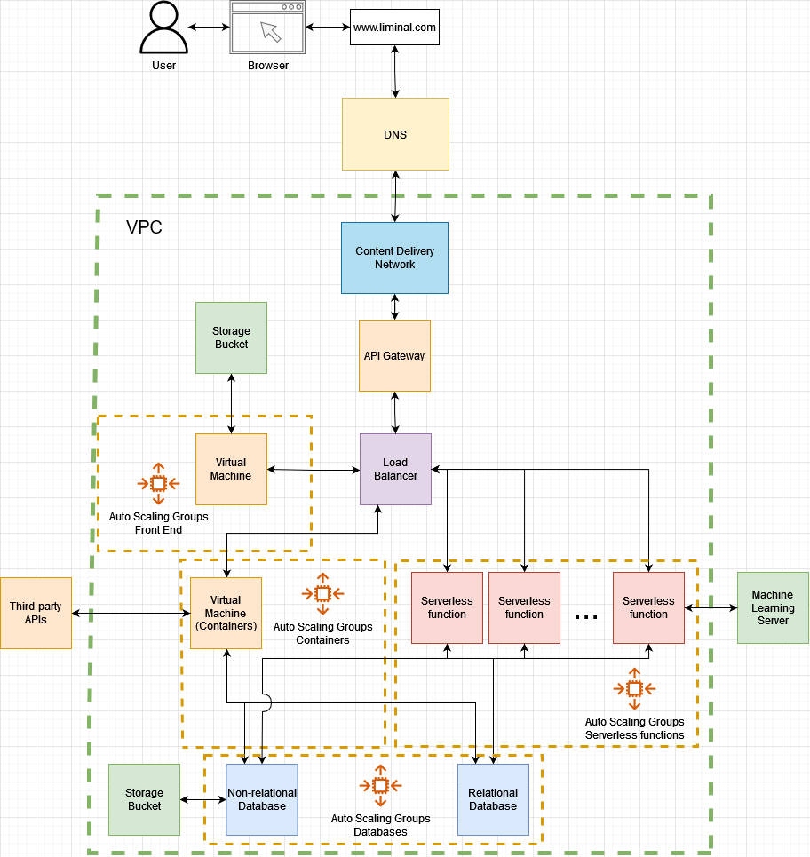

> **You do not have permission to push your changes directly into this branch!** 
> 
> Create an alternate branch and issue a Pull Request. For help, check out the [Student Manual](https://github.com/SFMBa01029956/TC3005B.502/blob/manuals/Files/Student%20Manual.md).

# TC3005B.501

    

## Autores

| #  | Matrícula | Nombre                                                 | Github Username                                     | Discord Username      | Número de teléfono | Correo Personal                          |
| -- | ---------- | ------------------------------------------------------------ | --------------------------------------------------- | --------------------- | ------------ | --------------------------------------- |
| 1  | A01352283  | [A B](mailto:a01352283@tec.mx)                               | [A01352283](https://github.com/A01352283)           | deRedBlob#9829        | 4622372250   | andres.brisenoc@gmail.com               |
| 2  | A01654063  | [Alexa Serrano Negrete](mailto:a01654063@tec.mx)             | [alexaserr](https://github.com/alexaserr)           | _alexaserr#1653       | 5534613157   | alexasnegrete@icloud.com                |
| 3  | A01658259  | [Alfredo Jeong Hyun Park](mailto:a01658259@tec.mx)           | [alfredoPark-48](https://github.com/alfredoPark-48) | APark#8241            | 5547689736   | parkalfredojeonghyun@gmail.com          |
| 4  | A01025303  | [Ana Paula Katsuda](mailto:a01025303@tec.mx)                 | [a01025303](https://github.com/a01025303)           | Akemi#0580            | 5514490291   | akatsuda@outlook.com                    |
| 5  | A01028728  | [Andrea Serrano Diego](mailto:a01028728@tec.mx)              | [AndyDiego13](https://github.com/AndyDiego13)       | Andy_Pandy_13#1462    | 5551670769   | andyserrano_d@outlook.com               |
| 6  | A01024927  | [Andreína Isabel Sanánez Rico](mailto:a01024927@tec.mx)      | [asananez2000](https://github.com/asananez2000)     | Andreina Sananez#5504 | 5521005914   | asananez2000@gmail.com                  |
| 7  | A01025076  | [Andrew Dunkerley](mailto:a01025076@tec.mx)                  | [Ace0x](https://github.com/Ace0x)                   | Ace0T#4575            | 55793218188  | andrew.d.72137@gmail.com                |
| 8  | A01781631  | [Diego Corrales Pinedo](mailto:a01781631@tec.mx)             | [Diego-CP](https://github.com/Diego-CP)             | Diego C#8309          | 5536778043   | pinedo.dc@gmail.com                     |
| 9  | A01025276  | [Do Hyun Nam](mailto:a01025276@tec.mx)                       | [catlikeflyer](https://github.com/catlikeflyer)     | CatLikeFlyer#4383     | 5516505092   | dhnam@aol.com                           |
| 10 | A01025453  | [Emiliano Cabrera Ruiz](mailto:a01025453@tec.mx)             | [Cabrera-git](https://github.com/Cabrera-git)       | GlowingMan#3054       | 5534223131   | cabreraruiz.emi@gmail.com               |
| 11 | A01633010  | [Francisco Daniel Salcedo Catalán](mailto:a01633010@tec.mx)  | [f-salcedo-c](https://github.com/f-salcedo-c)       | miss-juicy#0238       | 3335549545   | francisco.salcedo@mailbox.org           |
| 12 | A01029422  | [Gerardo Gutiérrez Paniagua](mailto:a01029422@tec.mx)        | [G3RZZZ](https://github.com/G3RZZZ)                 | G3RZZZ#0133           | 5531138636   | gerardogtzp6@gmail.com                  |
| 13 | A01732251  | [Iwalani Amador Piaga](mailto:a01732251@tec.mx)              | [ivalani](https://github.com/ivalani)               | Iwa#5072              | 5561289036   | iwalaniamador@gmail.com                 |
| 14 | A01025108  | [Karla Valeria Mondragón Rosas](mailto:a01025108@tec.mx)     | [karla-mond](https://github.com/karla-mond)         | karla#8194            | 5534623044   | karla.mondragon.rosas@gmail.com         |
| 15 | A01751941  | [Luis Javier Karam Galland](mailto:a01751941@tec.mx)         | [Luisjakg](https://github.com/Luisjakg)             | Luisjakg#1367         | 5555073248   | luisjakg@gmail.com                      |
| 16 | A01751912  | [Mateo Herrera Lavalle](mailto:a01751912@tec.mx)             | [MateoHerrera0](https://github.com/MateoHerrera0)   | Mat#0246              | 5628486354   | P14t0n@proton.me                        |
| 17 | A01284329  | [Regina Rodríguez Sánchez](mailto:a01284329@tec.mx)          | [reginardzss](https://github.com/reginardzss)       | reginardzs#5292       | 8180177096   | regina.rodriguezsan@gmail.com           |
| 18 | A01029956  | [Salvador Federico Milanés Braniff](mailto:a01029956@tec.mx) | [SFMBa01029956](https://github.com/SFMBa01029956)   | Salva4456#0437        | 5539048968   | salvadormilanesbraniff@gmail.com        |
| 19 | A01029746  | [Sebastián González Villacorta](mailto:a01029746@tec.mx)     | [sebasgonvitec](https://github.com/sebasgonvitec)   | cerillo22#5852        | 5587918611   | sebastian.gonzalez.villacorta@gmail.com |
| 20 | A01025459  | [Tonatiuh Reyes Huerta](mailto:a01025459@tec.mx)             | [Trh7101](https://github.com/Trh7101)               | Tona#5143             | 5536533155   | tonatiuhreyes8602@gmail.com             |

## Organigrama y Entregables

  

| Rol | Persona | Usuario Github |
| --- | ------- | -------------- |
| Project Manager | [Karla Valeria Mondragón Rosas](mailto:a01025108@tec.mx) | [karla-mond](https://github.com/karla-mond) | 
| Arquitecto de Software | [Sebastián González Villacorta](mailto:a01029746@tec.mx) |[sebasgonvitec](https://github.com/sebasgonvitec) |
| QA Head | [Mateo Herrera Lavalle](mailto:a01751912@tec.mx) | [MateoHerrera0](https://github.com/MateoHerrera0) | 
| Líder Back-End | [Andreína Isabel Sanánez Rico](mailto:a01024927@tec.mx) | [asananez2000](https://github.com/asananez2000) |
| Líder Front-End | [Ana Paula Katsuda](mailto:a01025303@tec.mx) | [a01025303](https://github.com/a01025303) | 
| Líder Base de Datos | [Gerardo Gutiérrez Paniagua](mailto:a01029422@tec.mx) | [G3RZZZ](https://github.com/G3RZZZ) |

## [Documento SRS →](https://github.com/SFMBa01029956/TC3005B.501/blob/main/Wiki/SRS.md)

## [Historias de Usuario →](https://docs.google.com/spreadsheets/d/1ekLYBNdBiyeopLcMUxqWD0kK3bIm1L-_8aUfY92UEo0/edit?usp=sharing)

## [Plan de Pruebas →](https://github.com/SFMBa01029956/TC3005B.501/blob/main/Wiki/DocPruebas.md)

## Arquitectura

  

## [Manuales →](https://github.com/SFMBa01029956/TC3005B.501/tree/manuals)
