> Pendiente a validar por todo el grupo
  
> By team 1
  
> ! Traducir
>
> ! No será mejor tenerlo en su propio .md ? - Salva
  
**2.6.1 General**
| Nombre de Caso de Uso: | Sign-up |
| --- | --- |
| Creado Por: | Grupo 501 |
| Última Actualización: | S. González |
| Fecha de Creación: | 09/03/2023 |
| Fecha de Última Revisión: | 31/03/2023 |
| **Descripción:** | Un usuario decide crear una cuenta en la plataforma. |
| **Actores:** | Usuario, platafoma, DBMS |
| **Precondiciones:** | 1. El usuario tiene acceso a una computadora.2. El usuario tiene acceso a los documentos necesarios. 3. El sistema tiene acceso a los servicios |
| **Postcondiciones:** | 1. El usuario tiene una cuenta en la plataforma. 2. El usuario puede usar su cuenta en la plataforma. |
| **Flujo:** | 1. El usuario entra a la plataforma desde la ágina principal. 2. El usuario hace clic en el botón "Registrarse". 4. Se le pide al usuario que elija entre iniciar sesión con Google o crear una cuenta, y elige crear una cuenta. 5. El usuario ingresa un correo electrónico y la información correspondiente requerida para crear una cuenta, como el nombre completo, fecha de nacimiento, número de teléfono y una contraseña segura. 6. Se le pide al usuario que ingrese los documentos legales requeridos que puedan verificar su identidad. 7. El usuario hace clic en el botón "Aceptar" y se le pide que acepte los términos y condiciones. 8. El usuario hace clic en el botón "Aceptar condiciones". 9. El frontend envía la información y los archivos al DBMS para que se inserten en la base de datos. 10. El DBMS crea una consulta para hacer una nueva entrada en la tabla de clientes. 11. El DBMS devuelve una respuesta exitosa al frontend. 12. El usuario es redirigido a su página de inicio personal.|
| **Flujos Alternativos:** | 4. In step 4 of the normal flow, the user can choose to make use of a Google account sign-in.1. The user is prompted to sign in via Google.2. The user enters their corresponding Google account and signs in.3. The user enters the corresponding information required to create an account, such as full name, date of birth, phone number, and a strong password.4. The user is prompted to enter the required legal documents that can verify their identity.5. The user clicks the "Accept" button and is prompted to accept the terms and conditions.6. The user clicks the "Accept conditions" button.7. The frontend sends the information and files to the DBMS for it to be inserted into the database.8. The DBMS creates a query to make a new entry in the Customer table.9. The DBMS returns a successful response to the frontend.10. The user is redirected to their personal homepage.6. In step 6 of the normal flow, as well as in step 4 of the previous alternate flow, the user can choose to skip adding documents at that moment.1. The user clicks the "Accept" button and is prompted to accept the terms and conditions.2. The user clicks the "Accept conditions" button.3. The frontend sends the information and files to the DBMS for it to be inserted into the database.4. The DBMS creates a query to make a new entry in the Customer table.5. The DBMS returns a successful response to the frontend.6. The user is redirected to their personal homepage.8. In step 8 of the normal flow, as well as steps 5 of the first alternate flow and step 2 of the second alternate flow, the user can turn down the terms and conditions.1. The corresponding prompt is closed and the user is redirected to the homepage. |
| **Exepciones:** | 8. In step 8 of the normal flow, in case the user turns down the terms and conditions their account is not created and are redirected to the general homepage. |
| **Requerimientos:** | The following requirements must be met before execution of the use case1. The user must have a stable internet connection.2. The user must input a valid email address.3. The user must input a valid phone number.4. The user must input a date of birth that corresponds with that of an adult of legal age. |

  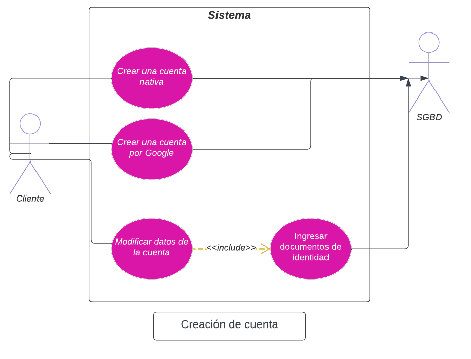

| Nombre del Caso de Uso: | Inicio de Sesión |
| --- | --- |
| Creado Por: | Equipo 1 |
| Última Actualización Por: | Sebastián González |
| Fecha de Creación: | 09/03/2023 |
| Última Fecha de Revisión: | 14/03/2023 |
| **Descripción:** | Un usuario decide ingresar a la plataforma AutoMart con una cuenta preexistente registrada. |
| **Actores:** | Usuario, plataforma AutoMart |
| **Precondiciones:** | 1. El usuario tiene acceso a una computadora. 2. El usuario se ha registrado previamente en la plataforma AutoMart, ya sea a través de Google o con una cuenta nativa. |
| **Postcondiciones:** | 1. El usuario puede usar su cuenta con éxito. |
| **Flujo:** | 1. El usuario ingresa al sitio y es recibido por la página de inicio. 2. El usuario hace clic en el botón "Iniciar sesión". 3. Se le solicita al usuario que elija entre el inicio de sesión de Google o que ingrese un correo electrónico y elige ingresar un correo electrónico. 4. El usuario ingresa el correo electrónico y la contraseña correspondiente. 5. El usuario hace clic en el botón "Ingresar" y el DBMS realiza una consulta para verificar que el par de correo electrónico y contraseña exista dentro de la base de datos. 6. El DBMS realiza una consulta a la tabla de miembros de la agencia para verificar si la cuenta tiene permisos adicionales. 7. Se devuelve una respuesta exitosa y se redirige al usuario a su página de inicio personal. |
| **Flujos Alternativos:** | 3. En el paso 3 del flujo normal, el usuario puede optar por utilizar el inicio de sesión de una cuenta de Google. 1. Se le solicita al usuario que inicie sesión a través de Google. 2. El usuario ingresa su cuenta de Google correspondiente y inicia sesión. 3. El DBMS realiza una consulta para verificar la existencia del par de correo electrónico y contraseña dentro de la base de datos. 4. Se devuelve una respuesta exitosa y se redirige al usuario a su página de inicio personal. |
| **Excepciones:** | 4. En el paso 4 del flujo normal, así como en el paso 2 del primer flujo alternativo, en caso de que el usuario ingrese los detalles de inicio de sesión incorrectos, el usuario nunca es redirigido a su página de inicio y, en su lugar, se le solicita que lo intente de nuevo. |
| **Requisitos:** | Los siguientes requisitos deben cumplirse antes de la ejecución del caso de uso: 1. El usuario debe tener una conexión a internet estable. 2. El usuario debe ingresar una dirección de correo electrónico válida y la contraseña correspondiente. |

  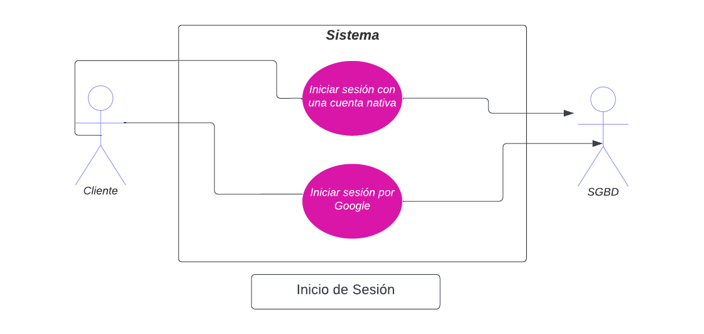

**2.6.2 Usuario Comprador**

| Nombre de Caso de Uso: | Comprar un coche como cliente |
| --- | --- |
| Creado por: | Equipo 1 |
| Última Actualización Por: | Sebastián González |
| Fecha de Creación: | 05/03/2023 |
|  Última Fecha de Revisión: | 02/04/2023 |
| **Description:** |	Un cliente compra un coche a través de la plataforma. |
| **Actors:** | 	Cliente, plataforma, vendedor, gerente |
| **Preconditions:** | 1. El cliente tiene acceso a una computadora. 2. El cliente ya se ha registrado en la plataforma AutoMart, ya sea a través de Google o con una cuenta nativa. 3. El cliente ha ingresado sus documentos legales requeridos en su cuenta. |
| **Postconditions:** | 1. El cliente está en proceso de comprar un coche. |
| **Flow:** | 	1. El cliente ingresa a su página de inicio, donde puede ver varios vehículos y puede desplazarse hacia abajo para ver más. 2. El cliente ingresa a la página específica del coche. 3. El cliente puede ver los detalles del vehículo. 4. El cliente puede elegir entre Agencias. 5. El cliente puede elegir detalles como la transmisión, el color y más, de acuerdo con la disponibilidad de inventario de la Agencia elegida. 6. El cliente puede elegir entre hacer una prueba de manejo o comprar el vehículo; elige comprar el vehículo. 7. Se le pide al cliente que ingrese su método de pago y los detalles del mismo, que pueden ser tarjeta de crédito / débito o transferencia bancaria. El cliente elige una tarjeta de crédito. 8. El gerente de la Agencia es notificado de la solicitud de compra, después de lo cual se asigna un vendedor a la transacción y se presentan sus detalles al cliente. 9. Se le presenta al cliente un mensaje que indica que la transacción está en marcha. |
| **Alternative Flows:** | 6. En el paso 6 del flujo normal, el cliente puede elegir solicitar una prueba de manejo. 1. Se le pide al cliente que elija una fecha y hora para la prueba. 2. Se envía un mensaje al gerente correspondiente de la Agencia. 3. Se presenta un mensaje al cliente que indica que se ha realizado su solicitud y que debe esperar más confirmación. 7. En el paso 7 del flujo normal, el cliente puede elegir entre varias opciones de pago, en caso de una transferencia bancaria. 1. Se le solicita al cliente que la transacción se ha iniciado y que proporcione una prueba de la transferencia antes de que se pueda hacer cualquier otra cosa. 2. La transacción se marca como pendiente en el historial del cliente para que pueda cargar la prueba y se notifica al gerente de la transferencia. 3. Después de que se haya cargado dicha prueba, se notifica al gerente de la Agencia de la carga de la prueba y, después de la validación, se asigna un vendedor a la transacción y se presentan sus detalles al cliente. 4. Se le presenta al cliente un mensaje que indica que la transacción está en marcha. |
| **Exceptions:** | En el paso 5 del flujo normal en caso de que el cliente no tenga los documentos adecuados o estén incompletos, no se le permite elegir ninguna opción y se le pide que complete sus documentos en su lugar. |
| **Requirements:** | Los siguientes requisitos deben cumplirse antes de la ejecución del caso de uso: 1. El cliente debe tener una conexión a internet estable. 2. Los fondos del cliente deben ser verificados antes de cualquier confirmación o reconocimiento de venta. |

  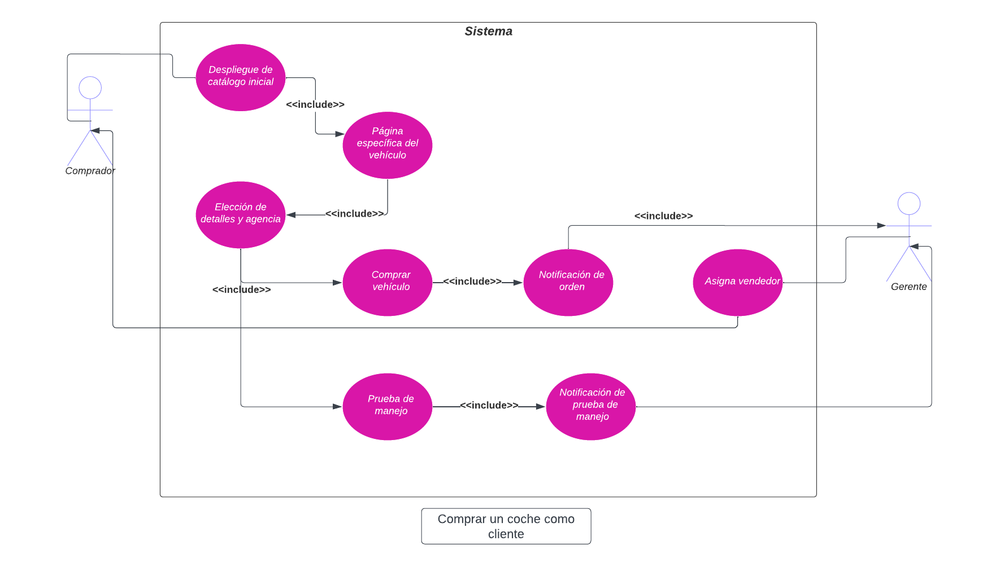

| Nombre de Caso de Uso: | Búsqueda de un auto por un cliente |
| --- | --- |
| Creado por: | Equipo 1 |
| Última actualización por: | Sebastián González |
| Fecha de creación: | 05/03/2023 |
| Fecha de última revisión: | 2/04/2023 |
| **Description:** | Un cliente busca un auto a través de la plataforma. |
| **Actors:** | Cliente, plataforma, DBMS, algoritmo NLP |
| **Preconditions:** | 1. El cliente tiene acceso a una computadora. 2. El cliente ya se ha registrado en la plataforma AutoMart, ya sea a través de Google o con una cuenta nativa. |
| **Postconditions:** | 1. El cliente recibe opciones de autos de acuerdo a sus especificaciones. |
| **Flow:** | 	1. El cliente está en su página de inicio. 2. El cliente puede hacer clic en la barra de búsqueda e ingresar términos específicos para buscar. 3. El cliente ingresa la búsqueda. 4. El algoritmo NLP segmenta los términos de búsqueda en posibles términos que coinciden con las columnas de la base de datos. 5. El DBMS realiza una consulta con los términos extraídos y devuelve los resultados. 6. El frontend crea elementos para mostrar la información al cliente. 7. El cliente recibe opciones de vehículos que se ajustan a su descripción. |
| **Alternative Flows:** | 2. En el paso 2 del flujo normal, el cliente puede optar por utilizar filtros. 1. El cliente puede seleccionar entre una variedad de opciones de selección, casillas de verificación y deslizadores para ajustar la marca, modelo, transmisión, color y más. 2. El cliente ingresa la búsqueda. 3. El DBMS realiza una consulta con los términos extraídos y devuelve los resultados. 4. El frontend crea elementos para mostrar la información al cliente. 5. El cliente recibe opciones de vehículos que se ajustan a los filtros seleccionados. |
| **Exceptions:** | 2. En el paso 2 del flujo normal, en caso de que el algoritmo NLP no encuentre términos utilizables, no se realiza ninguna consulta y se le indica al cliente que no hay resultados disponibles. |
| **Requirements:** | 	Se deben cumplir los siguientes requerimientos antes de la ejecución del caso de uso. 1. El cliente debe tener una conexión a internet estable. |

  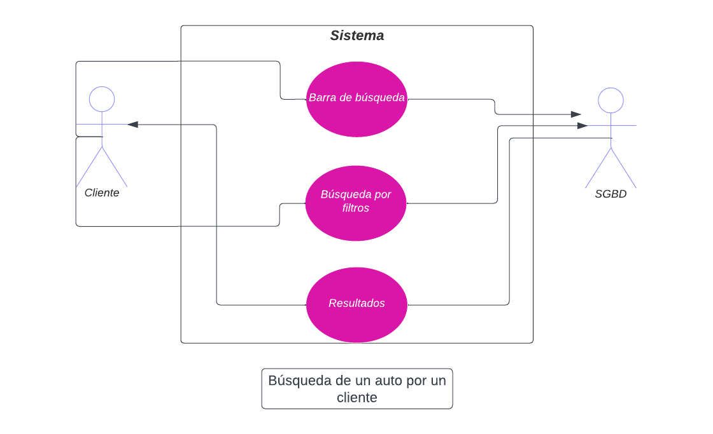

| Nombre de Caso de Uso: | Enviar mensajes a un vendedor como cliente |
| --- | --- |
| Creado por: | Equipo 1 |
| Última actualización por: | S. González |
| Fecha de creación: | 05/03/2023 |
| Fecha de última revisión: | 02/04/2023 |
| **Descripción:** | Un cliente desea contactar al vendedor de una transacción a través de la plataforma. |
| **Actores:** | Cliente, plataforma, vendedor |
| **Precondiciones:** | 1. El cliente tiene acceso a una computadora.2. El cliente ya se ha registrado en la plataforma AutoMart, ya sea a través de Google o con una cuenta nativa.3. El cliente está actualmente llevando a cabo una transacción. |
| **Postcondiciones::** | 	1. El cliente puede comunicarse con su correspondiente vendedor. |
| **Flujo:** | 	1. El cliente está en su página de inicio personal.2. El cliente hace click en su icono de cuenta y va a sus "Transacciones".3. El cliente entra en una transacción específica.4. El cliente hace clic en el botón "Contactar al vendedor".5. Se muestra una ventana de chat al usuario y puede comunicarse con el vendedor correspondiente.6. El vendedor correspondiente es notificado de que tiene un mensaje. |
| **Flujos alternativos:** | - |
| **Excepciones:** | 3. En el paso 3 del flujo normal, en caso de que el cliente no tenga transacciones en curso, no puede comunicarse con un vendedor. |
| **Requisitos:** | 	Los siguientes requisitos deben cumplirse antes de la ejecución del caso de uso.1. El cliente debe tener una conexión a internet estable.2. El cliente tiene una transacción en curso. |

  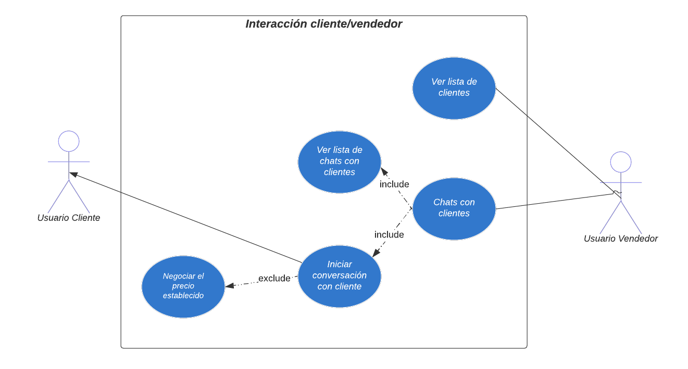

| Nombre del Caso de Uso: | 	Subir documentos legales como cliente |
| --- | --- |
| Creado por: | Equipo 1 |
| Última actualización por: | S. González |
| Fecha de Creación: | 05/03/2023 |
| Última Fecha de Revisión: | 2/04/2023 |
| **Descripción:** | Un cliente busca un coche a través de la plataforma. |
| **Actores:** | Cliente, plataforma. |
| **Precondiciones:** | 1. El cliente tiene acceso a un ordenador. 2. El cliente se ha registrado previamente en la plataforma AutoMart, ya sea a través de Google o con una cuenta nativa. |
| **Postcondiciones:** | 	1. El cliente tiene su identidad legal vinculada a su cuenta de la plataforma. |
| **Flujo:** | 1. El cliente se encuentra en su página de inicio personal. 2. El cliente hace clic en su icono de cuenta y va a su sección de "Configuración". 3. El cliente va a la sección de "Detalles". 4. El cliente selecciona el documento correspondiente y hace clic en el botón "Subir". 6. Se le pide al cliente que cargue un archivo. 7. El sistema valida el archivo. 8. El DBMS realiza una consulta para insertar los archivos en la base de datos. 9. Se presenta una notificación al cliente que indica que su archivo se ha subido correctamente. |
| **Flujos Alternativos:** | 7. En el paso 7 del flujo normal, en caso de que el documento no se pueda validar, se le pide al cliente que vuelva a intentarlo. |
| **Exceptions:** | 	1. En el paso 1 del flujo normal, en caso de que el cliente no tenga una cuenta, no puede acceder a su sección de "Configuración". |
| **Requirements:** | 	Los siguientes requisitos deben cumplirse antes de la ejecución del caso de uso: 1. El cliente debe tener una conexión a internet estable. |

  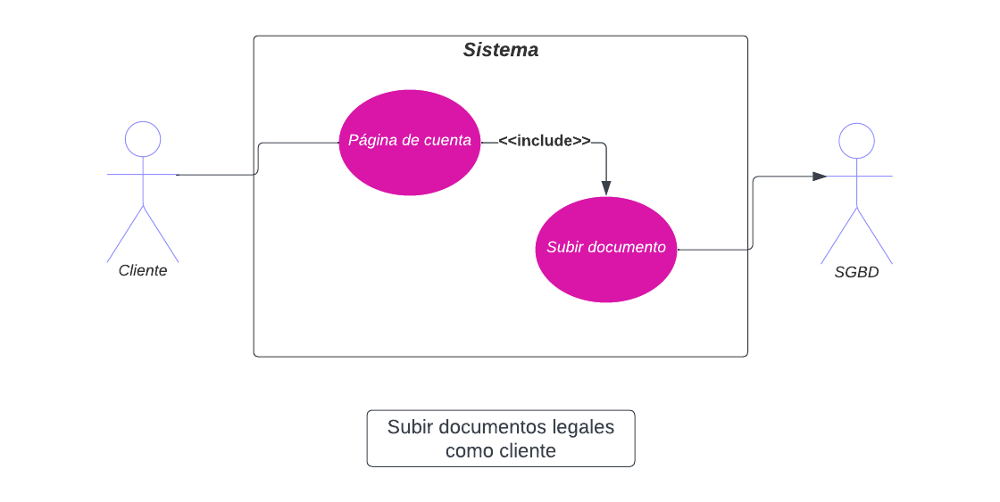

**2.6.3 Super Admin**

| Name of Use Case: | Manejar solicitudes de creación de Grupos Automotrices como Superadministrador |
| --- | --- |
| Creado por: | Equipo 1 |
| Última Actualización por: | S. Gonzáles |
| Fecha de Creación: | 05/03/2023 |
| Última Fecha de Revisión: | 02/04/2023 |
| **Descripción:** | 	Un superadministrador verifica que se pueda crear un Grupo Automotriz. |
| **Actores:** | Superadministrador, plataforma, Usuario Grupo Automotriz |
| **Precondiciones:** | 1. El superadministrador tiene acceso a una computadora. |
| **Postcondiciones:** | 1. El superadministrador verifica y crea un Grupo Automotriz o la solicitud es denegada. |
| **Flujo:** | 1. El superadministrador es notificado de una nueva solicitud de creación de Grupo Automotriz.2. El superadministrador inicia sesión y entra en la sección "Solicitud".3. El superadministrador puede ver todos los documentos adjuntos al Grupo Automotriz.4. El superadministrador acepta la solicitud y se crea un nuevo Grupo de Autos.5. El Administrador que presentó la solicitud es notificado de la creación y se le asigna al Grupo Automotriz. |
| **Flujos Alternativos:** | 4. En el paso 4 del flujo normal, en caso de que los documentos no se puedan validar o el superadministrador deniegue la solicitud.1. Se notifica al Administrador correspondiente de la denegación. |
| **Excepciones:** | - |
| **Requisitos:** | Los siguientes requisitos deben cumplirse antes de la ejecución del caso de uso1. El usuario del Grupo Automotriz debe tener una conexión a Internet estable. |

| Nombre del caso de uso: | Eliminación de administradores de Grupo Automotriz como superadministrador |
| --- | --- |
| Creado por: | Equipo 1 |
| Última actualización por: | S. González |
| Fecha de creación: | 05/03/2023 |
| Fecha de última revisión: | 02/04/2023 |
| **Descripción:** | 	Un superadministrador elimina al administrador de un grupo de automotriz. |
| **Actores:** |Superadministrador, plataforma, Usuario Grupo Automotriz, DBMS |
| **Precondiciones:** | 1. El superadministrador tiene acceso a una computadora. 2. Existe un grupo de Automotriz con un administrador. |
| **Postcondiciones:** | 1. El superadministrador elimina al administrador del grupo de automotriz. |
| **Flujo:** | 1. El superadministrador entra en la sección "Grupos Automotrices". 2. El superadministrador ingresa en el grupo automotriz correspondiente. 3. El superadministrador hace clic en el botón "Eliminar" debajo de la información del administrador del grupo de automóviles. 4. El DBMS envía una consulta para eliminar al administrador. |
| **Flujos alternativos:** | - |
| **Excepciones:** | 3. En el paso 3 del flujo normal, si no hay un administrador, no hay un botón "Eliminar". |
| **Requerimientos:** | Los siguientes requisitos deben cumplirse antes de la ejecución del caso de uso: 1. El superadministrador debe tener una conexión a Internet estable. |

| Nombre del Caso de Uso:| Añadir Administradores a un Grupo de Autos como superadmin |
| --- | --- |
| Creado por: | Equipo 1 |
| Última actualización por: | S. González |
| Fecha de creación: | 05/03/2023 |
| Fecha de última revisión: | 02/04/2023 |
| **Descripción:** | Un superadmin añade un administrador a un Grupo Automotriz. |
| **Actores:** | Superadmin, plataforma, Usuario Grupo Automotriz, DBMS |
| **Precondiciones:** | 1. El superadmin tiene acceso a una computadora. 2. Existe un Grupo Automotriz sin Administrador. |
| **Postcondiciones:** | 1. El superadmin añade un Administrador al Grupo Automotriz. |
| **Flujo:** | 1. El superadmin entra en la sección "Grupos Automotrices". 2. El superadmin entra en el Grupo Automotriz correspondiente. 3. El superadmin hace clic en el botón "Añadir Administrador" debajo de la información del Grupo Automotriz. 4. El superadmin puede ingresar un código de cuenta y hacer clic en el botón "Aceptar". 5. El DBMS crea una consulta para insertar al Administrador.. 6. La cuenta recibe permisos de Administrador y se agrega al Grupo Automotriz en cuestión.. |
| **Flujos Alternativos:** | - |
| **Excepciones:** | - |
| **Requisitos:** | Los siguientes requisitos deben cumplirse antes de la ejecución del caso de uso. 1. El superadmin debe tener una conexión a internet estable. |

| Nombre del Caso de Uso: | Ver detalles de cuenta como superadministrador |
| --- | --- |
| Creado por: | Equipo 1 |
| Última actualización por: | S. Gonzalez |
| Fecha de creación: | 05/03/2023 |
| Fecha de última revisión: | 02/04/2023 |
| **Descripción:** | 	Un superadministrador puede ver los detalles y documentos de cualquier cuenta. |
| **Actores:** | Superadministrador, plataforma, Usuario Grupo Automotriz, Gerente, Vendedor, Cliente, DBMS |
| **Precondiciones:** | 1. El superadministrador tiene acceso a una computadora.2. Existen cuentas dentro del sistema. |
| **Postcondiciones:** |1. El superadministrador puede ver los detalles de cualquier cuenta. |
| **Flujo:** | 1. El superadministrador puede elegir entre varias secciones relacionadas con todo tipo de cuentas (Clientes, Grupos Automotrices, Administradores, Gerentes, Vendedores).2. El superadministrador puede seleccionar cualquier cuenta existente en la sección que eligió.3. El superadministrador puede buscar una cuenta específica a través de una barra de búsqueda.4. El superadministrador selecciona la cuenta de la que está interesado.5. El DBMS hace una consulta para obtener todos los detalles de la cuenta y sus archivos.6. El superadministrador puede ver la información y acceder a los documentos que se han cargado. |
| **Flujos Alternativos:** | - |
| **Excepciones:** | 4. En el paso 4 del flujo normal, en caso de que no haya archivos cargados, el superadministrador no puede ver un archivo. |
| **Requerimientos:** | Los siguientes requisitos deben cumplirse antes de la ejecución del caso de uso: 1. El superadministrador debe tener una conexión a Internet estable. |

| Nombre del Caso de Uso: | Creando cuentas como superadministrador |
| --- | --- |
| Creado por: | Equipo 1 |
| Última actualización por: | S. González |
| Fecha de creación: | 05/03/2023 |
| Fecha de última revisión: | 02/04/2023 |
| **Descripción:** | Un superadministrador puede crear cualquier tipo de cuenta. |
| **Actores:** | Superadministrador, plataforma, usuario grupo automotriz, gerente, vendedor, cliente, DBMS |
| **Precondiciones:** | 1. El superadministrador tiene acceso a una computadora. |
| **Postcondiciones:** | 1. El superadministrador crea una cuenta. |
| **Flujo:** | 1. El superadministrador puede elegir entre varias secciones referentes a todos los tipos de cuentas (Clientes, Grupos Automotrices, Administradores, Gerentes, Vendedores).2. El superadministrador hace clic en el botón "Crear cuenta".3. Se le solicita que ingrese los mismos detalles que en el proceso de registro.4. El DBMS crea una consulta para insertar la información correspondiente en las tablas. |
| **Flujos alternativos:** | - |
| **Excepciones:** | 	3. En el paso 3 del flujo normal, en caso de que no agregue toda la información necesaria, el sistema no crea la cuenta. |
| **Requisitos:** | 	Los siguientes requisitos deben cumplirse antes de la ejecución del caso de uso.1. El superadministrador debe tener una conexión a internet estable. |

| Nombre del Caso de Uso: | Eliminar cuentas como superadmin |
| --- | --- |
| Creado por: | Equipo 1 |
| Última actualización por: | S. González |
| Fecha de creación: | 05/03/2023 |
| Fecha de última revisión: | 02/04/2023 |
| **Descripción:** | Un superadmin puede eliminar cualquier tipo de cuenta. |
| **Actores:** | 	Superadmin, plataforma, Usuario Grupo Automotriz, Gerente, Vendedor, Cliente, DBMS |
| **Precondiciones:** | 1. El superadmin tiene acceso a una computadora.2. Hay cuentas dentro del sistema. |
| **Postcondiciones:** | 1. El superadmin elimina una cuenta. |
| **Flujo:** | 1. El superadmin puede elegir entre varias secciones sobre todos los tipos de cuentas (Clientes, Grupos Automotrices, Administradores, Gerentes, Vendedores).2. El superadmin ingresa a una cuenta en particular.3. El superadmin hace clic en el botón "Eliminar".4. El DBMS realiza una consulta para eliminar la información correspondiente de las tablas. |
| **Flujos Alternativos:** | - |
| **Excepciones:** | - |
| **Requisitos:** | Los siguientes requisitos deben cumplirse antes de la ejecución del caso de uso.1. El superadmin debe tener una conexión a Internet estable. |

  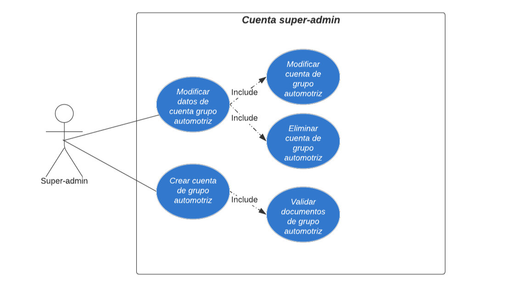

<!-- Pendiente-->
| Nombre del Caso de Uso: | Ver estadísitcas de la plataforma como superadmin |
| --- | --- |
| Creado por: | Equipo 1 |
| Última actualización por: | S. González |
| Fecha de creación: | 05/03/2023 |
| Fecha de última revisión: | 02/04/2023 |
| **Description:** | Un superadministrador puede ver las estádisitcas de la plataforma|
| **Actors:** | Superadmin, platform, DBMS |
| **Preconditions:** | 1. El super admin tiene acceso a una computadora |
| **Postconditions:** | 1. El super admin puede ver las estadísiticas de la plataforma. |
| **Flow:** | 1. The superadmin enters the "Auto Groups" section.2. The superadmin enters the corresponding Auto Group.3. The superadmin clicks the "Stats" button under the Auto Group's information.4. The DBMS makes a query to obtain all information regarding an Auto Group.5. The superadmin is presented with the Auto Group's statistics and can choose to download them as a file via a "Download" button. |
| **Alternative Flows:** | 5. In step 5 of the normal flow, the superadmin can choose to download a file.1. The backend converts the information into a \*.pdf file.2. The file is downloaded into their computer.3. They are prompted that the file has been downloaded. |
| **Exceptions:** | - |
| **Requirements:** | The following requirements must be met before execution of the use case1. The superadmin must have a stable internet connection. |

  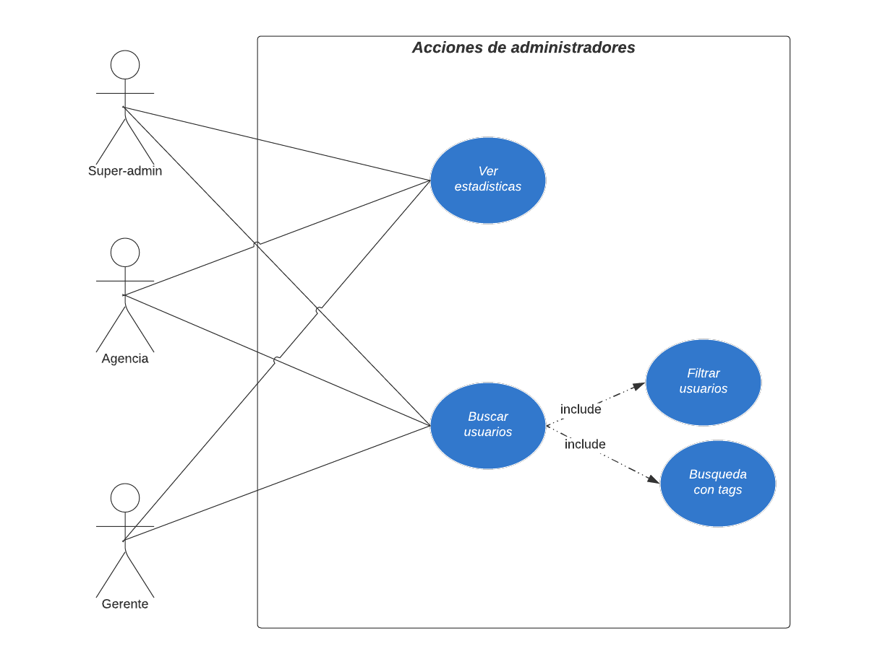

**2.6.4 Administrators**

| Nombre del Caso de Uso: | Asignar cuentas de gerente como administrador |
| --- | --- |
| Creado por: | Equipo 1 |
| Última actualización por: | S. González |
| Fecha de creación: | 05/03/2023 |
| Fecha de última revisión: | 02/04/2023 |
| **Descripción:** | Un administrador puede asignar cuentas de gerente a las agencias. |
| **Actores:** | Administrador, plataforma, gerente, DBMS |
| **Precondiciones:** | 1. El administrador tiene acceso a una computadora. 2. Hay cuentas dentro del sistema. |
| **Postcondiciones::** | 1. El administrador asigna un gerente a una agencia. |
| **Flujo:** | 1. El administrador puede elegir entre varias agencias. 2. El administrador hace clic en la agencia correspondiente. 3. Hacen clic en el botón "Agregar gerente". 4. El administrador puede ingresar un código de cuenta y hacer clic en el botón "Aceptar". 5. El DBMS realiza una consulta para insertar los datos correspondientes en la tabla de gerentes. 5. La cuenta recibe permisos de gerente y se asigna a la agencia. |
| **Flujos alternativos:** | - |
| **Excepciones:** | - |
| **Requisitos:** | 	Los siguientes requisitos deben cumplirse antes de la ejecución del caso de uso 1. El administrador debe tener una conexión a internet estable. |

| Nombre del Caso de Uso:  | Petición para crear un Grupo Automotriz como administrador |
| --- | --- |
| Creado por: | Equipo 1 |
| Última actualización por: | S. González |
| Fecha de creación: | 05/03/2023 |
| Fecha de última revisión: | 02/04/2023 |
| **Descripción:** | Un administrador puede solicitar a los Superadmins crear Grupos de Autos. |
| **Actores:** | Administrador, plataforma, Superadmin |
| **Precondiciones:** | 1. El administrador tiene acceso a una computadora.2. El administrador tiene una cuenta en la plataforma. |
| **Postcondiciones:** | 1. El Superadmin crea un nuevo Grupo Automotriz. |
| **Flujo:** | 1. El administrador está en su página de inicio y hace clic en el botón "Hacer Solicitud".2. El administrador se le solicita que ingrese la información requerida y cargue los documentos legales requeridos.3. El administrador hace clic en el botón "Hacer Solicitud".4. El Superadmin es notificado de una nueva solicitud.5. Se muestra un mensaje al administrador que indica que la solicitud ha sido ingresada.|
| **Flujos Alternativos:** | 2. En el paso 2 del flujo normal, en caso de que el administrador no agregue todos los documentos requeridos, no se le permite hacer la solicitud y en su lugar se le solicita que los agregue. |
| **Excepciones:** | - |
| **Requisitos:** | Los siguientes requerimientos deben ser cumplidos antes de la ejecución del caso de uso1. El administrador debe tener una conexión a Internet estable. |

| Nombre del Caso de Uso:  | Eliminar cuentas de Gerente como administrador |
| --- | --- |
| Creado por: | Equipo 1 |
| Última actualización por: | S. González |
| Fecha de creación: | 05/03/2023 |
| Fecha de última revisión: | 02/04/2023 |
| **Descripción:** | Un administrador puede eliminar cuentas de Gerente de las Agencias. |
| **Actores:** | Administrador, plataforma, Gerente, DBMS |
| **Precondiciones:** | 1. El administrador tiene acceso a una computadora.2. Hay al menos un Gerente asignado a una Agencia. |
| **Postcondiciones:** | 1. El administrador elimina un Gerente de una Agencia. |
| **Flujo:** | 1. El administrador puede elegir entre varias Agencias.2. El administrador hace clic en la Agencia correspondiente.3. Hacen clic en el botón "Eliminar" debajo de los detalles del Gerente. 4. El DBMS realiza una consulta para eliminar la información correspondiente de la tabla de Gerente. |
| **Flujos Alternativos:** | - |
| **Excepciones:** | 	4. En el paso 4 del flujo normal, en caso de que no haya Managers asignados, no habrá ningún botón disponible. |
| **Requisitos:** | Los siguientes requisitos deben ser cumplidos antes de la ejecución del caso de uso1. El administrador debe tener una conexión a internet estable. |

  

| Nombre del Caso de Uso:  | Crear Agencias como administrador |
| --- | --- |
| Creado por: | Equipo 1 |
| Última actualización por: | S. González |
| Fecha de creación: | 05/03/2023 |
| Fecha de última revisión: | 02/04/2023 |
| **Descripción:** | Un administrador puede crear Agencias. |
| **Actores:** | Administrator, AutoMart platform, DBMS |
| **Precondiciones:** | 	1. El administrador tiene acceso a una computadora.2. El administrador ha creado exitosamente un Grupo Automotriz. |
| **Precondiciones::** |1. El administrador crea una Agencia dentro de su Grupo Automotriz. |
| **Flujo:** | 1. El administrador hace clic en el botón "Crear Agencia" en su página de inicio.2. Se solicita al administrador que agregue todos los detalles relevantes sobre la Agencia, así como los documentos legales requeridos.3. El administrador hace clic en el botón "Crear".4. El DBMS hace una consulta para agregar la información correspondiente a la tabla de Agencias.5. El administrador recibe un mensaje que indica que la Agencia ha sido creada. |
| **Flujos alternativos:** | - |
| **Excepciones:** | 3. En el paso 3 del flujo normal, en caso de que el administrador no agregue todos los documentos o detalles, no se le permite crear la Agencia y en su lugar se le solicita que complete la información. |
| **Requerimientos:** | Los siguientes requerimientos deben ser cumplidos antes de la ejecución del caso de uso1. El administrador debe tener una conexión a internet estable. |

| Nombre del Caso de Uso:  | Ver estadísticas del grupo automotriz como administrador |
| --- | --- |
| Creado por: | Equipo 1 |
| Última actualización por: | S. González |
| Fecha de creación: | 05/03/2023 |
| Fecha de última revisión: | 02/04/2023 |
| **Descripción:** | Un administrador ve las estadísticas de su grupo automotriz. |
| **Actores:** | Administrador, plataforma, DBMS |
| **Precondiciones:** | 1. El administrador tiene acceso a una computadora. 2. Está asignado a un grupo de autos. |
| **Postcondiciones:** | 1. El administrador puede ver las estadísticas de su grupo de autos. |
| **Flujo:** | 1. El administrador ingresa a su grupo de autos.2. El administrador hace clic en el botón "Estadísticas" debajo de la información del grupo automotriz. 4. El DBMS hace una consulta para obtener toda la información relacionada con un grupo de autos.5. El administrador recibe las estadísticas del grupo automotriz y puede optar por descargarlas como un archivo mediante un botón "Descargar". |
| **Flujos alternativos:** | 4. En el paso 4 del flujo normal, el administrador puede optar por descargar un archivo.1. El backend convierte la información en un archivo *.pdf.2. El archivo se descarga en su computadora.3. Se les indica que el archivo ha sido descargado. |
| **Excepciones:** | - |
| **Requerimientos:** | Los siguientes requisitos deben cumplirse antes de la ejecución del caso de uso1. El administrador debe tener una conexión a Internet estable. |

| Nombre del Caso de Uso:  | Ver estadísticas de las Agencias como administrador |
| --- | --- |
| Creado por: | Equipo 1 |
| Última actualización por: | S. González |
| Fecha de creación: | 05/03/2023 |
| Fecha de última revisión: | 02/04/2023 |
| **Descripción:** | Un administrador puede ver las estadísticas de sus Agencias. |
| **Actores:** | Administrador, plataforma |
| **Precondiciones:** | 1. El administrador tiene acceso a una computadora.2. Está asignado a un Grupo Automotriz.3. Hay Agencias dentro del Grupo Automotriz.|
| **Postcondiciones:** | 1. El administrador puede ver las estadísticas de cualquier Agencia. |
| **Flujo:** | 1. El administrador entra en su Grupo Automotriz.2. El administrador ingresa a una Agencia.3. El administrador hace clic en el botón "Estadísticas" debajo de la información de la Agencia.4. El DBMS realiza una consulta para obtener toda la información sobre una Agencia.5. El administrador ve las estadísticas de la Agencia y puede elegir descargarlas como un archivo a través del botón "Descargar". |
| **Flujos Alternativos:** | 4. En el paso 4 del flujo normal, el administrador puede elegir descargar un archivo.1. El backend convierte la información en un archivo *.pdf.2. El archivo se descarga en su computadora.3. Se les avisa que el archivo ha sido descargado. |
| **Excepciones:** | - |
| **Requisitos:** | Los siguientes requisitos deben cumplirse antes de la ejecución del caso de uso1. El administrador debe tener una conexión a Internet estable. |

  

**2.6.5 Gerentes**

| Nombre del Caso de Uso:  | Ver el inventario de una Agencia como gerente |
| --- | --- |
| Creado por: | Equipo 1 |
| Última actualización por: | S. González |
| Fecha de creación: | 05/03/2023 |
| Fecha de última revisión: | 02/04/2023 |
| **Descripción:** | Un gerente puede ver el inventario de su Agencia. |
| **Actores:** | Gerente, plataforma, DBMS |
| **Precondiciones:** | 1. El gerente tiene acceso a una computadora.2. El gerente está asignado a una Agencia. |
| **Postcondiciones:** | 1. El gerente puede ver el inventario de su Agencia. |
| **Flujo:** | 1. El gerente hace clic en el botón "Ver Inventario" en su página de inicio.2. El DBMS realiza una consulta para ver todos los autos dentro de una Agencia.3. El gerente ve el inventario de su Agencia. |
| **Flujos Alternativos:** | - |
| **Excepciones:** | 3. En el paso 3 del flujo normal, si no hay inventario, no se mostrará nada. |
| **Requerimientos:** | Los siguientes requerimientos deben cumplirse antes de la ejecución del caso de uso: 1. El gerente debe tener una conexión a internet estable. |

| Nombre del Caso de Uso:  | Añadir al inventario de la agencia como gerente |
| --- | --- |
| Creado por: | Equipo 1 |
| Última actualización por: | S. González |
| Fecha de creación: | 05/03/2023 |
| Fecha de última revisión: | 02/04/2023 |
| **Descripción:** | Un gerente puede agregar al inventario de su agencia. |
| **Actores:** | Gerente, plataforma, DBMS |
| **Precondiciones:** | 1. El gerente tiene acceso a una computadora. 2. El gerente está asignado a una agencia. |
| **Postcondiciones:** |	1. El gerente puede ver el inventario de su agencia. |
| **Flujo:** | 1. El gerente hace clic en el botón "Agregar inventario" en su página de inicio. 2. Se le solicita al gerente que seleccione un modelo, sus detalles y especificaciones. 3. El gerente hace clic en el botón "Agregar". 4. El DBMS hace una consulta para insertar un nuevo automóvil en la tabla Car con la clave de agencia correspondiente. |
| **Flujos alternativos::** | - |
| **Excepciones:** | 2. En el paso 2 del flujo normal, en caso de que no se agreguen todos los campos requeridos, el elemento no se puede agregar. |
| **Requisitos:** | Los siguientes requisitos deben cumplirse antes de la ejecución del caso de uso. 1. El gerente debe tener una conexión a Internet estable. |

| Nombre del Caso de Uso:  | Eliminar del inventario de la agencia como gerente |
| --- | --- |
| Creado por: | Equipo 1 |
| Última actualización por: | S. González |
| Fecha de creación: | 05/03/2023 |
| Fecha de última revisión: | 02/04/2023 |
| **Descripción:** | 	Un gerente puede eliminar un elemento del inventario de su agencia. |
| **Actores:** | 	Gerente, plataforma, DBMS |
| **Precondiciones:** | 1. El gerente tiene acceso a una computadora. 2. El gerente está asignado a una agencia. |
| **Postcondiciones:** | 1. El gerente puede ver el inventario de su agencia. |
| **Flujo:** | 1. El gerente hace clic en el botón "Ver inventario" en su página de inicio. 2. Se presenta al gerente el inventario de su agencia. 3. El gerente hace clic en el botón "Eliminar" debajo de un elemento específico. 4. El DBMS hace una consulta para eliminar un elemento específico de la tabla Car. |
| **Flujos alternativos:** | - |
| **Excepciones:** | 2. En el paso 2 del flujo normal, en caso de que no haya inventario, no se mostrará nada. |
| **Requisitos:** | Los siguientes requisitos deben cumplirse antes de la ejecución del caso de uso. 1. El gerente debe tener una conexión a Internet estable. |

  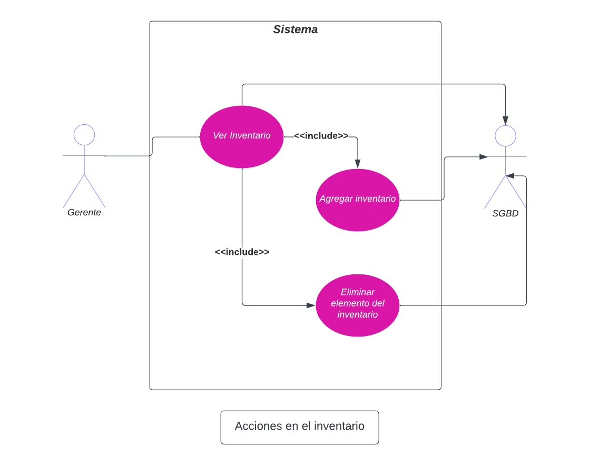

| Nombre del Caso de Uso:  | Asignar vendedor a una agencia como gerente |
| --- | --- |
| Creado por: | Equipo 1 |
| Última actualización por: | S. González |
| Fecha de creación: | 05/03/2023 |
| Fecha de última revisión: | 02/04/2023 |
| **Descripción**: | Un gerente puede asignar un vendedor a su agencia. |
| **Actores**: | Gerente, plataforma AutoMart, Vendedor |
| **Precondiciones**: | 1. El gerente tiene acceso a una computadora. 2. El gerente está asignado a una agencia. |
| **Postcondiciones: | 1. El gerente asigna vendedores a su agencia. |
| **Flujo**: | 1. El gerente es notificado de una nueva solicitud de vendedor. 2. El gerente hace clic en el botón "Agregar Vendedor" en su página de inicio. 3. El gerente puede ingresar un código de cuenta y hacer clic en el botón "Aceptar". 4. La cuenta recibe permisos de vendedor y se asigna a la agencia en cuestión. |
| **Flujos alternativos**: | - |
| **Excepciones**: | - |
| **Requisitos**: | Los siguientes requisitos deben cumplirse antes de la ejecución del caso de uso. 1. El gerente debe tener una conexión a Internet estable. |

| Nombre del Caso de Uso:  | Eliminar vendedores de una agencia como gerente |
| --- | --- |
| Creado por: | Equipo 1 |
| Última actualización por: | S. González |
| Fecha de creación: | 05/03/2023 |
| Fecha de última revisión: | 02/04/2023 |
| **Descripción**: | Un gerente puede eliminar a un vendedor de su agencia. |
| **Actores**: | Gerente, plataforma AutoMart, vendedor |
| **Precondiciones**: | 1. El gerente tiene acceso a una computadora.2. El gerente está asignado a una agencia.3. La agencia del gerente tiene al menos un vendedor. |
| **Postcondiciones: | 1. El gerente elimina a los vendedores de su agencia. |
| **Flujo**: | 1. El gerente hace clic en el botón "Ver personal" en su página de inicio.2. El gerente puede ver todos los vendedores actuales.3. El gerente hace clic en el botón "Eliminar" en uno de los vendedores. 4. El vendedor es eliminado de la agencia en cuestión. |
| **Flujos alternativos**: | - |
| **Excepciones**: | 2. En el paso 2 del flujo normal, en caso de que no haya vendedores. |
| **Requerimientos**: | Los siguientes requisitos deben ser cumplidos antes de la ejecución del caso de uso1. El gerente debe tener una conexión a internet estable. 

  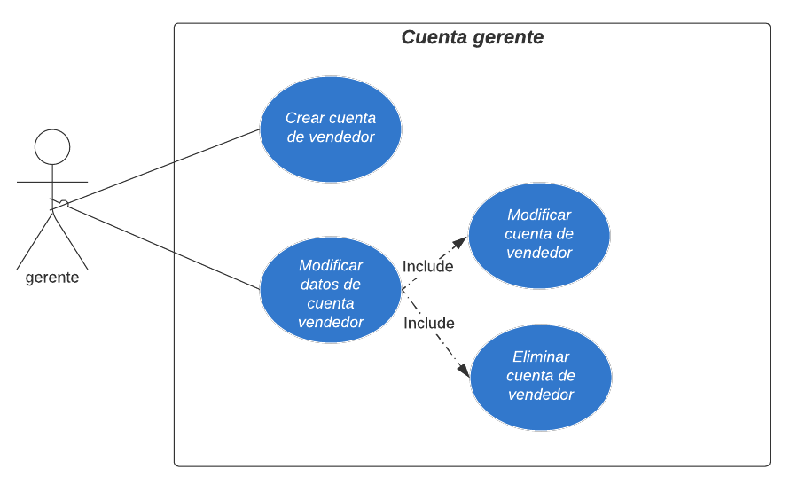

| Nombre del Caso de Uso:  | Ver estadísticas de una agencia como gerente|
| --- | --- |
| Creado por: | Equipo 1 |
| Última actualización por: | S. González |
| Fecha de creación: | 05/03/2023 |
| Fecha de última revisión: | 02/04/2023 |
| **Descripción:** | Un gerente puede ver las estadísticas de sus Agencias. |
| **Actores:** | Administrador, plataforma AutoMart |
| **Precondiciones:** | 1. El gerente tiene acceso a una computadora.2. Está asignado a una Agencia. |
| **Postcondiciones:** | 1. El gerente puede ver las estadísticas de cualquier Agencia. |
| **Flujo:** | 1. El gerente ingresa a su Agencia.2. El gerente hace clic en el botón "Estadísticas" debajo de la información de la Agencia.3. El gerente ve las estadísticas de la Agencia y puede optar por descargarlas como un archivo a través de un botón "Descargar". |
| **Flujos Alternativos:** | 4. En el paso 4 del flujo normal, el superadministrador puede optar por descargar un archivo.1. El archivo se descarga en su computadora.2. Se le indica que el archivo ha sido descargado. |
| **Excepciones:** | - |
| **Requisitos:** | Los siguientes requisitos deben cumplirse antes de la ejecución del caso de uso:1. El gerente debe tener una conexión a Internet estable. |

  

**2.6.6 Vendedores**

| Nombre del Caso de Uso:  | Visualizar las ordenes de compra activas como vendedor |
| --- | --- |
| Creado por: | Equipo 1 |
| Última actualización por: | S. González |
| Fecha de creación: | 05/03/2023 |
| Fecha de última revisión: | 02/04/2023 |
| **Descripción:** | Un vendedor puede ver todas sus ventas en curso. |
| **Actores:** | Vendedor, plataforma AutoMart |
| **Precondiciones:** | 1. El vendedor tiene acceso a una computadora. 2. El vendedor está asignado a una agencia. 3. El vendedor tiene una venta en curso. |
| **Postcondiciones:** | 1. El vendedor puede ver sus ventas en curso. |
| **Flujo:** | 1. El vendedor hace clic en el botón "Ver ventas" en su página de inicio. 2. El vendedor puede ver todas las ventas en curso y puede hacer clic en un botón "Ver detalles" debajo de cada una de ellas. 3. El vendedor puede ver los detalles de la venta elegida. |
| **Flujos Alternativos: | - |
| **Excepciones:** | 2. En el paso 2 del flujo normal, en caso de que no haya ventas en curso, el vendedor no verá nada. |
| **Requisitos:** | Se deben cumplir los siguientes requisitos antes de la ejecución del caso de uso: 1. El vendedor debe tener una conexión a internet estable. |

  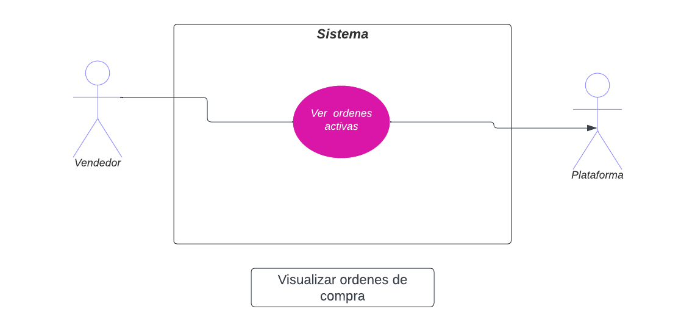

| Nombre del Caso de Uso:  | Mensajear un comprador como vendedor |
| --- | --- |
| Creado por: | Equipo 1 |
| Última actualización por: | S. González |
| Fecha de creación: | 05/03/2023 |
| Fecha de última revisión: | 02/04/2023 |
| **Descripción**: | Un vendedor puede ver todas sus ventas en curso. |
| **Actores:** | Vendedor, plataforma AutoMart |
| **Precondiciones:** | 1. El vendedor tiene acceso a una computadora. 2. El vendedor está asignado a una Agencia. 3. El vendedor tiene una venta en curso. |
| **Postcondiciones:** | 1. El vendedor puede enviar un mensaje a un cliente de una venta en curso. |
| **Flujo:** | 1. El vendedor hace clic en el botón "Ver ventas" en su página de inicio. 2. El vendedor puede ver todas las ventas en curso y puede hacer clic en un botón "Ver detalles" debajo de cada una de ellas. 3. El vendedor puede ver los detalles de la venta elegida y hacer clic en un botón "Mensaje al cliente". 4. El vendedor recibe una ventana de chat. |
| **Flujos alternativos:** | - |
| **Excepciones:** | 2. En el paso 2 del flujo normal, en caso de que no haya ventas en curso, el vendedor no verá nada. |
| **Requerimientos:** | Los siguientes requerimientos deben cumplirse antes de la ejecución del caso de uso. 1. El vendedor debe tener una conexión a internet estable. |

  

