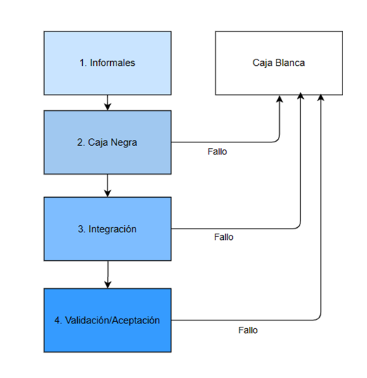

# Plan de Pruebas

| Date       | Version | Description  |  
|------------|:-------:| :----------- |
| 26/02/2023 | 0.1     | Creación del Doc SRS |

# Índice

1. [**Introducción**](#1-introducción)

2. [**Estrategia de Pruebas**](#2-estrategia-de-pruebas)

3. [**Manejo de Pruebas**](#3-manejo-de-pruebas)

4. [**Ambiente de pruebas**](#4-ambiente-de-pruebas)

5. [**Plantilla de Pruebas**](#5-plantilla-de-pruebas)

6. [**Conclusiones**](#6-conclusiones)

# 1. Introducción
## 1.1 Objetivo
El objetivo del presente documento, es proveer una propuesta respecto a las pruebas de software necesarias para el desarrollo y la funcionalidad correcta de la aplicación web de adquisición de autos. Estas contribuirán en la creación de un producto con un control de calidad alto por lo que serán detalladas y argumentadas en este escrito.

En cuanto al plan de pruebas que se realizará, este incluirá la especificación de elementos de software que serán probados, el nivel y la secuencia en la que serán probados, los criterios de salida y la manera en la que se aplicará la estrategia en el ambiente de pruebas. Junto con lo anterior, se considerarán los siguientes puntos:
- Lo que está dentro y fuera del alcance
- Supuestos
- Roles y responsabilidades del equipo QA
- Herramientas
- Entregables
- Gestión de Defectos
- Riesgos
- Calendario

Es relevante recalcar que el presente documento será organizado de manera que se especifiquen claramente las dos vertientes principales de pruebas: dinámicas y estáticas.

## 1.2 Descripción del Proyecto
El proyecto que será desarrollado por Pulse Technologies, se trata de una solución para grupos automotrices y compradores de autos en donde se permitirá digitalizar una parte del proceso de compra, evitando visitas excesivas a las agencias. Dicha solución está planteada como una aplicación web que permitirá a los usuarios interactuar con el agente, explorar distintas opciones de autos, obtener cotizaciones estimadas automáticamente, comparar autos, subir y editar sus documentos, solicitar pruebas de manejo y mantener un seguimiento adecuado (con la misma calidad de atención que en una agencia tradicional) de sus compras.

La aplicación beneficiará a los clientes de las agencias ya que les ahorrará tiempo, les proporcionará opciones de distintas marcas y agencias (con distintos planes de financiamiento) en una misma plataforma, y les permitirá tener una visión más clara de lo que quieren. Asimismo, beneficiará a las agencias y grupos automotrices, dándoles un espacio en el que tendrán visibilidad, la posibilidad de agilizar ciertos procesos (como lo es el de la entrega de documentos del cliente) para poder atender a más clientes y la posibilidad de obtener ciertas estadísticas que les podrán ayudar a analizar sus ventas.

## 1.3 Audiencia
En cuanto a la audiencia, es necesario separar claramente a las entidades involucradas para las pruebas dinámicas y para las pruebas estáticas. 

### Dinámicas
Puesto a que las pruebas dinámicas requieren de la ejecución del código, su audiencia principal son los desarrolladores (quienes generan en código, lo modifican y verifican que funcione dicho código). De igual manera, aquellos encargados de diseñar las pruebas estarán involucrados en las pruebas dinámicas ya que tendrán que planearlas. 

### Estáticas
En cuanto a las pruebas estáticas - que se basan en la revisión de productos de trabajo sin código -, estas involucrarán a los encargados de diseñar las pruebas (ya que mediante la revisión del trabajo podrán planear mejores pruebas), al Product Owner (quien tiene la visión de la perspectiva del cliente por lo que puede evaluar si se cumplen las necesidades del mismo), el Project Manager (quien supervisará que se lleve a cabo el proyecto correctamente y se entreguen las pruebas adecuadas), y cualquier otro participante del producto que quiera revisar los documentos y asegurar la calidad del mismo. 

### Dependencias
Esta lista de hitos es tentativa y puede cambiar debido a las siguientes razones:

a) Problemas en el ambiente de desarrollo

b) Cambios en el alcance

c) Dependencias que impacten los esfuerzos y tiempos

| Nu. | Tipo de Prueba | Ejemplo de Prueba (SUT) | Dependencias (DOC) |
|--|-----------|--------------------|------------------|
| 1 | Pruebas Unitarias | Conexion a BD  | Base de datos completa & API |
| 2 | Pruebas Unitarias | Login de usuario | Base de datos completa & API |
| 3 | Pruebas Unitarias | Registro de usuario | Base de datos completa & API |
| 4 | Pruebas de integracion | Chat entre usuarios | Los usuarios se pueden comunicar de manera exitosa |
| 5 | Pruebas de integracion | Compra de usuario | El usuario puede realizar compras de manera exitosa |
| 6 | Pruebas de validacion | La interfaz de usuario es agradable y facil de usar |  Diseño de interface completo|
| 7 | Pruebas de validacion | El sistema esta completo y el cliente esta satisfecho con su funcionamiento | El sistema esta completo|
| 8| Prueba de sistema | El usuario final puede iniciar sesion, navegar la pagina, realizar compras y comunicarse con vendedores por medio de chat | Base de datos completa, Conexiones API completas, Frontend de usuario final completo|
| 9 | Prueba de sistema | EL usuario administrador puede iniciar sesion, entrar a la vista de administrador, y administrar los usuarios de la pagina | Base de datos completa, Conexiones API completas Frontend de usuario administrador completo | 
| 10 | Prueba de sistema | El usuario vendedor puede iniciar sesion, entrar a la vista de vendedor, y administrar sus productos | Base de datos completa, Conexiones API completas, Frontend de usuario vendedor completo |
| 11 | Prueba de sistema | El usuario de grupo automotriz puede iniciar sesion, entrar a la vista de grupo automotriz, y asignar agencias asociadas | Base de datos completa, Conexiones API completas, Frontend de grupo automotriz completo |
| 12 | Prueba de sistema | El usuario de agencia puede iniciar sesio, entrar a la vista de agencia, y asignar vendedores asociados | Base de datos completa, Conexiones API completas, Frontend de grupo automotriz completo |

# 2. Estrategia de Pruebas
**Etapa 1 – Comprensión de los Requerimientos, Especificaciones del Proyecto y Pruebas Estáticas:** 

Antes de crear una estrategia de pruebas, primero se comprenden y establecen de manera detallada los requerimientos del proyecto. Para ello se tiene una serie de interacciones semanales con el cliente NDS en el cual se documentan de forma clara las características de la solución que cumplen con sus necesidades y objetivos. Al finalizar esta etapa se espera que haya pocos o nulos cambios, ya que el resto del proyecto se desarrollará en base a lo establecido en esta etapa, por lo cuál queda fuera de las etapas de iteración.

**Etapa 2 - Pruebas Informales:**

En un principio, se comenzará realizando pruebas informales durante el desarrollo del software. Esto incluiría pruebas realizadas individualmente por cada uno de los desarrolladores sin supervisión, teniendo un enfoque en comprobar la funcionalidad de componentes creados. En esta etapa comienza el proceso iterativo de las pruebas y va dentro de las pruebas dinámicas.

**Etapa 3 – Realización de Pruebas Unitarias:**

Esta etapa también va dentro de las pruebas dinámicas y se pretende comenzar realizando las pruebas unitarias para cada componente de software de la plataforma. Esto concentrándose en pruebas de caja negra (black box tests) tomando especial atención en la entrada y salida esperadas en su correcto funcionamiento. Simultáneamente a esto, se acordará de manera iterativa con NDS las pruebas de historias de usuario van de acuerdo a sus criterios de aceptación. Esto ayudará a garantizar que la página web satisfaga correctamente las necesidades de NDS y de sus clientes.

**Etapa 4 - Pruebas de Caja Blanca de cobertura (White Box Testing):**

En esta etapa, que también va dentro de las dinámicas, se realizan las pruebas de caja blanca a los componentes definidos en este documento, especialmente dando prioridad a aquellos componentes que generaron errores en las Pruebas de Caja Negra. De esta manera, se podrá analizar el código de dichos componentes, así permitiendo arreglar errores persistentes en pruebas anteriores o eliminar redundancias. Para hacer más eficaz nuestro proceso de pruebas de caja blanca, usaremos la técnica de cobertura en donde se probaran los caminos más utilizados para hacer uso de cada función de cada tipo de usuario.

**Etapa 5 - Pruebas de Integración:**

En esta etapa, que es la última dentro de las etapas dinámicas, después de que todas las pruebas unitarias hayan pasado con éxito se pasan a las pruebas de integración donde de manera ascendente se van uniendo los diferentes componentes para validar su correcto funcionamiento en conjunto. Las pruebas de integración se llevarán a cabo mediante pruebas de caja negra de casos de uso aleatorias, las cuales serán elegidas y supervisadas por el Project Manager responsable del equipo de desarrollo.

**Etapa 6 – Pruebas de Validación/Aceptación:**

En esta etapa, se requiere que haya pocos o ningún cambio, ya qué, después de que las pruebas de integración hayan sido exitosas se realizan las pruebas de validación en las que se revisará con el cliente NDS que los criterios de validación definidos en etapas anteriores se cumplen hasta el momento del proceso de pruebas.

**Etapa 7 – Pruebas de Estática de Recorridos:**

Una vez que se haya tenido la aprobación de NDS se realizará la prueba del funcionamiento del sistema como un todo, verificando el comportamiento y correcto funcionamiento de toda la plataforma en el nivel más alto posible.

**Etapa 8 - Manual de Usuario:**

En esta etapa final, una vez que se haya completado las etapas anteriores y son pocos o nulos los cambios se crea el manual de usuario en el que se le proveerá información e instrucciones al usuario de cómo usar el software desarrollado. En el manual de usuario se incluirán los caminos previamente establecidos en las pruebas de caja blanca de cobertura. El manual toma en cuenta la versión más actualizada y funcional de la aplicación.

Es relevante mencionar, que en esta estrategia se mantiene un flujo iterativo, donde de ser necesario se actualizará el documento de pruebas o se podrá regresar a etapas de pruebas anteriores para así solucionar cualquier fallo o error en cualquier nivel de la plataforma. 

El flujo de las pruebas se puede observar a continuación:

  

## 2.1 Objetivos de pruebas
 El objetivo de las pruebas que se realizarán durante el transcurso del proyecto es la validación de las funcionalidades fundamentales de la aplicación, al igual que comprobar la correcta implementación de los requerimientos establecidos en el documento SRS. En consideración de este objetivo, las pruebas a realizarse comprenderán:

- Pruebas que aseguren la correcta autorización de usuarios, al igual que la asignación de los premios asociados.
- Pruebas que comprueben el correcto funcionamiento en la búsqueda y filtrado del catálogo de autos.
- Pruebas que comprueben el correcto funcionamiento del guardado de automóviles en la base de datos.
- Pruebas que garanticen el funcionamiento de la recopilación, análisis, y generación de estadística relacionada con usuarios agentes de la aplicación.
- Pruebas relacionadas al servicio de chat implementado en la aplicación. Pruebas con el objetivo de comprobar el correcto funcionamiento del proceso de compra de un automóvil.
- Pruebas asociadas a la creación de usuarios con diferentes permisos.
- Pruebas asociadas al funcionamiento de un software estable y listo para producción.

## 2.2 Suposiciones sobre las Pruebas

###Suposiciones Clave
1. Se dará prioridad a las pruebas funcionales debido a limitantes de tiempo y presupuesto. 
2. Todas las pruebas se harán en el mismo ambiente.
3. Todas las pruebas se harán inicialmente con pruebas Informales y posteriormente en Caja Negra.

### Suposiciones Generales
1. Las pruebas funcionales serán las más relevantes del plan de pruebas.
2. Realizar las mismas pruebas conlleva a los mismos resultados.
3. Las pruebas con variedad en el rol de acceso no son equivalentes, y debe definirse una prueba por cada rol.
4. Si el ambiente de pruebas deja de estar disponible; el equipo de pruebas creará uno lo más similar lo antes posible.
5. Todas las funciones han sido probadas meticulosamente.
6. Las pruebas de caja blanca y pruebas paso a paso solo se ejecutarán si los resultados son distintos a lo esperado.
7. El equipo de pruebas documentará sus resultados de acuerdo a lo evaluado.
8. El equipo de pruebas asume que todas las entradas o inputs requeridos durante el diseño y la ejecución de las pruebas estarán apoyados por el desarrollador/analista respectivamente.
9. Todos los documentos personales del usuario serán guardados con el mismo formato y nomenclatura.
10. El PM verificará los resultados de todas las pruebas efectuadas.
11. El PM aprueba todos los casos de prueba propuestos previo a la ejecución de los mismos
12. El equipo de pruebas manejará todo el esfuerzo de ejecución de prueba de forma coordinada con el PM.
13. El recorrido y manual de usuario se realizará en los últimos sprints.

## 2.3 Alcance

## 2.4 Niveles de Prueba

## 2.5 Criterios de Entrada y Salida

### 2.5.1 Dinámicas

|*Criterio de Entrada*|*Equipo de Prueba*|*Equipo Técnico*|*Notas*|
| :- | :- | :- | :- |

De Caja Blanca

|*Criterio de Entrada*|*Equipo de Prueba*|*Equipo Técnico*|*Notas*|
| :- | :- | :- | :- |

Integración

|*Criterio de Entrada*|*Equipo de Prueba*|*Equipo Técnico*|*Notas*|
| :- | :- | :- | :- |

Aceptación

|*Criterio de Entrada*|*Equipo de Prueba*|*Equipo Técnico*|*Notas*|
| :- | :- | :- | :- |

**Criterio de Salida**

|*Criterio de Salida*|*Equipo de Prueba*|*Equipo Técnico*|*Notas*|
| :- | :- | :- | :- |

### 2.6.2 No funcionales

**NO se realizarán pruebas de tipo no funcional.**

### 2.6.3 Estáticas

Las pruebas estáticas que se llevarán a cabo son las siguientes.

**Documento SRS**

*Prioridad: Alta*

**Documento de Especificación de Pruebas**

*Prioridad: Alta*

**Manuales de Usuario (para todos los usuarios)**

*Prioridad: Media*

Se generarán manuales de usuario que describan los diferentes flujos y caminos que puede tomar un usuario en la plataforma. Estos flujos serán los flujos más relevantes como la compra de un coche, la dada de alta de un auto, etc. Es de vital importancia generar un manual de usuario por tipo de usuario (Final, Venedor, Gerente, Grupo Automotriz, Administrador de la Plataforma) y hacer estos manuales lo más gráficos y simples posible.

Para realizar estos manuales utilizaremos una herramienta llamada Tango, que se usa para generar guías paso a paso de alguna funcionalidad de la plataforma.

**Mockup de la interfaz gráfica**

*Prioridad: Alta*

Otra de las pruebas estáticas que realizaremos será la de un Mockup de la Interfaz de Usuario. Este mockup será un predecesor de la Interfaz Gráfica en donde se plantea el diseño de la plataforma y se incluyen los posibles recorridos que puede seguir el usuario.

Este documento será útil para obtener retroalimentación del usuario en cuestiones de experiencia de usuario y de apariencia física de la plataforma. Esta información nos ayudará a refinar la aplicación para ajustarla lo más posible a la comodidad del usuario.

**Documentación de las APIs**  

*Prioridad: Media*

Se generará documentación de todas las APIs que expongan los diferentes servicios que sean necesarios para el funcionamiento de la aplicación. Se realizarán usando la herramienta de OpenAPI para la definición de contratos.

Estos documentos tendrán la función de facilitar el desarrollo de la aplicación con la definición de los valores de entrada y salida esperados para el correcto funcionamiento de los servicios. De igual manera servirán para definir en primera instancia los diferentes endpoints.

## 2.7 Entregables

| No. | Nombre del Entregable | Autor | Sprint Esperado | Supervisor  |
|---|---|---|---|---|
| 1 |Plan de pruebas   | Equipo de prubas  | 1  | P.M. y Líder de QA |
| 2 |Casos de pruebas unitarias |Equipo de pruebas   |3   |P.M. y Líder de QA  |
| 3 |Caos de pruebas de integración   |Equipo de pruebas   |3   |P.M. y Líder de QA  |
| 4 |Revisión Técnica   |Equipo de pruebas   |Cada sprint después del tercero   |Líder de QA/Equipo de pruebas   |
| 5 |Reporte de estatus semanal   |Equipo de pruebas   |Cada sprint después del tercero   |Líder de QA/Equipo de pruebas   |
| 6 |Logs de resultados de pruebas   |Equipo de pruebas   |Cada sprint después del tercero   |Líder de QA/Equipo de pruebas   |
| 7 | Reporte de finalización de pruebas | Equipo de pruebas | 9 | P.M. y Líder de QA |

## 2.8 Lista de Hitos
Lista tentativa, sujeta a cambios.

| **No.** | **Tipo de prueba** | **Ejemplo de prueba** | **Dependencias** |
| --- | --- | --- | --- |
| 1 | Prueba unitaria | Conexión de base de datos | Bases de datos finalizadas |
| 2 | Prueba unitaria | Prueba de autenticación de usuario | Módulo de autenticación finalizado |
| 3 | Prueba unitaria | Prueba de registro de usuario | Módulo de registro finalizado |
| 4 | Prueba de integración | Prueba de registro/autenticación de usuario: El usuario es capaz de crear una cuenta y de autenticar esa cuenta | Pruebas unitarias finalizadas: 1, 2, 3 |
| 5 | Prueba unitaria | Prueba de envío de solicitudes | Módulo de solicitudes finalizado |
| 6 | Prueba unitaria | Prueba de validación de solicitudes | Módulo de aceptación de solicitudes finalizado |
| 7 | Prueba de integración | Prueba de manejo de solicitudes: El usuario es capaz de autenticar y enviar una solicitud. El administrador es capaz de autenticar y aceptar/denegar la solicitud | Pruebas unitarias finalizadas: 5, 6 |
| 8 | Prueba unitaria | Prueba de asignación de Gerentes/Vendedores | Módulo de asignación de Gerentes/Vendedores finalizado |
| 9 | Prueba de integración | Prueba de integración de Gerentes/Vendedores: Los privilegios de estas cuentas se ven reflejados en la base de datos | Pruebas unitarias finalizadas: 1, 8 |
| 10 | Prueba unitaria | Prueba de creación de cuentas | Módulo de creación de cuentas finalizado |
| 11 | Prueba de integración | Prueba de integración de creación de cuentas: La cuenta creada se ve reflejada en la base de datos | Pruebas unitarias finalizadas: 1, 10 |
| 12 | Prueba unitaria | Prueba de búsqueda de coches | Finalizado: Página inicial y módulos de búsqueda de página |
| 13 | Prueba de integración | Prueba de integración de búsqueda de coches: Muestar coches filtrados | Pruebas unitarias finalizadas: 1, 12 |
| 14 | Prueba unitaria | Prueba de compra de coches/prueba de manejo | Módulo de tarjeta de coche finalizado |
| 15 | Prueba de integración | Prueba de compra de coche/prueba de manejo: Se puede reservar una prueba de manejo y comprar un coche | Pruebas unitarias finalizadas: 1, 12, 14 |
| 16 | Prueba unitaria | Prueba de subida de modelo | Módulo de subda de modelos finalizado |
| 17 | Prueba de integración | Prueba unitaria de subida de modelo: Se puede subir un coche y se vera reflejado en la base de datos y en la búsqueda de coches | Pruebas unitarias finalizadas: 1, 12, 14, 16 |
|| Prueba unitaria | Prueba unitaria de validación de documentos: Se pueden subir documentos y se recibe un booleano que indique su validez | Módulo de validación de documentos finalizado |
| 18 | Prueba de validación | Hay pocos cambios o nulos. La interfaz está de acuerdo a los estándares del cliente. | Diseño de la interfaz finalizado |
| 19 | Prueba de validación | Hay pocos cambios o nulos. El programa está completo y funciona de acuerdo a los estándares del cliente. | Programa finalizado |
| 20 | Prueba de recorrido | Recorrido de todos los usuarios se puede completar | Bases de datos finalizadas, API finalizada, arquitectura de nube finalizada, conexiones finalizadas, implementación de front-end finalizada, implementación de back-end finalizada |

## 2.9 Estimado de Esfuerzo
Estimación basada en un equipo de 5 personas. Sujeta a cambios. 

### Pruebas Estáticas
<table>
  <thead>
    <tr>
      <th>
        Tipo de Prueba
      </th>
      <th>
        Horas
      </th>
      <th>
        D&iacute;as
      </th>
      <th>
        Porcentaje del Proyecto
      </th>
    </tr>
  </thead>
    <tr>
      <td>
        SRS
      </td>
      <td>
        56 
      </td>
      <td>
        7
      </td>
      <td>
        7.72%
      </td>
    </tr>
    <tr>
      <td>
        Plan de Pruebas
      </td>
      <td>
        56
      </td>
      <td>
        7 
      </td>
    </tr>
    <tr>
      <td>
        Recorrido Est&aacute;tico
      </td>
      <td>
        24
      </td>
      <td>
        3
      </td>
    </tr>
  </table>

### Pruebas Funcionales

<table>
  <thead>
    <tr>
      <th>
        Tipo de Prueba
      </th>
      <th>
        Horas
      </th>
      <th>
        D&iacute;as
      </th>
      <th>
        Porcentaje del Proyecto
      </th>
    </tr>
  </thead>
    <tr>
      <td>
        Pruebas Informales
      </td>
      <td>
        N/A
      </td>
      <td>
        N/A
      </td>
      <td>
        10.61%
      </td>
    </tr>
    <tr>
      <td>
        Pruebas de Integraci&oacute;n
      </td>
      <td>
        28
      </td>
      <td>
        3.5
      </td>
    </tr>
    <tr>
      <td>
        Pruebas de Caja Negra
      </td>
      <td>
        56
      </td>
      <td>
        7
      </td>
    </tr>
    <tr>
      <td>
        Pruebas de Caja Blanca
        *porcentaje variable dependiendo de qu&eacute; componentes lo necesiten
        

      </td>
      <td>
        98
      </td>
      <td>
        12.25
      </td>
    </tr>
  </table>

La estimación de esfuerzos anterior representa un 18.33% del total del proyecto.

# 3. Manejo de Pruebas
En esta sección, se describirá en más detalle el proceso de pruebas, incluidos los riesgos que pueden aparecer, su probabilidad de ocurrir, su impacto en el proyecto y las acciones que podemos tomar para mitigarlos. Además, se describirá con más detalle los roles y expectativas, para que cada miembro del equipo sepa qué hacer en cada fase del proyecto, para minimizar la probabilidad de cometer errores por falta de comunicación.

Además, hay un apartado donde se especifican las herramientas y los plazos considerados para el desarrollo de este proyecto, de forma que los tengamos listos antes de empezar, y todos sepan para qué sirve cada canal de comunicación.

Finalmente, para unir las cosas, también se incluye el diagrama de Gantt, que se compone de las fases de desarrollo y prueba del proyecto.

## 3.1 Plan de Ejecución de Pruebas

1. Aprobación del plan de pruebas y funcionamiento del ambiente de pruebas en todos los dispositivos que serán utilizados.
    - El ambiente de pruebas se comprueba por medio de una prueba informal que hagan de manera individual los desarrolladores.

2. Siguiendo el cronograma del proyecto y el plan de pruebas, el project manager en conjunto con el líder de pruebas asignará a cada líder sus respectivas pruebas.

3. Conforme se finalicen componentes pero el cronograma no indique una prueba, los desarrolladores estarán a cargo de las pruebas informales, y darles seguimiento.

4. Cuando se indique la ejecución de una prueba, cada líder tiene la responsabilidad de asegurarse de delegar las pruebas a sus equipos y darles seguimiento.

5. Cada desarrollador encargado de una prueba tiene la responsabilidad de documentar su proceso, el resultado de dicha prueba, el seguimiento que se le dará y la corrección de los errores.
    - El desarrollador tiene la responsabilidad de hacer su proceso de QA e informar si se pasa o no la prueba.

    - Primero se ejecutarán las pruebas de caja negra y en caso de que algún componente falle dicha prueba, se aplicará la prueba de caja blanca de cobertura en general y en algún componente crítico camino básico.

    - Una vez que cada componente pase las pruebas unitarias, se ejecutarán las pruebas de integración.

6. El desarrollador tiene la responsabilidad de informar a sus respectivos líderes acerca del resultado de las pruebas de sus componentes.

7. Si hay fallas, se le informará a los líderes y al project manager de acuerdo a la gravedad de ellas y se incluirán capturas de pantalla y llenar los formularios propuestos, si es necesario.

8. Este proceso se repite hasta que todos los casos de prueba se ejecuten por completo y tengan un estado en el que ya sea que pasen o fallen.
    - Durante el ciclo siguiente, se probarán las pruebas falladas corregidas y los resultados se actualizarán en el documento durante el ciclo hasta que todas las pruebas pasen. El proceso continúa hasta que se llegue a un estándar comercial, promoviendo fiabilidad, fácil acceso y alta estabilidad.

## 3.2 Factores de Riesgo y Mitigación de Pruebas
| **Riesgo** | **Probabilidad** | **Impacto** | **Plan de mitigación** |
| --- | --- | --- | --- |
| Commits de GitHub poco claros | Media | Bajo | Crear lineamiento de commits, los cuales incluirán instrucciones para presentar cambios, frecuecia y descripciones claras.|
| Falta de información en reportes de pruebas | Media | Medio | Crear plantillas claras y concisas para reportar los resultados de cada tipo de prueba y checar los resultados de manera inmediata tras completar la prueba, para que si alguna información se encuentra faltante, se puede corregir al momento. |
| Not indicar finalización de tareas en la tabla de SCRUM | Media | Bajo | Hacer un recordatorio diario, sea hecho por el PM o con ayuda de un recordatiorio ligado a la tera en la tabla. |
| Inyección de SQL en los campos de campos de entrada | Baja | Alto | Investigar métodos efectivos para la prevención de inyecciones SQL e implementarlos, o usar librerías para prevenirlos. |
| Clientes teniendo privilegios de administrador | Baja | Alto | Separar la infraestructura de clientes y administradores, al igual que encriptar la información de acceso de los administradores. |
| El programa no es capaz de manejar el tráfico | Baja | Alto | Revisar repetidamente el plan de arquitectura y revisar la configuración de la implementación para asegurar que todo se encuentre bien conectado e implementado. |
| Información no es ingresada de manera correcta a la base de datos | Baja | Medio | Durante la etapa de pruebas informales, asegurarse que las queries están estructuradas de manera correcta en la API para que no se envíen queries incorrectas durante el resto de las fases de prueba. |
| Las bases de datos se llenan de manera demasiado rápida | Media | Medio | Limitar número de queries y tamaño de documentos para que no haya documentos demasiado pesados o spam de queries.|
| La infromación no se muestar correctamente en el browser del tester | Media | Medio | Asegurar que el prgrama sea funcional en, como mínimo, 2/3 de los browsers más usados del mercado (por ejemplo, Firefox, Chrome y Opera) |

## 3.3 Plan de Comunicación y Roles de Equipo

### 3.3.1 Roles y Expectativas
<table>
    <thead>
    <tr>
      <th>
        Rol
      </th>
      <th>
        Descripci&oacute;n
      </th>
    </tr>
    </thead>
    <tr>
      <td>
        Project Manager 
      </td>
      <td>
        El miembro que est&aacute; a cargo de un equipo. Deben organizar y planificar las tareas del equipo para que el proyecto tenga &eacute;xito, asegur&aacute;ndose de que se entreguen en tiempo, forma y retroalimentadas. 
      </td>
    </tr>
    <tr >
      <td>
        L&iacute;der de QA
      </td>
      <td>
        Miembro del equipo que es responsable de participar y supervisar el desarrollo de las pruebas. Debe de tener en cuenta todos los alcances y criterios de validaci&oacute;n de cada prueba para asegurarse de que se cumplan en tiempo y forma. 
      </td>
    </tr>
    <tr >
      <td>
        L&iacute;der de Back-End
      </td>
      <td>
        Miembro del equipo que es responsable de participar y supervisar el desarrollo del back-end. Debe coordinar con todos los equipos de desarrollo el avance y los componentes del proyecto, asignar tareas, asegurarse de que se completen en tiempo y forma y coordinarse con el project manager.
      </td>
    </tr>
    <tr >
      <td>
        L&iacute;der de Front-End
      </td>
      <td>
        Miembro del equipo que es responsable de participar y supervisar el desarrollo del front-end. Debe coordinar con todos los equipos de desarrollo, el avance y los componentes del proyecto, asignar tareas, asegurarse de que se completen en tiempo y forma y coordinarse con el project manager.
      </td>
    </tr>
    <tr >
      <td>
        L&iacute;der de Base de Datos
      </td>
      <td>
        Miembro del equipo que es responsable de participar y supervisar el desarrollo de la base de datos. Debe coordinar con todos los equipos de desarrollo, el avance y los componentes del proyecto, asignar tareas, asegurarse de que se completen en tiempo y forma y coordinarse con el project manager.
      </td>
    </tr>
    <tr >
      <td>
        Arquitecto de Software
      </td>
      <td>
        Miembro del equipo que es responsable de participar y supervisar el desarrollo del back-end y de la nube, asegurandose que se cumplan los lineamientos del stack tecnológico y la arquitectura del software. Debe coordinar con todos los equipos de desarrollo, el avance y los componentes del proyecto, asignar tareas, asegurarse de que se completen en tiempo y forma y coordinarse con el project manager.
      </td>
    </tr>
    <tr >
      <td>
        Equipo de Desarrollo
      </td>
      <td>
        C&eacute;lula de trabajo encargada de requerimientos espec&iacute;ficos,compuesta de un miembro de back-end, uno de front-end, uno de base de datos, uno de seguridad, de pruebas y un project manager.
      </td>
    </tr>
  </table>

## Expectativas del Rol 
Es importante aclarar que dentro del proyecto presente, todos los involucrados en el desarrollo de la aplicación cumpliran un rol como tester a pesar de las responsabilidades que tengan en otro rol. Por lo antes mencionado, por cada componente que sea finalizado por cualquier persona en el equipo de desarrollo se realizará una prueba informal. De la misma manera, todo el equipo de desarrollo tiene como responsabilidad validar con el cliente los componentes de la aplicación y el entregable final.

La siguiente lista define en términos generales las expectativas relacionadas a los roles que están involucrados con el manejo, planeación o ejecución de la prueba para el proyecto.

## Project Manager 
Revisa el contenido del plan de pruebas, la estrategia de las pueblas, los estimados, criterios de validación con los equipos de trabajo, líderes y los stakeholders. Recopila la retroalimentación e informa a los demás. Tiene la responsabilidad de darle acompañamiento a las pruebas de caja blanca.

## Líder de QA 
Junto con el project manager, crea y revisa el contenido del plan de pruebas, la estrategia de las pueblas, los estimados y criterios de validación coordinando la ejecución con las actividades programadas en el cronograma del proyecto. Recibe retroalimentación de los equipos de trabajo, líderes y los stakeholders, se asegura que las pruebas se ejecuten en tiempo y forma y documenta el proceso y los resultados.

## Líder de Back-End 
Junto con el líder de pruebas y el project manager, suma al contenido del plan de pruebas considerando las actividades programadas para el desarrollo del back-end, el avance del mismo y se asegura de la ejecución de las pruebas de sus componentes y que la integración con los otros equipos sea probada y documentada. Se le asignan pruebas, es parte y delega dichas pruebas y se asegura que las funcionalidades críticas de su desarrollo sean consideradas como parte del plan de pruebas. Tiene un seguimiento de las pruebas informales que sus desarrolladores han ejecutado. 

## Líder de Front-End 
Junto con el líder de pruebas y el project manager, suma al contenido del plan de pruebas considerando las actividades programadas para el desarrollo del front-end, el avance del mismo y se asegura de la ejecución de las pruebas de sus componentes y que la integración con los otros equipos sea probada y documentada. Se le asignan pruebas, es parte y delega dichas pruebas y se asegura que las funcionalidades críticas de su desarrollo sean consideradas como parte del plan de pruebas. Tiene un seguimiento de las pruebas informales que sus desarrolladores han ejecutado. 

## Líder de Base de Datos 
Junto con el líder de pruebas y el project manager, suma al contenido del plan de pruebas considerando las actividades programadas para el desarrollo de la base de datos, el avance de la misma y se asegura de la ejecución de las pruebas de sus componentes y que la integración con los otros equipos sea probada y documentada. Se le asignan pruebas, es parte y delega dichas pruebas y se asegura que las funcionalidades críticas de su desarrollo sean consideradas como parte del plan de pruebas. Tiene un seguimiento de las pruebas informales que sus desarrolladores han ejecutado. 

## Líder de Arquitectura
Junto con el líder de pruebas y el project manager, suma al contenido del plan de pruebas considerando las actividades programadas para el desarrollo y la arquitectura de software. 
Se asegura de la ejecución de las pruebas de sus componentes y que la integración con los otros equipos sea probada y documentada. Se le asignan pruebas, es parte y delega dichas pruebas y se asegura que las funcionalidades críticas de su desarrollo sean consideradas como parte del plan de pruebas. Tiene un seguimiento de las pruebas informales que los desarrolladores han ejecutado.

## Equipo de Desarrollo / Testers
Junto con sus respectivos líderes ejecutan las diferentes pruebas establecidas en el plan y se aseguran de que estas sean ejecutadas en el mismo ambiente siguiendo la metodología. Proveen y dan seguimiento a la retroalimentación y documentan el proceso y los resultados, así garantizando un proceso de QA transparente. Informan a los líderes si existe algún problema o si algún componente necesita ser corregido, se encargan de hacer las pruebas en tiempo y forma (de acuerdo al cronograma), llevan un seguimiento de sus pruebas informales y corrigen sus funcionalidades. Cada integrante del desarrollo tiene la responsabilidad de realizar sus pruebas asignadas de caja negra y junto con el SCRUM Master y el Project Manager realizar las pruebas de caja blanca. 

### 3.3.2 Estrategia de Comunicación

## 3.4 Gantt

# 4. Ambiente de pruebas
El hardware utilizado para las pruebas tendrá un mínimo de 4 núcleos, Intel i5-1155G7 a 4,5 GHz y 8 GB de RAM. Este hardware correra tendrá un sistema operativo mínimo de Windows 10.0.19045. Todo el hardware utilizado por los equipos de prueba y desarrollo cumplirá con estos requisitos mínimos.

La aplicación en sí se alojará en una instancia VPC, que contendrá máquinas virtuales escalables para almacenar el front-end y el back-end por separado, así como una base de no relacional para datos secundarios. Para obtener más información, consulte el Diagrama de arquitectura en la Especificación de requisitos de software. Todos los miembros de los equipos de prueba y desarrollo tendrán acceso a la misma versión de esta instancia VPC.

# 5. Plantilla de pruebas
Esto se llenará en la fase de pruebas de la unidad de formación “TC30005B”. A continuación, la propuesta de templates que se utilizarán para las diferentes pruebas mencionadas. 
 

**Template Recorrido**

Nombre del Tester:  
Fecha:  
Nombre del Moderador:  

| ID | Paso    | Descripción | Resultado Esperado | Resultado Actual | Observaciones | Pasa o No Pasa |  
|----|:-------:| :---------- | :----------------- | :--------------- | :------------ | :---------: |
| x  | Ejemplo | Ejemplo     | Ejemplo            | Ejemplo          | Ejemplo       | Sí/No   |                      
 

**Template Caja Negra**

Nombre del Tester:  
Fecha:  
Nombre de la Función/Componente:  

| ID | Descripción | Resultado Esperado | Parámtero n | Parámtero n+1 |Resultado Actual | Observaciones | Pasa o No Pasa |  
|----|:-------:| :---------- | :----------------- | :--------------- | :------------ | :------------ | :---------: |
| x  | Ejemplo | Ejemplo     | Ejemplo            | Ejemplo          | Ejemplo       | Ejemplo       | Sí/No   |  
 

**Template Caja Blanca**

Nombre del Tester:  
Fecha:  
Nombre del Moderador:  

| ID | Descripción | Línea de Código | Resultado Esperado | Resultado Actual | Observaciones | Pasa o No Pasa |  
|----|:-------:| :---------- | :----------------- | :--------------- | :------------ | :---------: |
| x  | Ejemplo | Ejemplo     | Ejemplo            | Ejemplo          | Ejemplo       | Sí/No   |      
 

**Template Prueba de Integración**

Nombre del Tester:  
Fecha:  
Nombre de la Función/Componente:  

| ID | Descripción de la Relación | Resultado Esperado | Parámtero n | Parámtero n+1 |Resultado Actual | Observaciones | Pasa o No Pasa |  
|----|:-------:| :---------- | :----------------- | :--------------- | :------------ | :------------ | :---------: |
| x  | Ejemplo | Ejemplo     | Ejemplo            | Ejemplo          | Ejemplo       | Ejemplo       | Sí/No   |  
 

**Integración**

Nombre del Tester:  
Nombre de la Función/Componente:  

| ID | Descripción | Fecha | Módulos | Input(s) | Resultado Esperado | Resultado Actual | Pasa o No Pasa |
| --- | --- | --- | --- | --- | --- | --- | --- |
| x  | Ejemplo | Ejemplo | Ejemplo | Ejemplo | Ejemplo | Ejemplo | Sí/No |

# 6. Conclusiones