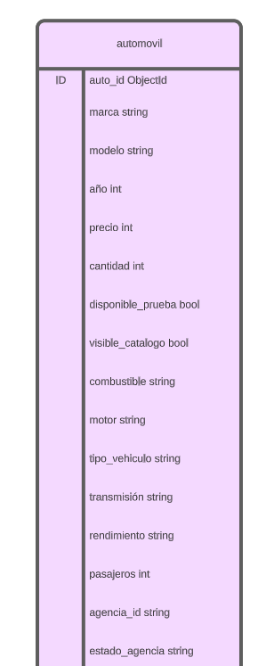
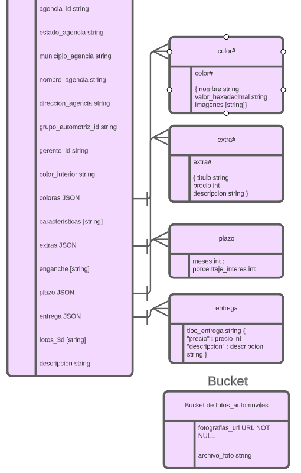
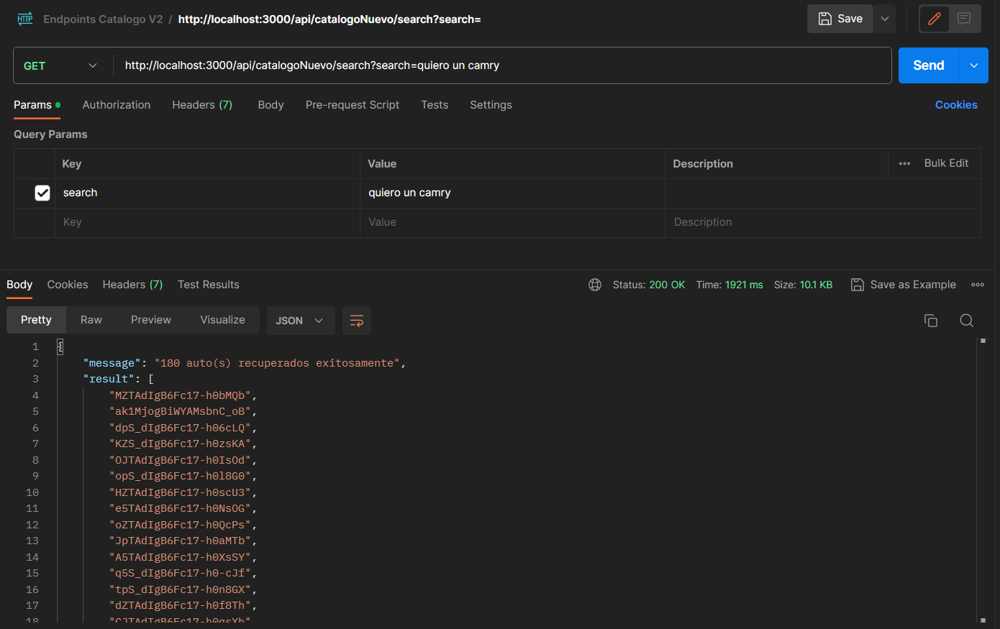
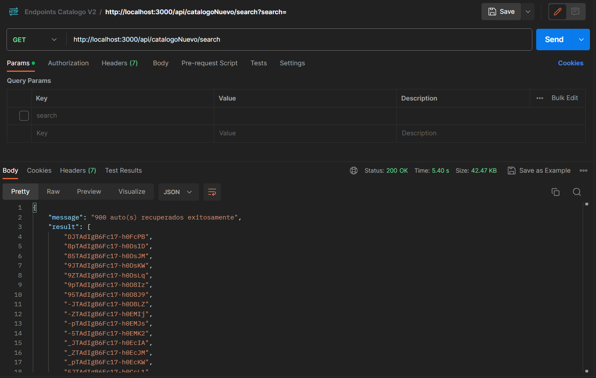
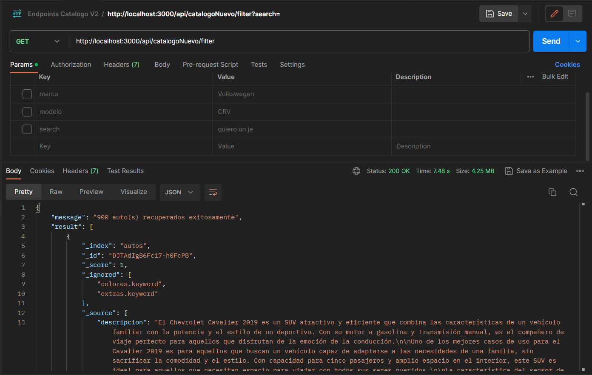
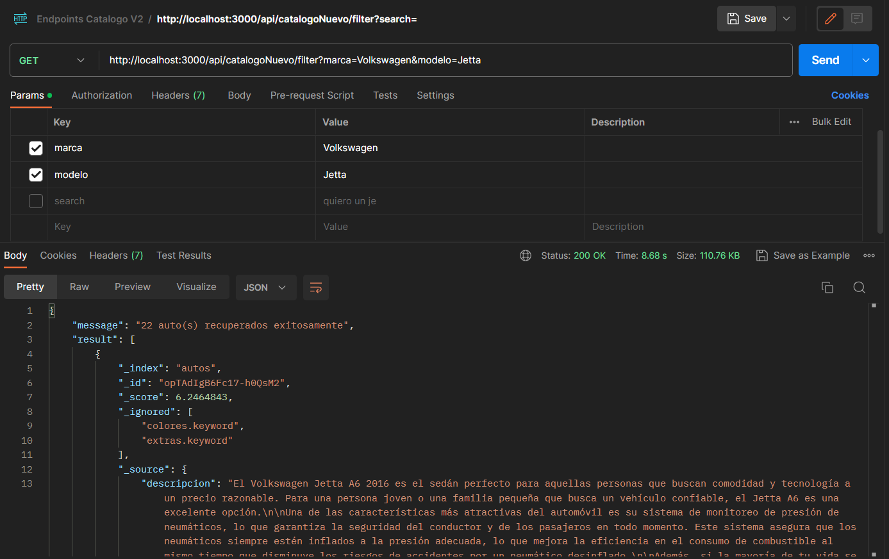
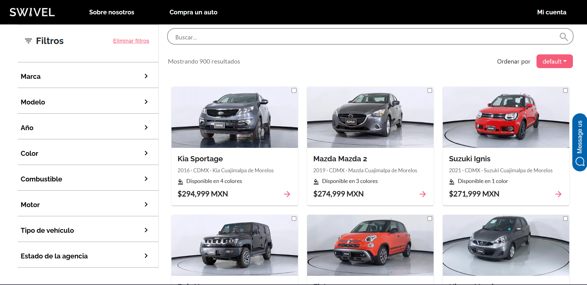
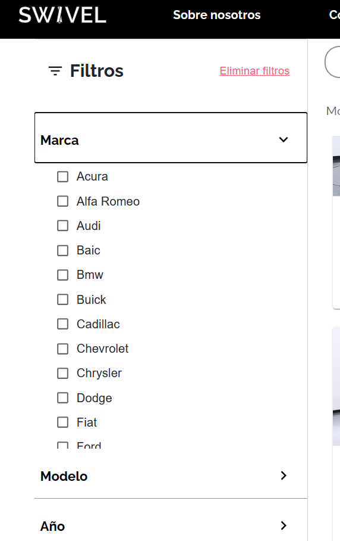

# Catálogo Comprador

Sebastián González Villacorta
A01029746

## Introducción

Este módulo es una parte fundamental de la plataforma, pues es donde los usuario compradores pueden ver el catálogo completo de autos disponibles para la venta, así como también pueden ver los detalles de cada uno de ellos, y en caso de que les interese, pueden empezar su proceso de compra.

## Componentes y Módulos

## Base de Datos

La base de datos de este módulo esta almacenada en ElasticSearch, lo cuál nos permite hacer búsquedas de texto completo, y también nos permite hacer búsquedas por filtros, como por ejemplo, por marca, modelo, año, etc. La base de datos está compuesta por el indice "autos" los cuales.

La conexión a ElasticSearch se hace por medio de un cliente de la librería de node llamada elasticsearch, en donde se establece la dirección del recurso en la nube y la API key para la conexión segura, todo esto dentro de los Endpoints del módulo.

El almacenamiento de un auto en la base de datos se ve de la siguiente manera:




## Procesamiento de Solicitudes
El servicio utiliza HTTPS para mandar requests a los endpoints REST que son parte de la aplicación y son los que acceden a la base de datos para obtener los autos. En este caso solo se utiliza el método http GET.

Los endpoints para obtener los datos del catálogo son los siguientes

### /search

#### Descripción
Este endpoint tiene la función de habilitar la búsqueda por lenguaje natural con un query personalizado de ElasticSearch. Regresa un mensaje de si se encontraron autos y una lista de los ids de los autos encontrados según la búsqueda. Adicionalmente se regresa un diccionario de los puntajes de cada auto para su acomodo posteriormente. Este puntaje indica cuanto se acerca un auto a la búsqueda introducida por el usuario. Este endpoint funciona en conjunto con el endpoint de /filter.

#### Método
El método para la obtención de los autos es GET.

#### Request
El endpoint recibe como propiedad de sus parametros de query el campo de search, el cuál incluye el texto introducido por el usuario en la barra de búsqueda. Este texto puede venir vacío, y es en ese caso que se regresan todos los autos disponibles en el catálogo.

_Ejemplo:_


Ejemplo de un query con búsqueda


Ejemplo de un query sin búsqueda

#### Recursos
El recurso al que accede este endpoint es el indice "autos" de ElasticSearch. Esta herramienta es la que se encarga de recuperar los autos que más se apeguen a la búsqueda del usuario.

#### URL
Para poder hacer requests a este endpoint se utiliza el siguiente path:

/api/catalogoNuevo/search

#### Respuesta
Se regresa un objeto tipo JSON que contiene un mensaje, una lista de los ids de los autos encontrados y el diccionario de puntajes. Este es un ejemplo de una respuesta exitosa

```json 
{
    "message": "54 auto(s) recuperados exitosamente",
    "result": [
        "0pTAdIgB6Fc17-h0UMNd",
        "LpTAdIgB6Fc17-h0a8Q_",
        "gpTAdIgB6Fc17-h0g8Sl",
        "opS_dIgB6Fc17-h0l8G0",
        "CJTAdIgB6Fc17-h0qsXh",
        "SZTAdIgB6Fc17-h0J8OE",
        "1JTAdIgB6Fc17-h0BcJS",
        "E5S_dIgB6Fc17-h0xcKz",
        "qZS_dIgB6Fc17-h0-MLN",
        "ApTAdIgB6Fc17-h0EsPD",
        "UZTAdIgB6Fc17-h0dcRh",
        "FZTAdIgB6Fc17-h0Y8TL",
        "15TAdIgB6Fc17-h0BsI5",
        "7ZS_dIgB6Fc17-h0tsGA",
        "UpS_dIgB6Fc17-h038JM",
        "tpS_dIgB6Fc17-h0_MKP",
        "tpS_dIgB6Fc17-h0n8GX",
        "2pTAdIgB6Fc17-h0UsO0",
        "tpTAdIgB6Fc17-h0ksTn",
        "KZTAdIgB6Fc17-h0acS1",
        "DZTAdIgB6Fc17-h0YcR-",
        "I5TAdIgB6Fc17-h0Z8T_",
        "c5TAdIgB6Fc17-h0f8RP",
        "nJTAdIgB6Fc17-h0QMN2",
        "5pS_dIgB6Fc17-h0s8G0",
        "O5TAdIgB6Fc17-h0vcVO",
        "wpTAdIgB6Fc17-h0S8OS",
        "_ZTAdIgB6Fc17-h0EcJM",
        "K5TAdIgB6Fc17-h0asRf",
        "3pS_dIgB6Fc17-h0sMGB",
        "rZS_dIgB6Fc17-h0-cLy",
        "OZTAdIgB6Fc17-h0vMWB",
        "E5TAdIgB6Fc17-h0Y8Q5",
        "6JTAdIgB6Fc17-h0C8Ic",
        "W5TAdIgB6Fc17-h0LMPL",
        "dpTAdIgB6Fc17-h0NcMQ",
        "x5TAdIgB6Fc17-h0TcMd",
        "4pS_dIgB6Fc17-h0ssEa",
        "EJS_dIgB6Fc17-h0xMKD",
        "0pS_dIgB6Fc17-h0q8FO",
        "tJTAdIgB6Fc17-h0ksRQ",
        "LpTAdIgB6Fc17-h0uMUa",
        "1pTAdIgB6Fc17-h0UcOK",
        "MpTAdIgB6Fc17-h0bMRk",
        "KpS_dIgB6Fc17-h0zsLQ",
        "YpS_dIgB6Fc17-h048L1",
        "wJS_dIgB6Fc17-h0o8G0",
        "M5TAdIgB6Fc17-h0IcMr",
        "U5TAdIgB6Fc17-h0dsQB",
        "FpTAdIgB6Fc17-h0GMOk",
        "25S_dIgB6Fc17-h0r8FO",
        "e5S_dIgB6Fc17-h0iMEa",
        "NJTAdIgB6Fc17-h0bMT5",
        "JpS_dIgB6Fc17-h0zcJN"
    ],
    "score": {
        "0pTAdIgB6Fc17-h0UMNd": 11.65332,
        "LpTAdIgB6Fc17-h0a8Q_": 11.593325,
        "gpTAdIgB6Fc17-h0g8Sl": 7.452157,
        "opS_dIgB6Fc17-h0l8G0": 5.0333104,
        "CJTAdIgB6Fc17-h0qsXh": 4.625866,
        "SZTAdIgB6Fc17-h0J8OE": 4.312936,
        "1JTAdIgB6Fc17-h0BcJS": 4.2458525,
        "E5S_dIgB6Fc17-h0xcKz": 4.191211,
        "qZS_dIgB6Fc17-h0-MLN": 3.981206,
        "ApTAdIgB6Fc17-h0EsPD": 3.969317,
        "UZTAdIgB6Fc17-h0dcRh": 3.968349,
        "FZTAdIgB6Fc17-h0Y8TL": 3.91995,
        "15TAdIgB6Fc17-h0BsI5": 3.8232954,
        "7ZS_dIgB6Fc17-h0tsGA": 3.7998002,
        "UpS_dIgB6Fc17-h038JM": 3.7998002,
        "tpS_dIgB6Fc17-h0_MKP": 3.7948313,
        "tpS_dIgB6Fc17-h0n8GX": 3.7519326,
        "2pTAdIgB6Fc17-h0UsO0": 3.7317674,
        "tpTAdIgB6Fc17-h0ksTn": 3.7317674,
        "KZTAdIgB6Fc17-h0acS1": 3.721234,
        "DZTAdIgB6Fc17-h0YcR-": 3.656095,
        "I5TAdIgB6Fc17-h0Z8T_": 3.6463628,
        "c5TAdIgB6Fc17-h0f8RP": 3.5831199,
        "nJTAdIgB6Fc17-h0QMN2": 3.5831199,
        "5pS_dIgB6Fc17-h0s8G0": 3.5831199,
        "O5TAdIgB6Fc17-h0vcVO": 3.4861822,
        "wpTAdIgB6Fc17-h0S8OS": 3.4861822,
        "_ZTAdIgB6Fc17-h0EcJM": 3.3945203,
        "K5TAdIgB6Fc17-h0asRf": 3.3945203,
        "3pS_dIgB6Fc17-h0sMGB": 3.3945203,
        "rZS_dIgB6Fc17-h0-cLy": 3.3356996,
        "OZTAdIgB6Fc17-h0vMWB": 3.2212524,
        "E5TAdIgB6Fc17-h0Y8Q5": 3.2212524,
        "6JTAdIgB6Fc17-h0C8Ic": 3.1143985,
        "W5TAdIgB6Fc17-h0LMPL": 3.1143985,
        "dpTAdIgB6Fc17-h0NcMQ": 3.1143985,
        "x5TAdIgB6Fc17-h0TcMd": 3.1143985,
        "4pS_dIgB6Fc17-h0ssEa": 3.1143985,
        "EJS_dIgB6Fc17-h0xMKD": 3.1143985,
        "0pS_dIgB6Fc17-h0q8FO": 3.1143985,
        "tJTAdIgB6Fc17-h0ksRQ": 3.1143985,
        "LpTAdIgB6Fc17-h0uMUa": 3.014406,
        "1pTAdIgB6Fc17-h0UcOK": 3.014406,
        "MpTAdIgB6Fc17-h0bMRk": 3.014406,
        "KpS_dIgB6Fc17-h0zsLQ": 3.014406,
        "YpS_dIgB6Fc17-h048L1": 3.014406,
        "wJS_dIgB6Fc17-h0o8G0": 3.014406,
        "M5TAdIgB6Fc17-h0IcMr": 2.9206343,
        "U5TAdIgB6Fc17-h0dsQB": 2.9206343,
        "FpTAdIgB6Fc17-h0GMOk": 2.9206343,
        "25S_dIgB6Fc17-h0r8FO": 2.9206343,
        "e5S_dIgB6Fc17-h0iMEa": 2.8325205,
        "NJTAdIgB6Fc17-h0bMT5": 2.8325205,
        "JpS_dIgB6Fc17-h0zcJN": 2.8325205
    }
}

```

#### Códigos de Estado HTTP
- 200: Se econtraron autos y se regresó la lista de ids y los puntajes
- 400: Método no permitido
- 404: No se encontraron autos
- 500: Error al buscar los autos

### /filter

#### Descripción
Este endpoint tiene la función de habilitar la búsqueda por filtros con un query que se arma dinámicamente dependiendo de las selecciones del usuario y los ids encontrados previamente en el endpoint de /search. Este endpoint permite filtrar sobre los resultado de la búsqueda por lenguaje natural así como hacer una búsqueda sin este. De igual manera en este endpoint se acomodan los resultados utilizando el diccionario que es parte de la respuesta del endpoint de /search. Regresa la información completa de los autos encontrados así como los filtros disponibles según los resultados previos.

#### Método
El método para la obtención de los autos es GET.

#### Request
El endpoint recibe como propiedad de sus parametros de query diferentes campos como las ids encontradas previamente en el endpoint de /search, la marca seleccionada, el modelo seleccionado, etc.

Con estos valores se arma dinámicamente el query que se le va a mandar posteriormente a ElasticSearch para recuperar los autos.

_Ejemplo:_


Ejemplo de query sin filtros seleccionados


Ejemplo de query con filtros seleccionados

#### Recursos
El recurso al que accede este endpoint es el indice "autos" de ElasticSearch. Esta herramienta es la que se encarga de recuperar los autos que más se apeguen a los filtros seleccionados por el usuario y los coches encontrados en el endpoint de /search.

#### URL
Para poder hacer requests a este endpoint se utiliza el siguiente path:

/api/catalogoNuevo/filter

#### Respuesta
Se regresa un objeto tipo JSON que contiene un mensaje, una lista de los objetos de auto completos, un objeto de los filtros disponibles y un objeto de los titulos de los filtros. Este es un ejemplo de una respuesta exitosa

```json 
{
    "message": "22 auto(s) recuperados exitosamente",
    "result": [
        {
            "_index": "autos",
            "_id": "opTAdIgB6Fc17-h0QsM2",
            "_score": 6.2464843,
            "_ignored": [
                "colores.keyword",
                "extras.keyword"
            ],
            "_source": {
                "descripcion": "El Volkswagen Jetta A6 2016 es el sedán perfecto para aquellas personas que buscan comodidad y tecnología a un precio razonable. Para una persona joven o una familia pequeña que busca un vehículo confiable, el Jetta A6 es una excelente opción.\n\nUna de las características más atractivas del automóvil es su sistema de monitoreo de presión de neumáticos, lo que garantiza la seguridad del conductor y de los pasajeros en todo momento. Este sistema asegura que los neumáticos siempre estén inflados a la presión adecuada, lo que mejora la eficiencia en el consumo de combustible al mismo tiempo que disminuye los riesgos de accidentes por un neumático desinflado.\n\nAdemás, si la mayoría de tu vida se desarrolla centrada en el uso del teléfono móvil, la tecnología Bluetooth del Jetta A6 se convierte en otro elemento imprescindible en tu día a día. Con ella podrás conectar tu dispositivo móvil sin necesidad de cables, permitiendo escuchar música, transmisiones de audio y llamadas con manos libres mientras conduces.\n\nPor último, los asientos con calefacción añaden mayor comodidad a los calientes asientos recubiertos en cuero. Ideal para viajes largos o para climas frescos, el control climático permite a los ocupantes mantener la temperatura interna del coche según su preferencia.\n\nSituaciones como trasladarse al trabajo, ir a visitar a la familia o incluso viajar con amigos, serán mucho más agradables en un vehículo como este. El Jetta A6 tiene todas las características que podemos necesitar, sin excederse en el presupuesto y siendo un sedán muy maniobrable.\n\nEn resumen, el Volkswagen Jetta A6 2016 puede considerarse el coche ideal para quienes buscan una experiencia de conducción segura, confortable y con tecnología a la mano. Si deseas adquirir un automóvil práctico y económico, con características que se ajusten a tu estilo de vida, el Jetta A6 es una excelente opción. Motor V6 6 pasajeros Colores: Gris Medio, Gris Oscuro, Azul Oscuro Extras: Sistema de Aviso de Cambio de Carril, Sistema de Asistencia de Mantenimiento de Carril, Volante Forrado en Cuero, Sistema de Frenos de Disco, Asientos Calefaccionados.",
                "motor": "V6",
                "caracteristicas": "['Sistema de monitoreo de presión de neumáticos', 'Tecnología Bluetooth', 'Asientos con calefacción']",
                "estado_agencia": "CDMX",
                "nombre_agencia": "Honda Santa Fe",
                "tipo_vehiculo": "Sedán",
                "colores": "[{'nombre': 'Gris Medio', 'valor_hexadecimal': '#808080', 'imagenes': ['https://images.prd.kavak.io/eyJidWNrZXQiOiJrYXZhay1pbWFnZXMiLCJrZXkiOiJpbWFnZXMvMTY1NzA1L0VYVEVSSU9SLWZyb250U2lkZVBpbG90TmVhci0xNjQzOTA3MzQ4Mjc3LmpwZWciLCJlZGl0cyI6eyJyZXNpemUiOnsid2lkdGgiOjU0MCwiaGVpZ2h0IjozMTB9fX0=']}, {'nombre': 'Gris Oscuro', 'valor_hexadecimal': '#696969', 'imagenes': ['https://images.prd.kavak.io/eyJidWNrZXQiOiJrYXZhay1pbWFnZXMiLCJrZXkiOiJpbWFnZXMvMTY1NzA1L0VYVEVSSU9SLWZyb250U2lkZVBpbG90TmVhci0xNjQzOTA3MzQ4Mjc3LmpwZWciLCJlZGl0cyI6eyJyZXNpemUiOnsid2lkdGgiOjU0MCwiaGVpZ2h0IjozMTB9fX0=']}, {'nombre': 'Azul Oscuro', 'valor_hexadecimal': '#00008B', 'imagenes': ['https://images.prd.kavak.io/eyJidWNrZXQiOiJrYXZhay1pbWFnZXMiLCJrZXkiOiJpbWFnZXMvMTYwMTQ4L0VYVEVSSU9SLWZyb250U2lkZVBpbG90TmVhci0xNjQyODA0MTcxMjA1LmpwZWciLCJlZGl0cyI6eyJyZXNpemUiOnsid2lkdGgiOjU0MCwiaGVpZ2h0IjozMTB9fX0=']}]",
                "extras": "[{'titulo': 'Sistema de Aviso de Cambio de Carril', 'precio': 6500.0, 'descripcion': 'Alerta al conductor cuando se produce un cambio de carril involuntario'}, {'titulo': 'Sistema de Asistencia de Mantenimiento de Carril', 'precio': 7500.0, 'descripcion': 'Ayuda a mantener el vehículo en el centro del carril de manera automática'}, {'titulo': 'Volante Forrado en Cuero', 'precio': 3000.0, 'descripcion': 'Proporciona un agarre suave y cómodo durante la conducción'}, {'titulo': 'Sistema de Frenos de Disco', 'precio': 5000.0, 'descripcion': 'Proporciona un frenado más eficiente y seguro'}, {'titulo': 'Asientos Calefaccionados', 'precio': 5000.0, 'descripcion': 'Proporciona calor en los asientos para mayor confort en climas fríos'}]",
                "municipio_agencia": "Cuajimalpa de Morelos",
                "ficha_tecnica": "https://github.com/SFMBa01029956/TC3005B.501",
                "coordenadas_agencia": "19.3595155,-99.2806805",
                "marca": "Volkswagen",
                "precio": 226999,
                "transmision": "Manual",
                "litros": "2",
                "entrega": "[{'nombre': 'Domicilio', 'precio': 8047, 'descripcion': 'Lo llevamos a la puerta de tu casa'}, {'nombre': 'Recoger en Agencia', 'precio': 0.0, 'descripcion': 'Recoge tu auto en la agencia GRATIS'}]",
                "direccion_agencia": "Juan Salvador Agraz No. 50, Lomas de Santa Fe, Contadero, Cuajimalpa de Morelos, 05348 Ciudad de México, CDMX",
                "gerente_id": "64883af4ce5aad58d77b287f",
                "enganche": "[35]",
                "pasajeros": 6,
                "plazos": "{'12': 4.5, '24': 4.6, '36': 4.7, '48': 4.9, '60': 5.1}",
                "agencia_id": "64883a6dce5aad58d77b287c",
                "modelo": "Jetta A6",
                "combustible": "Gasolina",
                "fotos_3d": "['https://images.prd.kavak.io/eyJidWNrZXQiOiJrYXZhay1pbWFnZXMiLCJrZXkiOiJpbWFnZXMvMTY1NzA1L0VYVEVSSU9SLWZyb250U2lkZVBpbG90TmVhci0xNjQzOTA3MzQ4Mjc3LmpwZWciLCJlZGl0cyI6eyJyZXNpemUiOnsid2lkdGgiOjU0MCwiaGVpZ2h0IjozMTB9fX0=']",
                "rendimiento": 12.3,
                "año": 2016,
                "vistas": 8,
                "cantidad": 2,
                "nombre_grupo_automotriz": "Calabria Automotriz",
                "grupo_automotriz_id": "64883904ce5aad58d77b2874",
                "score": 1
            }
        },
 ...
```


#### Códigos de Estado HTTP
- 200: Se econtraron autos y se regresaron los autos encontrados y los filtros acotados
- 400: Método no permitido
- 404: No se encontraron autos
- 500: Error al buscar los autos

## Interfaz de Usuario
La interfaz de usuario de este componente tiene como propósito proporcionar de una manera ordenada y cómoda la información encontrada al usuario. La interfaz se compone por tres partes principales: Filtros, Barra de Búsqueda y Listing.


Captura de Pantalla de Componente completo de Catálogo

### Filtros
Este componente muestra la lista de categorías de filtros disponibles de manera colapsada. Cuando se presiona la categoría deseada se despliega la lista completa de filtros disponibles. Cada filtro tiene una checkbox con la cuál el usuario puede seleccionarlo. Adicionalmente existe un botón de eliminar todos los filtros y reiniciar la búsqueda.


<br></br>
Captura de pantalla de los filtros expandidos

### Barra de Búsqueda 
Este componente se encuentra en la parte superior de la pantalla y cubre el mismo ancho que el Listing. Su función es ser el campo de entrada en donde el usuario puede introducir su búsqueda en lenguaje coloquial. Incluye un ícono de una lupa para aclarar su propósito.

### Listing
Por último el Listing ocupa la mayor parte de la pantalla, ya que es el componente principal del módulo. Este incluye los autos recuperados desplegados como tarjetas que incluyen la información básica del coche. Estas tarjetas se pueden presionar para continuar a visualizar la pantalla de detalle del auto. De igual manera cuenta con ordenamiento y paginación para poder ordenar los resultados según el parámetro seleccionado y desplegar el contenido en diferentes páginas con el propósito de hacer la navegación más cómoda para el usuario.
