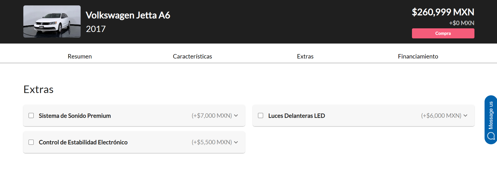

# Detalle de Auto Comprador

Sebastián González Villacorta
A01029746

## Introducción
El módulo que se describe a continuación forma parte del flujo de un usuario comprador. Este módulo es el encargado de desplegar la información acerca del auto selccionado por el usuario desde el catálogo para seleccionar las características deseadas y comenzar un proceso de compra.

## Componentes y Módulos

## Base de Datos
La base de datos de este módulo esta almacenada en ElasticSearch, lo cuál nos permite hacer búsquedas de texto completo, y también nos permite hacer búsquedas por filtros, como por ejemplo, por marca, modelo, año, etc. La base de datos está compuesta por el indice "autos" los cuales.

La conexión a ElasticSearch se hace por medio de un cliente de la librería de node llamada elasticsearch, en donde se establece la dirección del recurso en la nube y la API key para la conexión segura, todo esto dentro de los Endpoints del módulo.

El almacenamiento de un auto en la base de datos se ve de la siguiente manera:

## Procesamiento de Solicitudes
El servicio utiliza HTTPS para mandar requests a los endpoints REST que son parte de la aplicación y son los que acceden a la base de datos para obtener los autos. En este caso solo se utiliza el método http GET.

Los endpoints para obtener los datos del auto seleccionado por el usuario y crear un proceso de compra son los siguientes

## Endpoints
### /detalles-auto

#### Descripción
Este endpoint tiene la función de recuperar la información acerca de un auto según su id de la base de datos. Este endpoint recibe el id del auto que se quiere recuperar y regresa como respuesta el objeto del auto completo.

#### Método
El método para la obtención del auto es GET.

#### Request
El endpoint recibe como propiedad de sus parametros de query el campo de car_id para hacer la búsqueda en la base de datos.

_Ejemplo:_


#### Recursos
El recurso al que accede este endpoint es el indice "autos" de ElasticSearch. Esta herramienta es la que se encarga de recuperar el auto deseado.

#### URL
Para poder hacer requests a este endpoint se utiliza el siguiente path:

/api/catalogoNuevo/detalles-auto

#### Respuesta
Se regresa un objeto tipo JSON que contiene un mensaje y el objeto del auto recuperado. Este es un ejemplo de una respuesta exitosa.

```json 
{
    "message": "Detalles de Auto recuperados exitosamente",
    "result": {
        "descripcion": "El Volkswagen Jetta A6 2016 es el sedán perfecto para aquellas personas que buscan comodidad y tecnología a un precio razonable. Para una persona joven o una familia pequeña que busca un vehículo confiable, el Jetta A6 es una excelente opción.\n\nUna de las características más atractivas del automóvil es su sistema de monitoreo de presión de neumáticos, lo que garantiza la seguridad del conductor y de los pasajeros en todo momento. Este sistema asegura que los neumáticos siempre estén inflados a la presión adecuada, lo que mejora la eficiencia en el consumo de combustible al mismo tiempo que disminuye los riesgos de accidentes por un neumático desinflado.\n\nAdemás, si la mayoría de tu vida se desarrolla centrada en el uso del teléfono móvil, la tecnología Bluetooth del Jetta A6 se convierte en otro elemento imprescindible en tu día a día. Con ella podrás conectar tu dispositivo móvil sin necesidad de cables, permitiendo escuchar música, transmisiones de audio y llamadas con manos libres mientras conduces.\n\nPor último, los asientos con calefacción añaden mayor comodidad a los calientes asientos recubiertos en cuero. Ideal para viajes largos o para climas frescos, el control climático permite a los ocupantes mantener la temperatura interna del coche según su preferencia.\n\nSituaciones como trasladarse al trabajo, ir a visitar a la familia o incluso viajar con amigos, serán mucho más agradables en un vehículo como este. El Jetta A6 tiene todas las características que podemos necesitar, sin excederse en el presupuesto y siendo un sedán muy maniobrable.\n\nEn resumen, el Volkswagen Jetta A6 2016 puede considerarse el coche ideal para quienes buscan una experiencia de conducción segura, confortable y con tecnología a la mano. Si deseas adquirir un automóvil práctico y económico, con características que se ajusten a tu estilo de vida, el Jetta A6 es una excelente opción. Motor V6 6 pasajeros Colores: Gris Medio, Gris Oscuro, Azul Oscuro Extras: Sistema de Aviso de Cambio de Carril, Sistema de Asistencia de Mantenimiento de Carril, Volante Forrado en Cuero, Sistema de Frenos de Disco, Asientos Calefaccionados.",
        "motor": "V6",
        "caracteristicas": [
            "Sistema de monitoreo de presión de neumáticos",
            "Tecnología Bluetooth",
            "Asientos con calefacción"
        ],
        "estado_agencia": "CDMX",
        "nombre_agencia": "Honda Santa Fe",
        "tipo_vehiculo": "Sedán",
        "colores": [
            {
                "nombre": "Gris Medio",
                "valor_hexadecimal": "#808080",
                "imagenes": [
                    "https://images.prd.kavak.io/eyJidWNrZXQiOiJrYXZhay1pbWFnZXMiLCJrZXkiOiJpbWFnZXMvMTY1NzA1L0VYVEVSSU9SLWZyb250U2lkZVBpbG90TmVhci0xNjQzOTA3MzQ4Mjc3LmpwZWciLCJlZGl0cyI6eyJyZXNpemUiOnsid2lkdGgiOjU0MCwiaGVpZ2h0IjozMTB9fX0="
                ]
            },
            {
                "nombre": "Gris Oscuro",
                "valor_hexadecimal": "#696969",
                "imagenes": [
                    "https://images.prd.kavak.io/eyJidWNrZXQiOiJrYXZhay1pbWFnZXMiLCJrZXkiOiJpbWFnZXMvMTY1NzA1L0VYVEVSSU9SLWZyb250U2lkZVBpbG90TmVhci0xNjQzOTA3MzQ4Mjc3LmpwZWciLCJlZGl0cyI6eyJyZXNpemUiOnsid2lkdGgiOjU0MCwiaGVpZ2h0IjozMTB9fX0="
                ]
            },
            {
                "nombre": "Azul Oscuro",
                "valor_hexadecimal": "#00008B",
                "imagenes": [
                    "https://images.prd.kavak.io/eyJidWNrZXQiOiJrYXZhay1pbWFnZXMiLCJrZXkiOiJpbWFnZXMvMTYwMTQ4L0VYVEVSSU9SLWZyb250U2lkZVBpbG90TmVhci0xNjQyODA0MTcxMjA1LmpwZWciLCJlZGl0cyI6eyJyZXNpemUiOnsid2lkdGgiOjU0MCwiaGVpZ2h0IjozMTB9fX0="
                ]
            }
        ],
        "extras": [
            {
                "titulo": "Sistema de Aviso de Cambio de Carril",
                "precio": 6500,
                "descripcion": "Alerta al conductor cuando se produce un cambio de carril involuntario"
            },
            {
                "titulo": "Sistema de Asistencia de Mantenimiento de Carril",
                "precio": 7500,
                "descripcion": "Ayuda a mantener el vehículo en el centro del carril de manera automática"
            },
            {
                "titulo": "Volante Forrado en Cuero",
                "precio": 3000,
                "descripcion": "Proporciona un agarre suave y cómodo durante la conducción"
            },
            {
                "titulo": "Sistema de Frenos de Disco",
                "precio": 5000,
                "descripcion": "Proporciona un frenado más eficiente y seguro"
            },
            {
                "titulo": "Asientos Calefaccionados",
                "precio": 5000,
                "descripcion": "Proporciona calor en los asientos para mayor confort en climas fríos"
            }
        ],
        "municipio_agencia": "Cuajimalpa de Morelos",
        "ficha_tecnica": "https://github.com/SFMBa01029956/TC3005B.501",
        "coordenadas_agencia": "19.3595155,-99.2806805",
        "marca": "Volkswagen",
        "precio": 226999,
        "transmision": "Manual",
        "litros": "2",
        "entrega": [
            {
                "nombre": "Domicilio",
                "precio": 8047,
                "descripcion": "Lo llevamos a la puerta de tu casa"
            },
            {
                "nombre": "Recoger en Agencia",
                "precio": 0,
                "descripcion": "Recoge tu auto en la agencia GRATIS"
            }
        ],
        "direccion_agencia": "Juan Salvador Agraz No. 50, Lomas de Santa Fe, Contadero, Cuajimalpa de Morelos, 05348 Ciudad de México, CDMX",
        "gerente_id": "64883af4ce5aad58d77b287f",
        "enganche": [
            35
        ],
        "pasajeros": 6,
        "plazos": {
            "12": 4.5,
            "24": 4.6,
            "36": 4.7,
            "48": 4.9,
            "60": 5.1
        },
        "agencia_id": "64883a6dce5aad58d77b287c",
        "modelo": "Jetta A6",
        "combustible": "Gasolina",
        "fotos_3d": [
            "https://images.prd.kavak.io/eyJidWNrZXQiOiJrYXZhay1pbWFnZXMiLCJrZXkiOiJpbWFnZXMvMTY1NzA1L0VYVEVSSU9SLWZyb250U2lkZVBpbG90TmVhci0xNjQzOTA3MzQ4Mjc3LmpwZWciLCJlZGl0cyI6eyJyZXNpemUiOnsid2lkdGgiOjU0MCwiaGVpZ2h0IjozMTB9fX0="
        ],
        "rendimiento": 12.3,
        "año": 2016,
        "vistas": 8,
        "cantidad": 2,
        "nombre_grupo_automotriz": "Calabria Automotriz",
        "grupo_automotriz_id": "64883904ce5aad58d77b2874"
    }
}

```

#### Códigos de Estado HTTP
- 200: Se recuperó el auto exitosamente
- 400: Método no permitido
- 404: No se econtró auto
- 500: Error al recuperar auto

### /saleCreation/with-mongo

#### Descripción
#### Método
#### Request
#### Recursos
#### URL
#### Respuesta
#### Códigos de Estado HTTP
#### Código

## Interfaz de Usuario
La interfaz de usuario de este componente tiene como propósito desplegar toda la información pertinente acerca del vehículo seleccionado, así como las opciones para personalizar el mismo y un componente de resumen de compra para concluir creando el proceso de compra.

### Auto
En esta parte se muestra información general del auto como nombre, marca, año, imagen, ubicación y colores disponibles. Desde este componente se puede hacer la selección del color que se desea comprar.


### Resumen del Auto
En esta sección se muestran características generales del auto como combustible, transmisión, rendimiento, motor, tipo, etc.


### Características
En esta sección se muestra una lista de más características particulares del auto subido por la agencia.


### Extras
En la parte de extras se muestran como opciones seleccionables las opciones de personalización del vehículo propuestas por la agencia. Cada una incluye un titulo, el precio y una breve descripción.



### Financiamiento
La herramienta de selección de financiamiento consta de dos barras deslizables para permitir al usuario la selección de sus detalles de financiamiento. La primera permite la selección del porcentaje de enganche de una lista de valores establecidos por la agencia. La segunda permite la selección del plazo deseado de una lista igualmente establecida por la agencia. A cada plazo le corresponde una tasa de interés.

Por último se muestra también el total a pagar por cada mensualidad según los parámetros elegidos por el usuario.

### Entrega
En esta última sección se muestra una lista de componentes seleccionables de métodos de entrega. Cada opción incluye un titulo, descripción y precio.


### Modal de Resumen de Compra
Cuando se presionar el botón de comprar y una sesión está iniciada, se muestra una pantalla de resumen de compra en la que se muestra el desglose de precios de las selecciones que realizó el usuario. En esta pantalla también se muestra un botón que al presionarse crea el proceso de compra y redirecciona al usuario a la pantalla de entrega de documentos.


