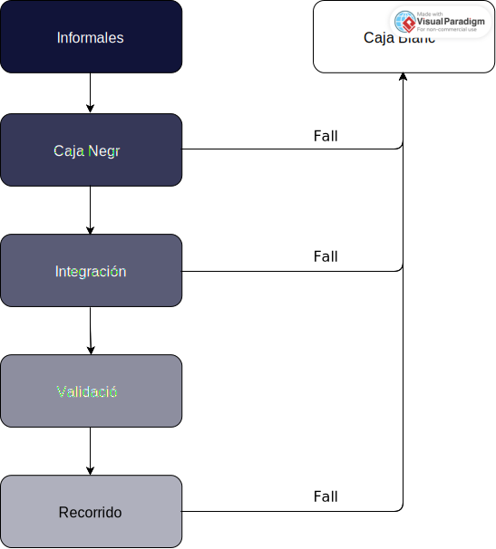

    

    

<h2 align="center"> Plan de Pruebas

| Date       | Version | Description  |  
|------------|:-------:| :----------- |
| 26/02/2023 | 0.1     | Creación del Doc SRS |
| 02/04/2023 | 1     | Plan de Pruebas by Pulse Studios |
| 25/04/2023 | 2     | Plan de Pruebas Final |

# Índice

1. [**Introducción**](#1-introducción)

2. [**Estrategia de Pruebas**](#2-estrategia-de-pruebas)

3. [**Manejo de Pruebas**](#3-manejo-de-pruebas)

4. [**Ambiente de pruebas**](#4-ambiente-de-pruebas)

5. [**Plantillas de Pruebas**](#5-plantilla-de-pruebas)

6. [**Conclusiones**](#6-conclusiones)

# 1. Introducción
## 1.1 Objetivo
El objetivo del presente documento, es proveer una propuesta respecto a las pruebas de software necesarias para el desarrollo y la funcionalidad correcta de la aplicación web de adquisición de autos. Estas contribuirán en la creación de un producto con un control de calidad alto por lo que serán detalladas y argumentadas en este escrito.

En cuanto al plan de pruebas que se realizará, este incluirá la especificación de elementos de software que serán probados, el nivel y la secuencia en la que serán probados, los criterios de salida y la manera en la que se aplicará la estrategia en el ambiente de pruebas. Cabe mencionar, que quién desarrollará las pruebas es todo el equipo de desarrolladores junto con los leads. Junto con lo anterior, se considerarán los siguientes puntos:
- Lo que está dentro y fuera del alcance
- Supuestos
- Roles y responsabilidades del equipo QA
- Herramientas
- Entregables
- Gestión de Defectos
- Riesgos
- Calendario

Es relevante recalcar que el presente documento será organizado de manera que se especifiquen claramente las dos vertientes principales de pruebas: dinámicas y estáticas.

## 1.2 Descripción del Proyecto
El proyecto que será desarrollado por Pulse Technologies, se trata de una solución para grupos automotrices y compradores de autos en donde se permitirá digitalizar una parte del proceso de compra, evitando visitas excesivas a las agencias. Dicha solución está planteada como una aplicación web que permitirá a los usuarios interactuar con el agente, explorar distintas opciones de autos, obtener cotizaciones estimadas automáticamente, comparar autos, subir y editar sus documentos, solicitar pruebas de manejo y mantener un seguimiento adecuado (con la misma calidad de atención que en una agencia tradicional) de sus compras.

La aplicación beneficiará a los clientes de las agencias ya que les ahorrará tiempo, les proporcionará opciones de distintas marcas y agencias (con distintos planes de financiamiento) en una misma plataforma, y les permitirá tener una visión más clara de lo que quieren. Asimismo, beneficiará a las agencias y grupos automotrices, dándoles un espacio en el que tendrán visibilidad, la posibilidad de agilizar ciertos procesos (como lo es el de la entrega de documentos del cliente) para poder atender a más clientes y la posibilidad de obtener ciertas estadísticas que les podrán ayudar a analizar sus ventas.

## 1.3 Audiencia
En cuanto a la audiencia, es necesario separar claramente a las entidades involucradas para las pruebas dinámicas y para las pruebas estáticas. 

## Funcionales
### Dinámicas
Puesto a que las pruebas dinámicas requieren de la ejecución del código, su audiencia principal son los desarrolladores (quienes generan en código, lo modifican y verifican que funcione dicho código). De igual manera, aquellos encargados de diseñar las pruebas estarán involucrados en las pruebas dinámicas ya que tendrán que planearlas. 

### Estáticas
En cuanto a las pruebas estáticas - que se basan en la revisión de productos de trabajo sin código -, estas involucran a los encargados de diseñar las pruebas (ya que mediante la revisión del trabajo podrán planear mejores pruebas), al Product Owner (quien tiene la visión de la perspectiva del cliente por lo que puede evaluar si se cumplen las necesidades del mismo), el Project Manager (quien supervisará que se lleve a cabo el proyecto correctamente y se entreguen las pruebas adecuadas), y cualquier otro participante del producto que quiera revisar los documentos y asegurar la calidad del mismo. 

## No Funcionales
### Prueba de estrés 
Debido a la naturaleza de la prueba (se basa en explorar la capacidad de la aplicación para dar servicio a múltiples usuarios a la vez), su audiencia principal consiste en el equipo de desarrollo que la realizará y en el cliente (NDS) ya que la prueba brinda aspectos sustanciales del despliegue de la aplicación. 

# 2. Estrategia de Pruebas
**Etapa 1 – Comprensión de los Requerimientos, Especificaciones del Proyecto y Pruebas Estáticas:** 

Antes de crear una estrategia de pruebas, primero se comprenden y establecen de manera detallada los requerimientos del proyecto. Para ello se tiene una serie de interacciones semanales con el cliente NDS en el cual se documentan de forma clara las características de la solución que cumplen con sus necesidades y objetivos. Al finalizar esta etapa se espera que haya pocos o nulos cambios, ya que el resto del proyecto se desarrollará en base a lo establecido en esta etapa, por lo cuál queda fuera de las etapas de iteración.

**Etapa 2 - Pruebas Informales:**

En un principio, se comenzará realizando pruebas informales durante el desarrollo del software. Esto incluiría pruebas realizadas individualmente por cada uno de los desarrolladores sin supervisión, teniendo un enfoque en comprobar la funcionalidad de componentes creados. En esta etapa comienza el proceso iterativo de las pruebas y va dentro de las pruebas dinámicas.

**Etapa 3 – Realización de Pruebas Unitarias:**

Esta etapa también va dentro de las pruebas dinámicas y se pretende comenzar realizando las pruebas unitarias para cada componente de software de la plataforma. Esto concentrándose en pruebas de caja negra (black box tests) tomando especial atención en la entrada y salida esperadas en su correcto funcionamiento. Simultáneamente a esto, se acordará de manera iterativa con NDS las pruebas de historias de usuario van de acuerdo a sus criterios de aceptación. Esto ayudará a garantizar que la página web satisfaga correctamente las necesidades de NDS y de sus clientes.

**Etapa 4 - Pruebas de Caja Blanca de cobertura (White Box Testing):**

En esta etapa, que también va dentro de las dinámicas, se realizan las pruebas de caja blanca a los componentes definidos en este documento, especialmente dando prioridad a aquellos componentes que generaron errores en las Pruebas de Caja Negra. De esta manera, se podrá analizar el código de dichos componentes, así permitiendo arreglar errores persistentes en pruebas anteriores o eliminar redundancias. Para hacer más eficaz nuestro proceso de pruebas de caja blanca, usaremos la técnica de cobertura en donde se probaran los caminos más utilizados para hacer uso de cada función de cada tipo de usuario.

**Etapa 5 - Pruebas de Integración:**

En esta etapa, que es la última dentro de las etapas dinámicas, después de que todas las pruebas unitarias hayan pasado con éxito se pasan a las pruebas de integración donde de manera ascendente se van uniendo los diferentes componentes para validar su correcto funcionamiento en conjunto. Las pruebas de integración se llevarán a cabo mediante pruebas de caja negra de casos de uso aleatorias, las cuales serán elegidas y supervisadas por el Project Manager responsable del equipo de desarrollo.

**Etapa 6 – Pruebas de Validación/Aceptación:**

En esta etapa, se requiere que haya pocos o ningún cambio, ya qué, después de que las pruebas de integración hayan sido exitosas se realizan las pruebas de validación en las que se revisará con el cliente NDS que los criterios de validación definidos en etapas anteriores se cumplen hasta el momento del proceso de pruebas.

**Etapa 7 – Pruebas de Estática de Recorridos:**

Una vez que se haya tenido la aprobación de NDS se realizará la prueba del funcionamiento del sistema como un todo, verificando el comportamiento y correcto funcionamiento de toda la plataforma en el nivel más alto posible.

**Etapa 8 - Manual de Usuario:**

En esta etapa, una vez que se haya completado las etapas anteriores y son pocos o nulos los cambios, se crea el manual de usuario en el que se le proveerá información e instrucciones al usuario de cómo usar el software desarrollado. En el manual de usuario se incluirán los caminos previamente establecidos en las pruebas de caja blanca de cobertura. El manual toma en cuenta la versión más actualizada y funcional de la aplicación.

Es relevante mencionar, que en esta estrategia se mantiene un flujo iterativo, donde de ser necesario se actualizará el documento de pruebas o se podrá regresar a etapas de pruebas anteriores para así solucionar cualquier fallo o error en cualquier nivel de la plataforma. 

El flujo de las pruebas se puede observar a continuación:

  

**Etapa 9 - Pruebas de estrés**
Como etapa final, se realizarán pruebas de estrés para comprobar el correcto funcionamiento de la aplicación en situaciones de alta carga de usuarios. Para esto se utilizará una herramienta como JMeter, la cual permite simular un gran número de usuarios simultáneos, y comprobar el correcto funcionamiento de la aplicación en dichas situaciones.
Estas pruebas servirán como "benchmark" para medir el rendimiento de la aplicación, y su capacidad de soporte.

## 2.1.  Objetivos de pruebas
 El objetivo de las pruebas que se realizarán durante el transcurso del proyecto es la validación de las funcionalidades fundamentales de la aplicación, al igual que comprobar la correcta implementación de los requerimientos establecidos en el documento SRS. En consideración de este objetivo, las pruebas a realizarse comprenderán:

- Pruebas que aseguren la correcta autorización de usuarios, al igual que la asignación de los premios asociados.
- Pruebas que comprueben el correcto funcionamiento en la búsqueda y filtrado del catálogo de autos.
- Pruebas que comprueben el correcto funcionamiento del guardado de automóviles en la base de datos.
- Pruebas que garanticen el funcionamiento de la recopilación, análisis, y generación de estadística relacionada con usuarios agentes de la aplicación.
- Pruebas relacionadas al servicio de chat implementado en la aplicación. Pruebas con el objetivo de comprobar el correcto funcionamiento del proceso de compra de un automóvil.
- Pruebas asociadas a la creación de usuarios con diferentes permisos.
- Pruebas asociadas al funcionamiento de un software estable y listo para producción.

## 2.2. Suposiciones sobre las Pruebas

### Suposiciones Clave
1. Se dará prioridad a las pruebas funcionales debido a limitantes de tiempo y presupuesto. 
2. Todas las pruebas se harán en el mismo ambiente.
3. Todas las pruebas se harán inicialmente con pruebas Informales y posteriormente en Caja Negra.

### Suposiciones Generales
1. Las pruebas funcionales serán las más relevantes del plan de pruebas.
2. Realizar las mismas pruebas conlleva a los mismos resultados.
3. Las pruebas con variedad en el rol de acceso no son equivalentes, y debe definirse una prueba por cada rol.
4. Si el ambiente de pruebas deja de estar disponible; el equipo de pruebas creará uno lo más similar lo antes posible.
6. Las pruebas de caja blanca solo se ejecutarán si los resultados son distintos a lo esperado.
7. El equipo de pruebas documentará sus resultados de acuerdo a lo evaluado.
8. El equipo de pruebas asume que todas las entradas o inputs requeridos durante el diseño y la ejecución de las pruebas estarán apoyados por el desarrollador/analista respectivamente.
9. Todos los documentos personales del usuario serán guardados con el mismo formato y nomenclatura.
10. El QA Lead verificará los resultados de todas las pruebas efectuadas.
11. El QA Lead aprueba todos los casos de prueba propuestos previo a la ejecución de los mismos
12. El equipo de pruebas manejará todo el esfuerzo de ejecución de prueba de forma coordinada con el QA Lead.
13. El recorrido y manual de usuario se realizará en los últimos sprints.

## 2.3. Objetos de las Pruebas
<i>Pruebas de Caja Negra</i> 
* Registro de Usuario Comprador 
* Registro de Usuario de Grupo Automotriz
* Login
* Búsqueda en el Catálogo de Autos
* Filtrado de Catálogo de Autos
* Agendado/Solicitud de Prueba de Manejo
* Subir documentos para la solicitud de una prueba de manejo
* Subir documentos para la solicitud de compra
* Generación de solicitud de compra
* Transacción de compra 
* Servicio de chat
* Edición / Eliminación de perfil de comprador
* Edición / Eliminación de perfil de Grupo Automotriz
* Subir documentos personales grupo automotriz
* Crear usuarios gerentes
* Edición / Eliminación de perfil de gerente
* Búsqueda de usuarios Gerente
* Filtrado de usuarios Gerente
* Búsqueda de solicitudes de creación de agencia
* Subir documentos de solicitud de agencia
* Edición / Eliminación de agencias
* Filtrado de solicitudes de creación de agencia
* Recuperación estadísticas de Grupo Automotriz
* Recuperacion estadísticas de Gerente
* Búsqueda de usuarios Vendedor
* Filtrado de usuarios Vendedor
* Crear usuarios vendedor
* Edición / Eliminación de perfil de vendedor
* Registrar nuevo automóvil
* Edición / Eliminación de auto
* Recuperación estadísticas vendedor
* Búsqueda de autos (gerente, vendedor)
* Filtrado de autos (gerente, vendedor)
* Búsqueda de solicitudes de compra/pruebas de manejo
* Filtrado de solicitudes de compra/ pruebas de manejo
* Confirmacion de solicitudes de compra/ pruebas de manejo
* Búsqueda de usuarios(todos al mismo tiempo) en la plataforma 
* Eliminación de usuarios(todos al mismo tiempo) en la plataforma 
* Búsqueda de solicitudes de de registro de grupo automotriz
* Filtrado de solicitudes de de registro de grupo automotriz
* Aceptación/Negación de registro de grupo automotriz
* Wishlist

<i>Pruebas de Integración</i> 

* Compra de un auto
* Reserva de Prueba de Manejo
* Registro de un nuevo auto al catálogo

<i>Pruebas de Recorrido</i> 

* Exploración paginas perfil grupo comprador
* Exploración paginas perfil grupo Automotriz
* Exploración paginas perfil gerente
* Exploración paginas perfil vendedor
* Exploración paginas perfil super admin

<i>Prueba de Aceptación</i> 

* Retroalimentación MVP 1
* Retroalimentación MVP 2
* Retroalimentación MVP 3

<i>Pruebas de Estrés</i> 

* Prueba de estrés

## 2.4 Alcance, Niveles de Prueba, Criterios de Entrada y Salida
A continuación se muestran el nivel de las pruebas que se realizarán durante el desarrollo del proyecto, además de detallar algunas de los métodos que se utilizaran al igual que los responsables de dichas pruebas.

### Pruebas Informales (Prueba Funcional)
El propósito de este tipo de pruebas es verificar rápidamente el funcionamiento de los componentes del software. Las pruebas de este estilo no tienen ningún tipo de entrega.

- _Alcance: Todas las secciones desarrolladas serán probadas mediante pruebas unitarias informales.
- _Responsables:_ Los desarrolladores de software.
- _Metodología:_ Los desarrolladores responsables del componentes se encargaran de realizar pruebas de Input-Output para comprobar su correcto funcionamiento.
- _Cada cuando:_ En cuanto se finalice, o se modifique algún componente.

### Prueba de Caja Negra (Prueba Funcional)
El propósito de las pruebas unitarias es probar cada uno de los componentes y funcionalidades que comprenden la aplicación que se desarrollará.

- _Alcance:_ Todas las secciones desarrolladas serán probadas mediante pruebas de caja negra.
- _Responsables:_ Los desarrolladores de software y los testers.
- _Metodología:_ Los desarrolladores probarán componentes de la aplicación sin tener conocimiento del código detrás de los mismos componentes, reportando errores en caso de encontrarlos. Específicamente, el tipo de pruebas de caja negra que se realizarán serán pruebas de tipo de casos de uso. Dentro de estas pruebas se realizarán tres baterías negativas y tres baterías positivas que se deberán cumplir cuando se realicen este tipo de pruebas.
- _Cada cuándo:_ Al finalizar cada componente.

### Prueba de Caja Blanca (Prueba Funcional)
El propósito de este tipo de pruebas es encontrar la causa de algún tipo de falla que se haya encontrado en otro tipo de pruebas. En específico, las pruebas de caja blanca que se realizan son pruebas de cobertura, es decir, se probarán los tres caminos más utilizados por los usuarios. Más aún, se considerará que los caminos seleccionados son apropiados si estos cubren un mínimo de 80% de los caminos posibles. Este 80% debe regresar resultados de prueba positivos para así justificar que el componente funciona de manera correcta.

- _Alcance:_ Cualquier componente de software que presente alguna falla dentro de algún otro tipo de prueba.
- _Responsables:_ Los desarrolladores de software y los testers.
- _Metodología:_ Los desarrolladores que se encargaron de crear los componentes en donde se encontraron los errores serán los encargados de realizar pruebas de caja blanca con el objetivo de encontrar que pedazo de código es el que está causando dicho error.
- _Cada cuándo:_ Al finalizar cada sprint.

### Prueba de Integración (Prueba Funcional)
El propósito de las pruebas de integración es comprobar el correcto funcionamiento de la aplicación cuando todos los componentes son utilizados en conjunto. Para efectos de este proyecto, debido a las restricciones de tiempo, este tipo de pruebas sólo serán realizadas en los componentes críticos de la aplicación.

- _Alcance:_ Componentes críticos para el funcionamiento de la aplicación
- _Responsables:_ Los responsables de cada célula de trabajo.
- _Metodología:_ Los desarrolladores responsables de cada célula, al terminar más de un componente relacionado, empezaran a realizar pruebas e integración. De la misma manera, al terminar el proyecto, se realizarán nuevas pruebas de este estilo.
- _Cada cuándo:_ Al terminarse pedazos de software relacionados y al acabar todos los componentes de la aplicación.

### Prueba de Aceptación (Prueba Funcional)
El propósito de este tipo de pruebas es validar con el equipo de desarrollo y NDS si el sistema está a la par con sus expectativas y cumple las funcionalidades que fueron discutidas en el documento SRS.

- _Alcance:_ Todos los aspectos del pedazo de software serán probados pruebas de validación. Esto con el objetivo de revisar si aspectos de diseño y funcionalidad de la aplicación están a la par de las expectativas de NDS.
- _Responsables:_ Rubén Raya (NDS), los desarrolladores, los testers y el SCRUM master..
- _Metodología:_ Los desarrolladores se reunirán con Rubén Raya y bajo su supervisión se encargará de validar los aspectos importantes de la aplicación desarrollada.
- _Cada cuándo:_ En cuanto se cumplan las pruebas de integración.

### Prueba de Recorrido Estático (Validación)
El propósito de este tipo de pruebas es asegurar que el servicio, en términos de funcionalidad y desempeño, actúe de manera satisfactoria.

- _Alcance:_ Dado que se trata de una prueba de sistema, el software será probado en completud.
- _Responsables:_ Desarrolladores no pertenecientes al proyecto, los testers, el SCRUM master y Rubén Raya (NDS). Un recorrido se considera aceptado una vez que sea aprobado por el equipo de desarrolladores y Rubén Raya. Los responsables del proceso de validación son los desarrolladores no pertenecientes al proyecto, Esteban Castillo y Ruben Raya.
- _Metodología:_ Crear escenarios de acuerdo a las situaciones más usuales de los usuarios.
- _Cada cuándo:_ Al final del proyecto.

### Prueba de Estrés (No Funcional)
El propósito de este tipo de pruebas es asegurar que el servicio, en términos de funcionalidad y desempeño, actúe de manera satisfactoria en terminos de capacidad y velocidad de servicio.

- _Alcance:_ Dado que se trata de una prueba de sistema, el software será probado en completud.
- _Responsables:_ Desarrolladores no pertenecientes al proyecto, testers. Un recorrido se considera aceptado una vez que sea aprobado por el equipo de desarrolladores y Rubén Raya. Los responsables del proceso de validación son los desarrolladores no pertenecientes al proyecto, Esteban Castillo y Ruben Raya.
- _Metodología:_ Crear escenarios de casos de uso que involucren un alto número de usuarios y solicitudes.
- _Cada cuándo:_ Al final del proyecto.

## 2.5. Criterios de Aceptación
### Pruebas Informales
Cada desarrollador tiene como responsabilidad realizar una prueba informal a cada componente que finalice. Ya que esta prueba no sigue una metodología específica, el desarrollador sabrá que el componente pasó la prueba si realiza de manera correcta su funcionalidad y trabaja de manera adecuada con otros componentes.

### Pruebas Unitarias
- Funcionalidad de Login: Esta funcionalidad nunca debe fallar. Todas las pruebas deben proporcionar el usuario y la página de inicio correctos, o bien enviar un mensaje de error indicando que el usuario no existe. Esto para cada tipo de usuario que permite la plataforma.

- Funcionalidad de Registro: Todas las pruebas deben de crear las credenciales ingresadas de forma correcta en la base de datos o bien enviar un mensaje de error indicando la razón por la cual las credenciales no son permitidas. Igualmente, el registro debe agregar la cuenta con los privilegios y permisos correspondientes a cada tipo de usuario.

- Funcionalidad CRUD del Catálogo: Todas las pruebas deben permitir la subida, lectura, modificación y eliminación de elementos del catálogo de autos. Esto debe de permitirse acorde a los permisos respectivos a cada tipo de cuenta, respetando los privilegios que conlleva cada una de ellas. Se debe de desplegar el mensaje de error correspondiente, si la información/datos por el usuario no es permitida/correcta.

- Funcionalidad de Búsqueda del Catálogo: Todas las pruebas deben permitir la búsqueda de los autos dentro del catálogo con uso de lenguaje natural. Para todos los tipos de administradores que tienen acceso al catálogo pueden hacer una búsqueda de los autos que pertenecen a su respectivo grupo automotriz o a su respectiva agencia, para los clientes pueden hacer una búsqueda de todos los autos de todas las agencia. Los resultados mostrados deben ser relacionados a las palabras ingresadas en la barra de búsqueda, si no hay autos relacionados con las palabras ingresadas en la búsqueda, no se mostrarán resultados ya que no hay autos que coincidan.

- Funcionalidad de Filtrado del Catálogo: Todas las pruebas deben permitir el filtrado de los autos dentro del catálogo con los filtros previamente determinados. Para todos los tipos de administradores que tienen acceso al catálogo pueden hacer un filtrado de la búsqueda de los autos que pertenecen a su respectivo grupo automotriz o a su respectiva agencia, para los clientes pueden hacer un filtrado de la búsqueda de todos los autos de todas las agencia. Los resultados mostrados deben ser según los filtros relacionados, si no hay autos que cumplan con las restricciones de los filtros, no se mostrarán resultados ya que no hay autos que coincidan.

- Funcionalidad de Búsqueda de Usuarios: Todas las pruebas deben permitir la búsqueda de otros usuarios con uso de lenguaje natural. Para todos los tipos de administradores que tienen acceso a la búsqueda de otros usuarios pueden hacer una búsqueda de los usuarios que pertenecen a su respectivo grupo automotriz o a su respectiva agencia. Los resultados mostrados deben ser relacionados a las palabras ingresadas en la barra de búsqueda, si no hay usuarios relacionados con las palabras ingresadas en la búsqueda, no se mostrarán resultados ya que no hay usuarios que coincidan.

- Funcionalidad de Filtrado de usuarios: Todas las pruebas deben permitir el filtrado de los usuarios con los filtros previamente determinados. Para todos los tipos de administradores que tienen acceso a la búsqueda de otros usuarios pueden hacer un filtrado de la búsqueda de los autos que pertenecen a su respectivo grupo automotriz o a su respectiva agencia. Los resultados mostrados deben ser según los filtros relacionados, si no hay usuarios que cumplan con las restricciones de los filtros, no se mostrarán resultados ya que no hay usuarios que coincidan.

- Funcionalidad de Pago: Todas las pruebas deben permitir que el usuario pueda realizar el pago de un auto mediante cada uno de los diferentes métodos de pago que ofrece la plataforma. Se deben de desplegar mensajes ya sea de éxito en la transacción o falla en la misma, indicando al usuario si hay una razón de su lado por la cual no fue posible efectuar el pago.

- Funcionalidad de Chat: Todas las pruebas deben permitir que el usuario pueda seleccionar a otro usuario y comunicarse con este efectivamente mediante mensajes. Los mensajes enviados deben de ser visibles y mostrarse en la cuenta receptora, con la capacidad de mostrar un mensaje de error indicando al usuario la razón por la cual no se pudo enviar el mismo.

- Funcionalidad de Favoritos (Wishlist): Todas las pruebas deben permitir que el usuario pueda marcar como “favorito” a todos los autos que desea, así como visualizarlos correctamente en la sección de “wishlist”. Asimismo, el usuario siempre debe de ser capaz de eliminar a cualquier auto de dicha lista, donde los cambios deberán reflejarse correctamente.

- Funcionalidad Analítica: Todas las pruebas deben permitir que cada tipo de usuario pueda visualizar correctamente las estadísticas e información adecuada para los permisos que le corresponden a dicha cuenta. Esta funcionalidad siempre deberá estar activa, y de haber un error en el lado del servidor, se deberá indicar con un mensaje respectivamente.

### Pruebas de Integración

- Registro de auto: Todas las pruebas deberán permitir a un usuario con los permisos correctos registrar un nuevo auto dentro del catálogo. Para ello, un usuario con permisos correctos deberá ser capaz de entrar a una vista que contenga un botón de registro de automóvil, llenar un formulario con información referente al auto y registrar este auto en la base de datos. Por otro lado, el usuario cliente deberá ser capaz de encontrar el vehículo registrado dentro de la plataforma.

- Compra de un Auto: Todas las pruebas deberán permitir que el cliente tenga la capacidad de comprar un auto exitosamente, y que este pase por las dos posibilidades principales en el proceso de compra, siendo la aceptación o negación de la solicitud. Para ello, el cliente debe ser capaz de seleccionar un auto junto con sus especificaciones, aplicar para la compra del mismo, subir la información y documentos necesarios, darle seguimiento a su solicitud, esperar la aceptación/negación de la misma, efectuar la compra por uno de los métodos de pago disponible, continuar la comunicación con el vendedor el tiempo que sea necesario para finalmente recibir su adquisición.

- Agendado de la prueba de manejo: Todas las pruebas deberán permitir que el cliente tenga la capacidad de agendar una prueba de manejo exitosamente, y que este pase por las dos posibilidades principales en el proceso de agendado, siendo la aceptación o negación de la solicitud. Para ello, el cliente debe ser capaz de seleccionar un auto, solicitar una prueba de manejo para el mismo, subir la información y documentación necesaria, darle seguimiento a la solicitud, y de ser aceptada seleccionar una fecha, lugar y hora disponible en el horario del vendedor. Asimismo, la comunicación entre el cliente y el vendedor debe de ser posible en todo momento como parte del seguimiento de la prueba de manejo.

### Pruebas de Validación/Aceptación
Las pruebas de validación/aceptación consisten en mostrar el avance del proyecto al cliente y recibir retroalimentación de su parte, habrá dos sesiones de retroalimentación y la tercera sería la entrega final del proyecto.

### Pruebas Estáticas de Recorrido
Es posible completar el flujo básico de la plataforma para cada uno de los tipos de usuario, desde el registro, login hasta cada una de sus acciones principales. 

### Pruebas de Estrés
La plataforma es capaz de manejar un número de usuarios simultáneos igual o mayor al calculado previamente sin que se vea afectado el funcionamiento y la velocidad

## 2.6. Entregables

| No. | Nombre del Entregable | Autor | Sprint Esperado | Supervisor  |
|---|---|---|---|---|
| 1 | Plan de pruebas V1  | P.M. y Líder de QA  | 1  | Felipe Morales  |
| 2 | Plan de pruebas VF  | P.M. y Líder de QA  | 1  | Felipe Morales  |
| 3 | Casos de pruebas de Caja Negra | Equipo de desarrollo | 4 | P.M. y Líder de QA  |
| 4 |  Casos de pruebas de Caja Blanca | Equipo de desarrollo | Dependiente de Caja Negra  | P.M. y Líder de QA  |
| 5 | Casos de pruebas de Integración | Equipo de desarrollo | Al acabar caja blanca, tentativamente sprint 8  |
| 6 | Casos de pruebas de Recorrido | Equipo de desarrollo | Tentativamente sprint 9 |
| 7 | Casos de pruebas de Estrés | Equipo de desarrollo | Tentativamente sprint 9 |
| 8 | Reporte de estatus semanal | Líder de QA | Cada sprint después del cuarto | Eduardo Rubinstein |
| 9 | Reporte de defectos | Equipo de pruebas | 9 | P.M. y Líder de QA | 
 

## 2.8 Historias de Usuario
Lista tentativa, sujeta a cambios.

<table class="waffle" cellspacing="0" cellpadding="0"><thead><tr><th class="row-header freezebar-origin-ltr"></th><th id="517000524C0" style="width:147px;" class="column-headers-background">A</th><th id="517000524C1" style="width:100px;" class="column-headers-background">B</th><th id="517000524C2" style="width:210px;" class="column-headers-background">C</th><th id="517000524C3" style="width:298px;" class="column-headers-background">D</th><th id="517000524C4" style="width:425px;" class="column-headers-background">E</th><th id="517000524C5" style="width:100px;" class="column-headers-background">F</th><th id="517000524C6" style="width:100px;" class="column-headers-background">G</th></tr></thead><tbody><tr style="height: 20px"><th id="517000524R0" style="height: 20px;" class="row-headers-background">
1
</th><td class="s0" dir="ltr">ÉPICA</td><td class="s0" dir="ltr">ID</td><td class="s1" dir="ltr">HISTORIA DE USUARIO</td><td class="s2" dir="ltr">DESCRIPCIÓN (quién, qué, para qué)</td><td class="s3" dir="ltr">CRITERIOS DE ACEPTACIÓN</td><td class="s4" dir="ltr">PRIORIDAD</td><td class="s4" dir="ltr">VALOR</td></tr><tr style="height: 20px"><th id="517000524R1" style="height: 20px;" class="row-headers-background">
2
</th><td class="s5" dir="ltr" rowspan="42">Prebas de Caja Negra</td><td class="s6" dir="ltr">CN_001</td><td class="s7" dir="ltr">Prueba de caja negra: Registro de usuario comprador</td><td class="s7" dir="ltr">Como tester quiero probar la funcionalidad de registro para el usuario comprador para verificar que usuarios sean capaces de registrarse en la plataforma</td><td class="s6" dir="ltr">- Lenar formato de prueba de caso de uso. - Registrar evidencia de realizacion de prueba. - Generar codigo de prueba con un framework de prueba. -Generar un resultado exitoso de prueba.</td><td class="s8" dir="ltr">M</td><td class="s8" dir="ltr">10</td></tr><tr style="height: 20px"><th id="517000524R2" style="height: 20px;" class="row-headers-background">
3
</th><td class="s6" dir="ltr">CN_003</td><td class="s7" dir="ltr">Prueba de caja negra: Registro de usuario Grupo automotriz</td><td class="s7" dir="ltr">Como tester quiero probar la funcionalidad de registro para el usuario Grupo Automotriz para verificar que usuarios sean capaces de registrarse en la plataforma</td><td class="s6" dir="ltr">- Lenar formato de prueba de caso de uso. - Registrar evidencia de realizacion de prueba. - Generar codigo de prueba con un framework de prueba. -Generar un resultado exitoso de prueba.</td><td class="s8" dir="ltr">M</td><td class="s8" dir="ltr">10</td></tr><tr style="height: 20px"><th id="517000524R3" style="height: 20px;" class="row-headers-background">
4
</th><td class="s6" dir="ltr">CN_004</td><td class="s7" dir="ltr">Prueba de caja negra: Login</td><td class="s7" dir="ltr">Como tester quiero probar la funcionalidad de login para verificar que los usuarios tengan la capacidad de entrar a la plataforma con las credenciales correctas</td><td class="s6" dir="ltr">- Lenar formato de prueba de caso de uso. - Registrar evidencia de realizacion de prueba. - Generar codigo de prueba con un framework de prueba. -Generar un resultado exitoso de prueba.</td><td class="s8" dir="ltr">M</td><td class="s8" dir="ltr">10</td></tr><tr style="height: 20px"><th id="517000524R4" style="height: 20px;" class="row-headers-background">
5
</th><td class="s6" dir="ltr">CN_008</td><td class="s7" dir="ltr">Prueba de caja negra:  Búsqueda en el catalogo de autos</td><td class="s7" dir="ltr">Como tester quiero probar la funcionalidad de búsqueda del catalogo de autos para verificar que los usuarios sean capaces de encontrar autos específicos de la plataforma</td><td class="s6" dir="ltr">- Lenar formato de prueba de caso de uso. - Registrar evidencia de realizacion de prueba. - Generar codigo de prueba con un framework de prueba. -Generar un resultado exitoso de prueba.</td><td class="s8" dir="ltr">M</td><td class="s8" dir="ltr">10</td></tr><tr style="height: 20px"><th id="517000524R5" style="height: 20px;" class="row-headers-background">
6
</th><td class="s6" dir="ltr">CN_009</td><td class="s7" dir="ltr">Prueba de caja negra: Filtrado de catálogo de autos</td><td class="s7" dir="ltr">Como tester quiero probar la funcionalidad de filtrado del catálogo de autos para verificar que los usuarios sean capaces de encontrar autos específicos de la plataforma</td><td class="s6" dir="ltr">- Lenar formato de prueba de caso de uso. - Registrar evidencia de realizacion de prueba. - Generar codigo de prueba con un framework de prueba. -Generar un resultado exitoso de prueba.</td><td class="s8" dir="ltr">M</td><td class="s8" dir="ltr">10</td></tr><tr style="height: 20px"><th id="517000524R6" style="height: 20px;" class="row-headers-background">
7
</th><td class="s6" dir="ltr">CN_010</td><td class="s7" dir="ltr">Prueba de caja negra: Agendado/solicitud de prueba de manejo</td><td class="s7" dir="ltr">Como tester quiero probar la funcionalidad de agendado y solicitud de prueba de manejo para verificar que si se pueda agendar este tipo de citas</td><td class="s6" dir="ltr">- Lenar formato de prueba de caso de uso. - Registrar evidencia de realizacion de prueba. - Generar codigo de prueba con un framework de prueba. -Generar un resultado exitoso de prueba.</td><td class="s8" dir="ltr">M</td><td class="s8" dir="ltr">10</td></tr><tr style="height: 20px"><th id="517000524R7" style="height: 20px;" class="row-headers-background">
8
</th><td class="s6" dir="ltr">CN_011</td><td class="s7" dir="ltr">Prueba de caja negra: Subir documentos para la solicitud de una prueba de manejo</td><td class="s7" dir="ltr">Como tester quiero probar la funcionalidad de subir documentos relacionados a la prueba de manejo, dado que esto es necesario para el proceso de reserva de citas</td><td class="s6" dir="ltr">- Lenar formato de prueba de caso de uso. - Registrar evidencia de realizacion de prueba. - Generar codigo de prueba con un framework de prueba. -Generar un resultado exitoso de prueba.</td><td class="s8" dir="ltr">M</td><td class="s8" dir="ltr">10</td></tr><tr style="height: 20px"><th id="517000524R8" style="height: 20px;" class="row-headers-background">
9
</th><td class="s6" dir="ltr">CN_012</td><td class="s7" dir="ltr">Prueba de caja negra: Subir documentos para la solicitud de compra</td><td class="s7" dir="ltr">Como tester quiero probar la funcionalidad de subir documentos relacionados a la compra, dado que esto es necesario para el proceso de compra</td><td class="s6" dir="ltr">- Lenar formato de prueba de caso de uso. - Registrar evidencia de realizacion de prueba. - Generar codigo de prueba con un framework de prueba. -Generar un resultado exitoso de prueba.</td><td class="s8" dir="ltr">M</td><td class="s8" dir="ltr">10</td></tr><tr style="height: 20px"><th id="517000524R9" style="height: 20px;" class="row-headers-background">
10
</th><td class="s6" dir="ltr">CN_013</td><td class="s7" dir="ltr">Prueba de caja negra: Generación de solicitud de compra</td><td class="s7" dir="ltr">Como tester quiero probar la funcionalidad de solicitud de compra para verificar que si se pueda iniciar este proceso</td><td class="s6" dir="ltr">- Lenar formato de prueba de caso de uso. - Registrar evidencia de realizacion de prueba. - Generar codigo de prueba con un framework de prueba. -Generar un resultado exitoso de prueba.</td><td class="s8" dir="ltr">M</td><td class="s8" dir="ltr">10</td></tr><tr style="height: 20px"><th id="517000524R10" style="height: 20px;" class="row-headers-background">
11
</th><td class="s6" dir="ltr">CN_ 014</td><td class="s7" dir="ltr">Prueba de caja negra: Transacción de compra </td><td class="s7" dir="ltr">Como tester quiero probar la funcionalidad de pago dentro de la plataforma dado que es imperativo para el proceso de compra</td><td class="s6" dir="ltr">- Lenar formato de prueba de caso de uso. - Registrar evidencia de realizacion de prueba. - Generar codigo de prueba con un framework de prueba. -Generar un resultado exitoso de prueba.</td><td class="s8" dir="ltr">M</td><td class="s8" dir="ltr">10</td></tr><tr style="height: 20px"><th id="517000524R11" style="height: 20px;" class="row-headers-background">
12
</th><td class="s6" dir="ltr">CN_016</td><td class="s7" dir="ltr">Prueba de caja negra: Servicio de chat</td><td class="s7" dir="ltr">Como tester quiero probar probar la funcionalidad de chat para verificar que este servicio funcione correctamente dentro de la plataforma</td><td class="s6" dir="ltr">- Lenar formato de prueba de caso de uso. - Registrar evidencia de realizacion de prueba. - Generar codigo de prueba con un framework de prueba. -Generar un resultado exitoso de prueba.</td><td class="s8" dir="ltr">M</td><td class="s8" dir="ltr">10</td></tr><tr style="height: 20px"><th id="517000524R12" style="height: 20px;" class="row-headers-background">
13
</th><td class="s6" dir="ltr">CN_017</td><td class="s7" dir="ltr">Prueba de caja negra: Edición / Eliminación de perfil de comprador</td><td class="s7" dir="ltr">Como tester quiero probar la funcionalidad de eliminación y edición del perfil de comprador para verificar que los usuarios, si asi lo desean, puedan modificar su información personal.</td><td class="s6" dir="ltr">- Lenar formato de prueba de caso de uso. - Registrar evidencia de realizacion de prueba. - Generar codigo de prueba con un framework de prueba. -Generar un resultado exitoso de prueba.</td><td class="s8" dir="ltr">M</td><td class="s8" dir="ltr">10</td></tr><tr style="height: 20px"><th id="517000524R13" style="height: 20px;" class="row-headers-background">
14
</th><td class="s6" dir="ltr">CN_018</td><td class="s7" dir="ltr">Prueba de caja negra: Edicion / Eliminación de perfil de Grupo Automotriz</td><td class="s7" dir="ltr">Como tester quiero probar la funcionalidad de eliminación y edición del perfil de grupo automotriz para verificar que los usuarios, si asi lo desean, puedan modificar su información personal.</td><td class="s6" dir="ltr">- Lenar formato de prueba de caso de uso. - Registrar evidencia de realizacion de prueba. - Generar codigo de prueba con un framework de prueba. -Generar un resultado exitoso de prueba.</td><td class="s8" dir="ltr">M</td><td class="s8" dir="ltr">10</td></tr><tr style="height: 20px"><th id="517000524R14" style="height: 20px;" class="row-headers-background">
15
</th><td class="s6" dir="ltr">CN_019</td><td class="s7" dir="ltr">Prueba de Caja Negra: Subir documentos personales grupo automotriz</td><td class="s7" dir="ltr">Como tester quiero probar la funcionalidad de subir documentos relacionados al registro del grupo automotriz, dado que esto es necesario para el proceso de validación de grupo automotriz</td><td class="s6" dir="ltr">- Lenar formato de prueba de caso de uso. - Registrar evidencia de realizacion de prueba. - Generar codigo de prueba con un framework de prueba. -Generar un resultado exitoso de prueba.</td><td class="s8" dir="ltr">M</td><td class="s8" dir="ltr">10</td></tr><tr style="height: 20px"><th id="517000524R15" style="height: 20px;" class="row-headers-background">
16
</th><td class="s6" dir="ltr">CN_020</td><td class="s7" dir="ltr">Prueba de Caja Negra: Crear usuarios gerentes</td><td class="s7" dir="ltr">Como tester quiero probar la funcionalidad de creación de usuarios gerente para verificar que este registro funcione en la plataforma dado que los gerentes son vitales para el correcto funcionamiento de la plataforma.</td><td class="s6" dir="ltr">- Lenar formato de prueba de caso de uso. - Registrar evidencia de realizacion de prueba. - Generar codigo de prueba con un framework de prueba. -Generar un resultado exitoso de prueba.</td><td class="s8" dir="ltr">M</td><td class="s8" dir="ltr">10</td></tr><tr style="height: 20px"><th id="517000524R16" style="height: 20px;" class="row-headers-background">
17
</th><td class="s6" dir="ltr">CN_021</td><td class="s7" dir="ltr">Prueba de caja negra: Edición / Eliminación de perfil de gerente</td><td class="s7" dir="ltr">Como tester quiero probar la funcionalidad de eliminación y edición del perfil de gerente para verificar que los usuarios puedan ser modificados y eliminados por el grupo automotriz o modificados por ellos mismos</td><td class="s6" dir="ltr">- Lenar formato de prueba de caso de uso. - Registrar evidencia de realizacion de prueba. - Generar codigo de prueba con un framework de prueba. -Generar un resultado exitoso de prueba.</td><td class="s8" dir="ltr">M</td><td class="s8" dir="ltr">10</td></tr><tr style="height: 20px"><th id="517000524R17" style="height: 20px;" class="row-headers-background">
18
</th><td class="s6" dir="ltr">CN_022</td><td class="s7" dir="ltr">Prueba de Caja Negra: Búsqueda de usuarios Gerente</td><td class="s7" dir="ltr">Como tester quiero probar la funcionalidad de búsqueda de usuarios gerentes para verificar que los usuarios grupo automotriz sean capaces de encontrar gerentes específicos</td><td class="s6" dir="ltr">- Lenar formato de prueba de caso de uso. - Registrar evidencia de realizacion de prueba. - Generar codigo de prueba con un framework de prueba. -Generar un resultado exitoso de prueba.</td><td class="s8" dir="ltr">M</td><td class="s8" dir="ltr">10</td></tr><tr style="height: 20px"><th id="517000524R18" style="height: 20px;" class="row-headers-background">
19
</th><td class="s6" dir="ltr">CN_023</td><td class="s7" dir="ltr">Prueba de Caja Negra: Filtrado de usuarios Gerente</td><td class="s7" dir="ltr">Como tester quiero probar la funcionalidad de filtrado de usuarios gerentes para verificar que los usuarios grupo automotriz sean capaces de encontrar gerentes específicos</td><td class="s6" dir="ltr">- Lenar formato de prueba de caso de uso. - Registrar evidencia de realizacion de prueba. - Generar codigo de prueba con un framework de prueba. -Generar un resultado exitoso de prueba.</td><td class="s8" dir="ltr">M</td><td class="s8" dir="ltr">10</td></tr><tr style="height: 20px"><th id="517000524R19" style="height: 20px;" class="row-headers-background">
20
</th><td class="s6" dir="ltr">CN_ 024</td><td class="s7" dir="ltr">Prueba de Caja Negra: Busqueda de solicitudes de creación de agencia</td><td class="s7" dir="ltr">Como tester quiero probar la funcionalidad de búsqueda de solicitudes de creación de agenda para verificar que los usuarios grupo automotriz sean capaces de encontrar dichas solicitudes</td><td class="s6" dir="ltr">- Lenar formato de prueba de caso de uso. - Registrar evidencia de realizacion de prueba. - Generar codigo de prueba con un framework de prueba. -Generar un resultado exitoso de prueba.</td><td class="s8" dir="ltr">M</td><td class="s8" dir="ltr">10</td></tr><tr style="height: 20px"><th id="517000524R20" style="height: 20px;" class="row-headers-background">
21
</th><td class="s6" dir="ltr">CN_025</td><td class="s7" dir="ltr">Prueba de Caja Negra: Subir documentos de solicitud de agencia</td><td class="s7" dir="ltr">Como tester quiero probar la funcionalidad de subir documentos relacionados al registro de una agencia, dado que esto es necesario para el proceso de validación de una agencia</td><td class="s6" dir="ltr">- Lenar formato de prueba de caso de uso. - Registrar evidencia de realizacion de prueba. - Generar codigo de prueba con un framework de prueba. -Generar un resultado exitoso de prueba.</td><td class="s8" dir="ltr">M</td><td class="s8" dir="ltr">10</td></tr><tr style="height: 20px"><th id="517000524R21" style="height: 20px;" class="row-headers-background">
22
</th><td class="s6" dir="ltr">CN_026</td><td class="s7" dir="ltr">Prueba de caja negra: Edicion / Eliminación de agencias</td><td class="s7" dir="ltr">Como tester quiero probar la funcionalidad de eliminación y edición de agencias para verificar que las puedan ser modificadas y eliminadas por el grupo automotriz.</td><td class="s6" dir="ltr">- Lenar formato de prueba de caso de uso. - Registrar evidencia de realizacion de prueba. - Generar codigo de prueba con un framework de prueba. -Generar un resultado exitoso de prueba.</td><td class="s8" dir="ltr">M</td><td class="s8" dir="ltr">10</td></tr><tr style="height: 20px"><th id="517000524R22" style="height: 20px;" class="row-headers-background">
23
</th><td class="s6" dir="ltr">CN_027</td><td class="s7" dir="ltr">Prueba de Caja Negra: Filtrado de solicitudes de creación de agencia</td><td class="s7" dir="ltr">Como tester quiero probar la funcionalidad de filtrado de solicitudes de agencia para verificar que los usuarios sean capaces de encontrar solicitudes de agencia específicos de la plataforma</td><td class="s6" dir="ltr">- Lenar formato de prueba de caso de uso. - Registrar evidencia de realizacion de prueba. - Generar codigo de prueba con un framework de prueba. -Generar un resultado exitoso de prueba.</td><td class="s8" dir="ltr">M</td><td class="s8" dir="ltr">10</td></tr><tr style="height: 20px"><th id="517000524R23" style="height: 20px;" class="row-headers-background">
24
</th><td class="s6" dir="ltr">CN_028</td><td class="s7" dir="ltr">Prueba de Caja Negra: Recuperacion estadísticas de Grupo Automotriz</td><td class="s7" dir="ltr">Como tester quiero probar la recuperación de estadisticas de un grupo automotriz dado que de esta funcionalidad se construye el landing page de este usuario.</td><td class="s6" dir="ltr">- Lenar formato de prueba de caso de uso. - Registrar evidencia de realizacion de prueba. - Generar codigo de prueba con un framework de prueba. -Generar un resultado exitoso de prueba.</td><td class="s8" dir="ltr">M</td><td class="s8" dir="ltr">10</td></tr><tr style="height: 20px"><th id="517000524R24" style="height: 20px;" class="row-headers-background">
25
</th><td class="s6" dir="ltr">CN_ 029</td><td class="s7" dir="ltr">Prueba de Caja Negra: Recuperacion estadísticas de Gerente</td><td class="s7" dir="ltr">Como tester quiero probar la recuperación de estadisticas de un gerente dado que de esta funcionalidad se construye el landing page de este usuario.</td><td class="s6" dir="ltr">- Lenar formato de prueba de caso de uso. - Registrar evidencia de realizacion de prueba. - Generar codigo de prueba con un framework de prueba. -Generar un resultado exitoso de prueba.</td><td class="s8" dir="ltr">M</td><td class="s8" dir="ltr">10</td></tr><tr style="height: 20px"><th id="517000524R25" style="height: 20px;" class="row-headers-background">
26
</th><td class="s6" dir="ltr">CN_030</td><td class="s7" dir="ltr">Prueba de Caja Negra: Búsqueda de usuarios Vendedor</td><td class="s7" dir="ltr">Como tester quiero probar la funcionalidad de búsqueda de usuarios vendedor para verificar que los usuarios gerente sean capaces de encontrar vendedores específicos de la plataforma</td><td class="s6" dir="ltr">- Lenar formato de prueba de caso de uso. - Registrar evidencia de realizacion de prueba. - Generar codigo de prueba con un framework de prueba. -Generar un resultado exitoso de prueba.</td><td class="s8" dir="ltr">M</td><td class="s8" dir="ltr">10</td></tr><tr style="height: 20px"><th id="517000524R26" style="height: 20px;" class="row-headers-background">
27
</th><td class="s6" dir="ltr">CN_ 031</td><td class="s7" dir="ltr">Prueba de Caja Negra: Filtrado de usuarios Vendedor</td><td class="s7" dir="ltr">Como tester quiero probar la funcionalidad de filtrado de usuarios vendedor para verificar que los usuarios gerente sean capaces de encontrar vendedores específicos de la plataforma</td><td class="s6" dir="ltr">- Lenar formato de prueba de caso de uso. - Registrar evidencia de realizacion de prueba. - Generar codigo de prueba con un framework de prueba. -Generar un resultado exitoso de prueba.</td><td class="s8" dir="ltr">M</td><td class="s8" dir="ltr">10</td></tr><tr style="height: 20px"><th id="517000524R27" style="height: 20px;" class="row-headers-background">
28
</th><td class="s6" dir="ltr">CN_ 032</td><td class="s7" dir="ltr">Prueba de Caja Negra: Crear usuarios vendedor</td><td class="s7" dir="ltr">Como tester quiero probar la funcionalidad de creación de usuarios vendedor para verificar que este registro funcione en la plataforma dado que los vendedores son vitales para el correcto funcionamiento de la plataforma.</td><td class="s6" dir="ltr">- Lenar formato de prueba de caso de uso. - Registrar evidencia de realizacion de prueba. - Generar codigo de prueba con un framework de prueba. -Generar un resultado exitoso de prueba.</td><td class="s8" dir="ltr">M</td><td class="s8" dir="ltr">10</td></tr><tr style="height: 20px"><th id="517000524R28" style="height: 20px;" class="row-headers-background">
29
</th><td class="s6" dir="ltr">CN_ 033</td><td class="s7" dir="ltr">Prueba de caja negra: Edicion / Eliminación de perfil de vendedor</td><td class="s7" dir="ltr">Como tester quiero probar la funcionalidad de eliminación y edición del perfil de vendedor para verificar que los usuarios puedan ser modificados y eliminados por el gerente o modificados por ellos mismos</td><td class="s6" dir="ltr">- Lenar formato de prueba de caso de uso. - Registrar evidencia de realizacion de prueba. - Generar codigo de prueba con un framework de prueba. -Generar un resultado exitoso de prueba.</td><td class="s8" dir="ltr">M</td><td class="s8" dir="ltr">10</td></tr><tr style="height: 20px"><th id="517000524R29" style="height: 20px;" class="row-headers-background">
30
</th><td class="s6" dir="ltr">CN_ 034</td><td class="s7" dir="ltr">Prueba de Caja Negra: Registrar nuevo automóvil</td><td class="s7" dir="ltr">Como tester quiero probar la funcionalidad de registro de nuevos autos para verificar que este registro funcione en la plataforma dado que el registro de automóviles es lo que permite a la página fungir su funcion basica de ventas de autos</td><td class="s6" dir="ltr">- Lenar formato de prueba de caso de uso. - Registrar evidencia de realizacion de prueba. - Generar codigo de prueba con un framework de prueba. -Generar un resultado exitoso de prueba.</td><td class="s8" dir="ltr">M</td><td class="s8" dir="ltr">10</td></tr><tr style="height: 20px"><th id="517000524R30" style="height: 20px;" class="row-headers-background">
31
</th><td class="s6" dir="ltr">CN_ 035</td><td class="s7" dir="ltr">Prueba de caja negra: Edición / Eliminacion de auto</td><td class="s7" dir="ltr">Como tester quiero probar la funcionalidad de eliminación y edicion de autos para verificar que los autos puedan ser modificados y eliminados por el gerente.</td><td class="s6" dir="ltr">- Lenar formato de prueba de caso de uso. - Registrar evidencia de realizacion de prueba. - Generar codigo de prueba con un framework de prueba. -Generar un resultado exitoso de prueba.</td><td class="s8" dir="ltr">M</td><td class="s8" dir="ltr">10</td></tr><tr style="height: 20px"><th id="517000524R31" style="height: 20px;" class="row-headers-background">
32
</th><td class="s6" dir="ltr">CN_036</td><td class="s7" dir="ltr">Prueba de Caja Negra: Recuperación estadisticas vendedor</td><td class="s7" dir="ltr">Como tester quiero probar la recuperación de estadisticas de un vendedor dado que de esta funcionalidad se construye el landing page de este usuario.</td><td class="s6" dir="ltr">- Lenar formato de prueba de caso de uso. - Registrar evidencia de realizacion de prueba. - Generar codigo de prueba con un framework de prueba. -Generar un resultado exitoso de prueba.</td><td class="s8" dir="ltr">M</td><td class="s8" dir="ltr">10</td></tr><tr style="height: 20px"><th id="517000524R32" style="height: 20px;" class="row-headers-background">
33
</th><td class="s6" dir="ltr">CN_037</td><td class="s7" dir="ltr">Prueba de Caja Negra: Búsqueda de autos (gerente, vendedor)</td><td class="s7" dir="ltr">Como tester quiero probar la funcionalidad de búsqueda de autos para los gerentes y los vendedores para verificar que estos usuarios sean capaces de encontrar autos dentro del catálogo</td><td class="s6" dir="ltr">- Lenar formato de prueba de caso de uso. - Registrar evidencia de realizacion de prueba. - Generar codigo de prueba con un framework de prueba. -Generar un resultado exitoso de prueba.</td><td class="s8" dir="ltr">M</td><td class="s8" dir="ltr">10</td></tr><tr style="height: 20px"><th id="517000524R33" style="height: 20px;" class="row-headers-background">
34
</th><td class="s6" dir="ltr">CN_038</td><td class="s7" dir="ltr">Prueba de Caja Negra: Filtrado de autos (gerente, vendedor)</td><td class="s7" dir="ltr">Como tester quiero probar la funcionalidad de filtrado de autos para los gerentes y los vendedores para verificar que estos usuarios sean capaces de encontrar autos dentro del catálogo</td><td class="s6" dir="ltr">- Lenar formato de prueba de caso de uso. - Registrar evidencia de realizacion de prueba. - Generar codigo de prueba con un framework de prueba. -Generar un resultado exitoso de prueba.</td><td class="s8" dir="ltr">M</td><td class="s8" dir="ltr">10</td></tr><tr style="height: 20px"><th id="517000524R34" style="height: 20px;" class="row-headers-background">
35
</th><td class="s6" dir="ltr">CN_039</td><td class="s7" dir="ltr">Prueba de Caja Negra: Búsqueda de solicitudes de compra/pruebas de manejo</td><td class="s7" dir="ltr">Como tester quiero probar la funcionalidad de búsqueda de solicitudes de compra o pruebas de manejo para que los vendedores y gerentes puedan tener un seguimiento más sencillo de sus solicitudes</td><td class="s6" dir="ltr">- Lenar formato de prueba de caso de uso. - Registrar evidencia de realizacion de prueba. - Generar codigo de prueba con un framework de prueba. -Generar un resultado exitoso de prueba.</td><td class="s8" dir="ltr">M</td><td class="s8" dir="ltr">10</td></tr><tr style="height: 20px"><th id="517000524R35" style="height: 20px;" class="row-headers-background">
36
</th><td class="s6" dir="ltr">CN_040</td><td class="s7" dir="ltr">Prueba de Caja Negra: Filtrado de solicitudes de compra/ pruebas de manejo</td><td class="s7" dir="ltr">Como tester quiero probar la funcionalidad de filtrado de solicitudes de compra o pruebas de manejo para que los vendedores y gerentes puedan tener un seguimiento más sencillo de sus solicitudes</td><td class="s6" dir="ltr">- Lenar formato de prueba de caso de uso. - Registrar evidencia de realizacion de prueba. - Generar codigo de prueba con un framework de prueba. -Generar un resultado exitoso de prueba.</td><td class="s8" dir="ltr">M</td><td class="s8" dir="ltr">10</td></tr><tr style="height: 20px"><th id="517000524R36" style="height: 20px;" class="row-headers-background">
37
</th><td class="s6" dir="ltr">CN_041</td><td class="s7" dir="ltr">Prueba de Caja Negra: Confirmacion de solicitudes de compra/ pruebas de manejo</td><td class="s7" dir="ltr">Como tester quiero probar la funcionalidad de confirmación de solicitudes de compra o pruebas de manejo para que los vendedores y gerentes puedan comunicar al comprador que se acepta su solicitud</td><td class="s6" dir="ltr">- Lenar formato de prueba de caso de uso. - Registrar evidencia de realizacion de prueba. - Generar codigo de prueba con un framework de prueba. -Generar un resultado exitoso de prueba.</td><td class="s8" dir="ltr">M</td><td class="s8" dir="ltr">10</td></tr><tr style="height: 20px"><th id="517000524R37" style="height: 20px;" class="row-headers-background">
38
</th><td class="s6" dir="ltr">CN_042</td><td class="s7" dir="ltr">Prueba de Caja Negra: Búsqueda de usuarios(todos al mismo tiempo) en la plataforma </td><td class="s7" dir="ltr">Como tester quiero probar la funcionalidad de búsqueda de todos los usuarios dentro de la plataforma para que el usuario Super Admin pueda administrar usuarios de manera más sencilla.</td><td class="s6" dir="ltr">- Lenar formato de prueba de caso de uso. - Registrar evidencia de realizacion de prueba. - Generar codigo de prueba con un framework de prueba. -Generar un resultado exitoso de prueba.</td><td class="s8" dir="ltr">M</td><td class="s8" dir="ltr">10</td></tr><tr style="height: 20px"><th id="517000524R38" style="height: 20px;" class="row-headers-background">
39
</th><td class="s6" dir="ltr">CN_ 043</td><td class="s7" dir="ltr">Prueba de Caja Negra: Eliminación de usuarios(todos al mismo tiempo) en la plataforma </td><td class="s7" dir="ltr">Como tester quiero probar la funcionalidad de eliminación usuarios dentro de la plataforma para que el usuario Super Admin pueda borrar usuarios si es necesario.</td><td class="s6" dir="ltr">- Lenar formato de prueba de caso de uso. - Registrar evidencia de realizacion de prueba. - Generar codigo de prueba con un framework de prueba. -Generar un resultado exitoso de prueba.</td><td class="s8" dir="ltr">M</td><td class="s8" dir="ltr">10</td></tr><tr style="height: 20px"><th id="517000524R39" style="height: 20px;" class="row-headers-background">
40
</th><td class="s6" dir="ltr">CN_044</td><td class="s7" dir="ltr">Prueba de Caja Negra: Búsqueda de solicitudes de de registro de grupo automotriz</td><td class="s7" dir="ltr">Como tester quiero probar la funcionalidad de búsqueda de solicitudes de registro de Grupos Automotrices para verificar que estos usuarios sean capaces de encontrar autos dentro del catálogo</td><td class="s6" dir="ltr">- Lenar formato de prueba de caso de uso. - Registrar evidencia de realizacion de prueba. - Generar codigo de prueba con un framework de prueba. -Generar un resultado exitoso de prueba.</td><td class="s8" dir="ltr">M</td><td class="s8" dir="ltr">10</td></tr><tr style="height: 20px"><th id="517000524R40" style="height: 20px;" class="row-headers-background">
41
</th><td class="s6" dir="ltr">CN_045</td><td class="s7" dir="ltr">Prueba de Caja Negra: Filtrado de solicitudes de de registro de grupo automotriz</td><td class="s7" dir="ltr">Como tester quiero probar la funcionalidad de filtrado de solicitudes de registro de Grupos Automotrices para verificar que estos usuarios sean capaces de encontrar autos dentro del catálogo</td><td class="s6" dir="ltr">- Lenar formato de prueba de caso de uso. - Registrar evidencia de realizacion de prueba. - Generar codigo de prueba con un framework de prueba. -Generar un resultado exitoso de prueba.</td><td class="s8" dir="ltr">M</td><td class="s8" dir="ltr">10</td></tr><tr style="height: 20px"><th id="517000524R41" style="height: 20px;" class="row-headers-background">
42
</th><td class="s6" dir="ltr">CN_046</td><td class="s7" dir="ltr">Prueba de Caja Negra: Aceptación/Negación de registro de grupo automotriz</td><td class="s7" dir="ltr">Como tester quiero probar la funcionalidad de registro de grupo automotriz para permitir a distintos grupos puedan darse de alta en el sistema y operar en el mismo.  </td><td class="s6" dir="ltr">- Lenar formato de prueba de caso de uso. - Registrar evidencia de realizacion de prueba. - Generar codigo de prueba con un framework de prueba. -Generar un resultado exitoso de prueba.</td><td class="s8" dir="ltr">M</td><td class="s8" dir="ltr">10</td></tr><tr style="height: 20px"><th id="517000524R42" style="height: 20px;" class="row-headers-background">
43
</th><td class="s6" dir="ltr">CN_ 047</td><td class="s7" dir="ltr">Prueba de Caja Negra: Wishlist</td><td class="s7" dir="ltr">Como tester quiero probar la funcionalidad de wishlist para verificar que el usuario pueda guardar los autos que le gustaría adquirir posteriormente</td><td class="s6" dir="ltr">- Lenar formato de prueba de caso de uso. - Registrar evidencia de realizacion de prueba. - Generar codigo de prueba con un framework de prueba. -Generar un resultado exitoso de prueba.</td><td class="s8" dir="ltr">M</td><td class="s8" dir="ltr">10</td></tr><tr style="height: 20px"><th id="517000524R43" style="height: 20px;" class="row-headers-background">
44
</th><td class="s5" dir="ltr" rowspan="3">Pruebas de Integración</td><td class="s6" dir="ltr">I_01</td><td class="s7" dir="ltr">Prueba de Integracion: Compra de un auto</td><td class="s7" dir="ltr">Como tester quiero probar todo el proceso de compra de un auto para verificar el correcto funcionamiento de todos los componentes que comprenden esta funcionalidad.</td><td class="s6" dir="ltr">- Lenar formato de prueba de caso de uso. - Registrar evidencia de realizacion de prueba. - Generar codigo de prueba con un framework de prueba. -Generar un resultado exitoso de prueba.</td><td class="s8" dir="ltr">M</td><td class="s9" dir="ltr">20</td></tr><tr style="height: 20px"><th id="517000524R44" style="height: 20px;" class="row-headers-background">
45
</th><td class="s6" dir="ltr">I_ 02</td><td class="s7" dir="ltr">Prueba de Integración: Reserva de Prueba de Manejo</td><td class="s7" dir="ltr">Como tester quiero probar todo el proceso de reserva de una prueba de manejo para verificar el correcto funcionamiento de todos los componentes que comprenden esta funcionalidad.</td><td class="s6" dir="ltr">- Lenar formato de prueba de caso de uso. - Registrar evidencia de realizacion de prueba. - Generar codigo de prueba con un framework de prueba. -Generar un resultado exitoso de prueba.</td><td class="s8" dir="ltr">M</td><td class="s9" dir="ltr">20</td></tr><tr style="height: 20px"><th id="517000524R45" style="height: 20px;" class="row-headers-background">
46
</th><td class="s6" dir="ltr">I_03</td><td class="s7" dir="ltr">Prueba de Integración: Registro de un nuevo auto al catalogo</td><td class="s7" dir="ltr">Como tester quiero probar todo el proceso de registro de un nuevo auto para verificar el correcto funcionamiento de todos los componentes que comprenden esta funcionalidad.</td><td class="s6" dir="ltr">- Lenar formato de prueba de caso de uso. - Registrar evidencia de realizacion de prueba. - Generar codigo de prueba con un framework de prueba. -Generar un resultado exitoso de prueba.</td><td class="s8" dir="ltr">M</td><td class="s9" dir="ltr">20</td></tr><tr style="height: 20px"><th id="517000524R46" style="height: 20px;" class="row-headers-background">
47
</th><td class="s5" dir="ltr" rowspan="5">Pruebas de Recorrido</td><td class="s6" dir="ltr">R_01</td><td class="s7" dir="ltr">Exploración paginas perfil grupo comprador</td><td class="s7" dir="ltr">Como tester quiero supervisar el recorrido de las páginas que se muestran a un usuario comprador realizado por un sujeto ajeno al desarrollo del proyecto para simular el uso de la página por un usuario real.</td><td class="s6" dir="ltr">- Lenar formato de prueba de caso de uso. - Registrar evidencia de realizacion de prueba. - Generar codigo de prueba con un framework de prueba. -Generar un resultado exitoso de prueba.</td><td class="s8" dir="ltr">M</td><td class="s9" dir="ltr">20</td></tr><tr style="height: 20px"><th id="517000524R47" style="height: 20px;" class="row-headers-background">
48
</th><td class="s6" dir="ltr">R_ 02</td><td class="s7" dir="ltr">Exploración paginas perfil grupo Automotriz</td><td class="s7" dir="ltr">Como tester quiero supervisar el recorrido de las páginas que se muestran a un usuario grupo automotriz realizado por un sujeto ajeno al desarrollo del proyecto para simular el uso de la página por un usuario real.</td><td class="s6" dir="ltr">- Lenar formato de prueba de caso de uso. - Registrar evidencia de realizacion de prueba. - Tomar un registro de los eventos que trancurran durante el recorrido</td><td class="s8" dir="ltr">M</td><td class="s9" dir="ltr">20</td></tr><tr style="height: 20px"><th id="517000524R48" style="height: 20px;" class="row-headers-background">
49
</th><td class="s6" dir="ltr">R_ 03</td><td class="s7" dir="ltr">Exploración paginas perfil gerente</td><td class="s7" dir="ltr">Como tester quiero supervisar el recorrido de las páginas que se muestran a un usuario gerente realizado por un sujeto ajeno al desarrollo del proyecto para simular el uso de la página por un usuario real.</td><td class="s6" dir="ltr">- Lenar formato de prueba de caso de uso. - Registrar evidencia de realizacion de prueba. - Tomar un registro de los eventos que trancurran durante el recorrido</td><td class="s8" dir="ltr">M</td><td class="s9" dir="ltr">20</td></tr><tr style="height: 20px"><th id="517000524R49" style="height: 20px;" class="row-headers-background">
50
</th><td class="s6" dir="ltr">R_ 04</td><td class="s7" dir="ltr">Exploración paginas perfil vendedor</td><td class="s7" dir="ltr">Como tester quiero supervisar el recorrido de las páginas que se muestran a un usuario vendedor realizado por un sujeto ajeno al desarrollo del proyecto para simular el uso de la página por un usuario real.</td><td class="s6" dir="ltr">- Lenar formato de prueba de caso de uso. - Registrar evidencia de realizacion de prueba. - Tomar un registro de los eventos que trancurran durante el recorrido</td><td class="s8" dir="ltr">M</td><td class="s9" dir="ltr">20</td></tr><tr style="height: 20px"><th id="517000524R50" style="height: 20px;" class="row-headers-background">
51
</th><td class="s6" dir="ltr">R_ 05</td><td class="s7" dir="ltr">Exploración paginas perfil super admin</td><td class="s7" dir="ltr">Como tester quiero supervisar el recorrido de las páginas que se muestran a un usuario super admin realizado por un sujeto ajeno al desarrollo del proyecto para simular el uso de la página por un usuario real.</td><td class="s6" dir="ltr">- Lenar formato de prueba de caso de uso. - Registrar evidencia de realizacion de prueba. - Tomar un registro de los eventos que trancurran durante el recorrido</td><td class="s8" dir="ltr">M</td><td class="s9" dir="ltr">20</td></tr><tr style="height: 20px"><th id="517000524R51" style="height: 20px;" class="row-headers-background">
52
</th><td class="s5" dir="ltr" rowspan="3">Prueba de Aceptación</td><td class="s6" dir="ltr">A_01</td><td class="s7" dir="ltr">Retroalimentación MVP 1</td><td class="s7" dir="ltr">Como tester quiero toma nota de los comentarios que NO tiene en respecto a los componentes de la página presentes en el primer MVP para así mejorar los aspectos de la aplicacion que no sean deseables</td><td class="s6 softmerge" dir="ltr">
- Lenar formato de prueba de caso de uso. - Registrar evidencia de realizacion de prueba. - Tomar nota de comentarios realizados durante la evaluacion de el MVP
</td><td class="s8" dir="ltr">M</td><td class="s8" dir="ltr">15</td></tr><tr style="height: 20px"><th id="517000524R52" style="height: 20px;" class="row-headers-background">
53
</th><td class="s6" dir="ltr">A_02</td><td class="s7" dir="ltr">Retroalimentación MVP 2</td><td class="s7" dir="ltr">Como tester quiero toma nota de los comentarios que NO tiene en respecto a los componentes de la página presentes en el segundo MVP para así mejorar los aspectos de la aplicacion que no sean deseables</td><td class="s6 softmerge" dir="ltr">
- Lenar formato de prueba de caso de uso. - Registrar evidencia de realizacion de prueba. - Tomar nota de comentarios realizados durante la evaluacion de el MVP
</td><td class="s8" dir="ltr">M</td><td class="s8" dir="ltr">15</td></tr><tr style="height: 20px"><th id="517000524R53" style="height: 20px;" class="row-headers-background">
54
</th><td class="s6" dir="ltr">A_03</td><td class="s7" dir="ltr">Retroalimentación MVP 3</td><td class="s7" dir="ltr">Como tester quiero toma nota de los comentarios que NO tiene en respecto a los componentes de la página presentes en el tercer MVP para así mejorar los aspectos de la aplicacion que no sean deseables</td><td class="s6 softmerge" dir="ltr">
- Lenar formato de prueba de caso de uso. - Registrar evidencia de realizacion de prueba. - Tomar nota de comentarios realizados durante la evaluacion de el MVP
</td><td class="s8" dir="ltr">M</td><td class="s8" dir="ltr">15</td></tr><tr style="height: 20px"><th id="517000524R54" style="height: 20px;" class="row-headers-background">
55
</th><td class="s6" dir="ltr">Pruebas de Estrés</td><td class="s6" dir="ltr">E_01</td><td class="s7" dir="ltr">Prueba de estrés</td><td class="s7" dir="ltr">Como tester quiero probar cuales son los límites de la aplicacion en relación a la cantidad de trafico que esta puede soportar con el objetivo de tomar nota de estos valores.</td><td class="s6" dir="ltr">- Lenar formato de prueba de caso de uso. - Registrar evidencia de realizacion de prueba. - Generar codigo de prueba con un framework de prueba. - Tomar nota de resultados finales.</td><td class="s8" dir="ltr">S</td><td class="s8" dir="ltr">5</td></tr></tbody></table>

## 2.9 Estimado de Esfuerzo
Estimación basada en un equipo de 5 personas. Sujeta a cambios. 

### Pruebas Estáticas
<table>
  <thead>
    <tr>
      <th>
        Tipo de Prueba
      </th>
      <th>
        Horas
      </th>
      <th>
        D&iacute;as
      </th>
      <th>
        Porcentaje del Proyecto
      </th>
    </tr>
  </thead>
    <tr>
      <td>
        SRS
      </td>
      <td>
        56 
      </td>
      <td>
        7
      </td>
      <td>
        7.72%
      </td>
    </tr>
    <tr>
      <td>
        Plan de Pruebas
      </td>
      <td>
        56
      </td>
      <td>
        7 
      </td>
    </tr>
    <tr>
      <td>
        Recorrido Est&aacute;tico
      </td>
      <td>
        24
      </td>
      <td>
        3
      </td>
    </tr>
  </table>

### Pruebas Funcionales

<table>
  <thead>
    <tr>
      <th>
        Tipo de Prueba
      </th>
      <th>
        Horas
      </th>
      <th>
        D&iacute;as
      </th>
      <th>
        Porcentaje del Proyecto
      </th>
    </tr>
  </thead>
    <tr>
      <td>
        Pruebas Informales
      </td>
      <td>
        N/A
      </td>
      <td>
        N/A
      </td>
      <td>
        10.61%
      </td>
    </tr>
    <tr>
      <td>
        Pruebas de Integraci&oacute;n
      </td>
      <td>
        28
      </td>
      <td>
        3.5
      </td>
    </tr>
    <tr>
      <td>
        Pruebas de Caja Negra
      </td>
      <td>
        56
      </td>
      <td>
        7
      </td>
    </tr>
    <tr>
      <td>
        Pruebas de Caja Blanca
        *porcentaje variable dependiendo de qu&eacute; componentes lo necesiten
        

      </td>
      <td>
        98
      </td>
      <td>
        12.25
      </td>
    </tr>
  </table>

  La estimación de esfuerzos anterior representa un 18.33% del total del proyecto.

  ### Pruebas de estrés

  <table>
    <thead>
      <tr>
        <th>
          Tipo de Prueba
        </th>
        <th>
          Horas
        </th>
        <th>
          D&iacute;as
        </th>
        <th>
          Porcentaje del Proyecto
        </th>
      </tr>
    </thead>
      <tr>
        <td>
          Pruebas de estr&eacute;s
        </td>
        <td>
          TBD 
        </td>
        <td>
          TBD
        </td>
        <td>
          TBD
        </td>
      </tr>
    </table>

# 3. Manejo de Pruebas
En esta sección, se describe en más detalle el proceso de pruebas, incluidos los riesgos que pueden aparecer, su probabilidad de ocurrir, su impacto en el proyecto y las acciones que podemos tomar para mitigarlos. Además, se describirán con más detalle los roles y expectativas, para que cada miembro del equipo sepa qué hacer en cada fase del proyecto, para minimizar la probabilidad de cometer errores por falta de comunicación.

Finalmente, también se incluye el diagrama de Gantt, que se compone de las fases de desarrollo y prueba del proyecto.

## 3.1 Plan de Ejecución de Pruebas

1. Aprobación del plan de pruebas y funcionamiento del ambiente de pruebas en todos los dispositivos que serán utilizados.
    - El ambiente de pruebas se comprueba por medio de una prueba informal que hagan de manera individual los desarrolladores.

2. Siguiendo el cronograma del proyecto y el plan de pruebas, el project manager en conjunto con el líder de pruebas asignará a cada líder sus respectivas pruebas.

3. Conforme se finalicen componentes pero el cronograma no indique una prueba, los desarrolladores estarán a cargo de las pruebas informales, y darles seguimiento.

4. Cuando se indique la ejecución de una prueba, cada líder tiene la responsabilidad de asegurarse de delegar las pruebas a sus equipos y darles seguimiento.

5. Cada desarrollador encargado de una prueba tiene la responsabilidad de documentar su proceso, el resultado de dicha prueba, el seguimiento que se le dará y la corrección de los errores.
    - El desarrollador tiene la responsabilidad de hacer su proceso de QA e informar si se pasa o no la prueba.

    - Primero se ejecutarán las pruebas de caja negra y en caso de que algún componente falle dicha prueba, se aplicará la prueba de caja blanca de cobertura en general y en algún componente crítico camino básico.

    - Una vez que cada componente pase las pruebas unitarias, se ejecutarán las pruebas de integración.

6. El desarrollador tiene la responsabilidad de informar a sus respectivos líderes acerca del resultado de las pruebas de sus componentes.

7. Si hay fallas, se le informará a los líderes y al project manager de acuerdo a la gravedad de ellas y se incluirán capturas de pantalla y llenar los formularios propuestos, si es necesario.

8. Este proceso se repite hasta que todos los casos de prueba se ejecuten por completo y tengan un estado en el que ya sea que pasen o fallen.
    - Durante el ciclo siguiente, se probarán las pruebas falladas corregidas y los resultados se actualizarán en el documento durante el ciclo hasta que todas las pruebas pasen. El proceso continúa hasta que se llegue a un estándar comercial, promoviendo fiabilidad, fácil acceso y alta estabilidad.

9. Como validacion final, se hará una suerte de métrica por medio de pruebas de estrés, para verificar la estabilidad del sistema y su capacidad de respuesta ante un gran número de usuarios.

## 3.2 Factores de Riesgo y Mitigación de Pruebas
| **Riesgo** | **Probabilidad** | **Impacto** | **Plan de mitigación** |
| --- | --- | --- | --- |
| Commits de GitHub poco claros | Media | Bajo | Crear lineamiento de commits, los cuales incluirán instrucciones para presentar cambios, frecuecia y descripciones claras.|
| Falta de información en reportes de pruebas | Media | Medio | Crear plantillas claras y concisas para reportar los resultados de cada tipo de prueba y checar los resultados de manera inmediata tras completar la prueba, para que si alguna información se encuentra faltante, se puede corregir al momento. |
| Not indicar finalización de tareas en la tabla de SCRUM | Media | Bajo | Hacer un recordatorio diario, sea hecho por el PM o con ayuda de un recordatiorio ligado a la tera en la tabla. |
| Inyección de SQL en los campos de campos de entrada | Baja | Alto | Investigar métodos efectivos para la prevención de inyecciones SQL e implementarlos, o usar librerías para prevenirlos. |
| Clientes teniendo privilegios de administrador | Baja | Alto | Separar la infraestructura de clientes y administradores, al igual que encriptar la información de acceso de los administradores. |
| El programa no es capaz de manejar el tráfico | Baja | Alto | Revisar repetidamente el plan de arquitectura y revisar la configuración de la implementación para asegurar que todo se encuentre bien conectado e implementado. |
| Información no es ingresada de manera correcta a la base de datos | Baja | Medio | Durante la etapa de pruebas informales, asegurarse que las queries están estructuradas de manera correcta en la API para que no se envíen queries incorrectas durante el resto de las fases de prueba. |
| Las bases de datos se llenan de manera demasiado rápida | Media | Medio | Limitar número de queries y tamaño de documentos para que no haya documentos demasiado pesados o spam de queries.|
| La infromación no se muestar correctamente en el browser del tester | Media | Medio | Asegurar que el prgrama sea funcional en, como mínimo, 2/3 de los browsers más usados del mercado (por ejemplo, Firefox, Chrome y Opera) |

## 3.3 Plan de Comunicación y Roles de Equipo

### 3.3.1 Roles y Expectativas
<table>
    <thead>
    <tr>
      <th>
        Rol
      </th>
      <th>
        Descripci&oacute;n
      </th>
    </tr>
    </thead>
    <tr>
      <td>
        Project Manager 
      </td>
      <td>
        El miembro que est&aacute; a cargo de un equipo. Deben organizar y planificar las tareas del equipo para que el proyecto tenga &eacute;xito, asegur&aacute;ndose de que se entreguen en tiempo, forma y retroalimentadas. 
      </td>
    </tr>
    <tr >
      <td>
        L&iacute;der de QA
      </td>
      <td>
        Miembro del equipo que es responsable de participar y supervisar el desarrollo de las pruebas. Debe de tener en cuenta todos los alcances y criterios de validaci&oacute;n de cada prueba para asegurarse de que se cumplan en tiempo y forma. 
      </td>
    </tr>
    <tr >
      <td>
        L&iacute;der de Back-End
      </td>
      <td>
        Miembro del equipo que es responsable de participar y supervisar el desarrollo del back-end. Debe coordinar con todos los equipos de desarrollo el avance y los componentes del proyecto, asignar tareas, asegurarse de que se completen en tiempo y forma y coordinarse con el project manager.
      </td>
    </tr>
    <tr >
      <td>
        L&iacute;der de Front-End
      </td>
      <td>
        Miembro del equipo que es responsable de participar y supervisar el desarrollo del front-end. Debe coordinar con todos los equipos de desarrollo, el avance y los componentes del proyecto, asignar tareas, asegurarse de que se completen en tiempo y forma y coordinarse con el project manager.
      </td>
    </tr>
    <tr >
      <td>
        L&iacute;der de Base de Datos
      </td>
      <td>
        Miembro del equipo que es responsable de participar y supervisar el desarrollo de la base de datos. Debe coordinar con todos los equipos de desarrollo, el avance y los componentes del proyecto, asignar tareas, asegurarse de que se completen en tiempo y forma y coordinarse con el project manager.
      </td>
    </tr>
    <tr >
      <td>
        Arquitecto de Software
      </td>
      <td>
        Miembro del equipo que es responsable de participar y supervisar el desarrollo del back-end y de la nube, asegurandose que se cumplan los lineamientos del stack tecnológico y la arquitectura del software. Debe coordinar con todos los equipos de desarrollo, el avance y los componentes del proyecto, asignar tareas, asegurarse de que se completen en tiempo y forma y coordinarse con el project manager.
      </td>
    </tr>
    <tr >
      <td>
        Equipo de Desarrollo
      </td>
      <td>
        C&eacute;lula de trabajo encargada de requerimientos espec&iacute;ficos,compuesta de un miembro de back-end, uno de front-end, uno de base de datos, uno de seguridad, de pruebas y un project manager.
      </td>
    </tr>
  </table>

## Expectativas del Rol 
Es importante aclarar que dentro del proyecto presente, todos los involucrados en el desarrollo de la aplicación cumpliran un rol como tester a pesar de las responsabilidades que tengan en otro rol. Por lo antes mencionado, por cada componente que sea finalizado por cualquier persona en el equipo de desarrollo se realizará una prueba informal. De la misma manera, todo el equipo de desarrollo tiene como responsabilidad validar con el cliente los componentes de la aplicación y el entregable final.

La siguiente lista define en términos generales las expectativas relacionadas a los roles que están involucrados con el manejo, planeación o ejecución de la prueba para el proyecto.

## Project Manager 
Revisa el contenido del plan de pruebas, la estrategia de las pruebas, los estimados, criterios de validación con los equipos de trabajo, líderes y los stakeholders. Recopila la retroalimentación e informa a los demás. Tiene la responsabilidad de darle acompañamiento a las pruebas de caja blanca.

## Líder de QA 
Junto con el project manager, crea y revisa el contenido del plan de pruebas, la estrategia de las pueblas, los estimados y criterios de validación coordinando la ejecución con las actividades programadas en el cronograma del proyecto. Recibe retroalimentación de los equipos de trabajo, líderes y los stakeholders, se asegura que las pruebas se ejecuten en tiempo y forma y documenta el proceso y los resultados.

## Líder de Back-End 
Junto con el líder de pruebas y el project manager, suma al contenido del plan de pruebas considerando las actividades programadas para el desarrollo del back-end, el avance del mismo y se asegura de la ejecución de las pruebas de sus componentes y que la integración con los otros equipos sea probada y documentada. Se le asignan pruebas, es parte y delega dichas pruebas y se asegura que las funcionalidades críticas de su desarrollo sean consideradas como parte del plan de pruebas. Tiene un seguimiento de las pruebas informales que sus desarrolladores han ejecutado. 

## Líder de Front-End 
Junto con el líder de pruebas y el project manager, suma al contenido del plan de pruebas considerando las actividades programadas para el desarrollo del front-end, el avance del mismo y se asegura de la ejecución de las pruebas de sus componentes y que la integración con los otros equipos sea probada y documentada. Se le asignan pruebas, es parte y delega dichas pruebas y se asegura que las funcionalidades críticas de su desarrollo sean consideradas como parte del plan de pruebas. Tiene un seguimiento de las pruebas informales que sus desarrolladores han ejecutado. 

## Líder de Base de Datos 
Junto con el líder de pruebas y el project manager, suma al contenido del plan de pruebas considerando las actividades programadas para el desarrollo de la base de datos, el avance de la misma y se asegura de la ejecución de las pruebas de sus componentes y que la integración con los otros equipos sea probada y documentada. Se le asignan pruebas, es parte y delega dichas pruebas y se asegura que las funcionalidades críticas de su desarrollo sean consideradas como parte del plan de pruebas. Tiene un seguimiento de las pruebas informales que sus desarrolladores han ejecutado. 

## Arquitecto de Software
Junto con el líder de pruebas y el project manager, suma al contenido del plan de pruebas considerando las actividades programadas para el desarrollo y la arquitectura de software. 
Se asegura de la ejecución de las pruebas de sus componentes y que la integración con los otros equipos sea probada y documentada. Se le asignan pruebas, es parte y delega dichas pruebas y se asegura que las funcionalidades críticas de su desarrollo sean consideradas como parte del plan de pruebas. Tiene un seguimiento de las pruebas informales que los desarrolladores han ejecutado.

## Equipo de Desarrollo / Testers
Junto con sus respectivos líderes ejecutan las diferentes pruebas establecidas en el plan y se aseguran de que estas sean ejecutadas en el mismo ambiente siguiendo la metodología. Proveen y dan seguimiento a la retroalimentación y documentan el proceso y los resultados, así garantizando un proceso de QA transparente. Informan a los líderes si existe algún problema o si algún componente necesita ser corregido, se encargan de hacer las pruebas en tiempo y forma (de acuerdo al cronograma), llevan un seguimiento de sus pruebas informales y corrigen sus funcionalidades. Cada integrante del desarrollo tiene la responsabilidad de realizar sus pruebas asignadas de caja negra y junto con el SCRUM Master y el Project Manager realizar las pruebas de caja blanca. 

### 3.3.2 Estrategia de Comunicación
Aquí, se describirá la forma en que el equipo se comunicará entre sí y con el propietario del proyecto según las diferentes tareas o las que surjan.

| **Concept** | **Target** | **Objectives** | **Schedule** | **Format** | **Owner** |
| --- | --- | --- | --- | --- | --- |
| Daily Touchpoint | Equipo del Proyecto | Revisar las actividades realizadas el día anterior y establecer metas para el día. | Diario | Junta | Project manager y Líderes de área |
| Revisión de Hitos | Stakeholders | Proporcionar entregables, obtener retroalimentación y discutir próximos pasos. | En hito | Junta | Project manager |
| Weekly touchpoint | Project owner/equipo | Proporcionar actualizaciones del progreso realizado en la semana. | Semanal | Junta | Project manager y Líderes de área |
| Preguntas y problemas | Project owner/equipo | Discutir problemas y preguntas que pueden surgir sobre el desarrollo. | Espontánea | Mensaje/Discord | Desarrolladores |
| Tareas terminadas | Equipo de proyecto | Informar y revisar las tareas realizadas por área. | Al terminar una tarea | Trello/ Discord | Project manager |

## 3.4 Gantt
https://docs.google.com/spreadsheets/d/1gQOCrEyqyHThUOxP-niAMtOYwplinlct/edit?usp=sharing&ouid=103048302256739869165&rtpof=true&sd=true

# 4. Ambiente de pruebas
El hardware utilizado para las pruebas tendrá un mínimo de 4 núcleos, Intel i5-1155G7 a 4,5 GHz y 8 GB de RAM. Este hardware correra tendrá un sistema operativo mínimo de Windows 10.0.19045. Todo el hardware utilizado por los equipos de prueba y desarrollo cumplirá con estos requisitos mínimos.

La aplicación en sí se alojará en una instancia VPC, que contendrá máquinas virtuales escalables para almacenar el front-end y el back-end por separado, así como una base de no relacional para datos secundarios. Para obtener más información, consulte el Diagrama de arquitectura en la Especificación de requisitos de software. Todos los miembros de los equipos de prueba y desarrollo tendrán acceso a la misma versión de esta instancia VPC.

# 5. Plantilla de pruebas
Esto se llenará en la fase de pruebas de la unidad de formación “TC30005B”. A continuación, la propuesta de templates que se utilizarán para las diferentes pruebas mencionadas. 
 

**Template Recorrido**

Nombre del Tester:  
Fecha:  
Nombre del Moderador:  

| ID | Paso    | Descripción | Resultado Esperado | Resultado Actual | Observaciones | Pasa o No Pasa |  
|----|:-------:| :---------- | :----------------- | :--------------- | :------------ | :---------: |
| x  | Ejemplo | Ejemplo     | Ejemplo            | Ejemplo          | Ejemplo       | Sí/No   |                      
 

**Template Caja Negra**

Nombre del Tester:  
Fecha:  
Nombre de la Función/Componente:  

| ID | Descripción | Resultado Esperado | Parámtero n | Parámtero n+1 |Resultado Actual | Observaciones | Pasa o No Pasa |  
|----|:-------:| :---------- | :----------------- | :--------------- | :------------ | :------------ | :---------: |
| x  | Ejemplo | Ejemplo     | Ejemplo            | Ejemplo          | Ejemplo       | Ejemplo       | Sí/No   |  
 

**Template Caja Blanca**

Nombre del Tester:  
Fecha:  
Nombre del Moderador:  

| ID | Descripción | Línea de Código | Resultado Esperado | Resultado Actual | Observaciones | Pasa o No Pasa |  
|----|:-------:| :---------- | :----------------- | :--------------- | :------------ | :---------: |
| x  | Ejemplo | Ejemplo     | Ejemplo            | Ejemplo          | Ejemplo       | Sí/No   |      
 

**Template Prueba de Integración**

Nombre del Tester:  
Fecha:  
Nombre de la Función/Componente:  

| ID | Descripción de la Relación | Resultado Esperado | Parámtero n | Parámtero n+1 |Resultado Actual | Observaciones | Pasa o No Pasa |  
|----|:-------:| :---------- | :----------------- | :--------------- | :------------ | :------------ | :---------: |
| x  | Ejemplo | Ejemplo     | Ejemplo            | Ejemplo          | Ejemplo       | Ejemplo       | Sí/No   |  
 

# 6. Conclusiones
El presente documento demuestra la planeación de pruebas para el aplicativo propuesto. Este documento detalla la implementación de todas las pruebas a ejecutar sobre el aplicativo: desde su concepción, ejecución, y documentación.

Las pruebas detalladas tienen pensado ejecutarse durante el desarrollo del aplicativo propuesto: para poder identificar, documentar, exhibir y corregir errores que surjan en el ambiente de desarrollo - así como para identificar riesgos en el diseño o implementación y poder emplear una solución.

Estas pruebas serán ejecutadas por un equipo definido de pruebas - que trabaja de la mano con el equipo de desarrollo - esta comunicación entre equipos asegura un flujo de pruebas correcto y eficiente.

Asimismo, el plan de pruebas puede ayudar al equipo a evaluar y mejorar el rendimiento general del proyecto. Mediante el seguimiento del progreso y la identificación de áreas de mejora, el equipo puede perfeccionar el plan del proyecto, optimizar los recursos y mejorar la eficiencia general del proyecto. En términos generales, la aplicación de un plan de pruebas exhaustivo es esencial para el éxito de cualquier proyecto. Con pruebas continuas, directrices claras y el compromiso de los miembros del equipo, el proyecto puede entregarse a tiempo, dentro del presupuesto y con la calidad esperada. La implementación exitosa de este documento será de gran beneficio para el equipo de desarrollo, el cliente y últimamente para el usuario: asegurando así la sustentabilidad y operatividad del aplicativo - que se espera, sea un gran producto. 
