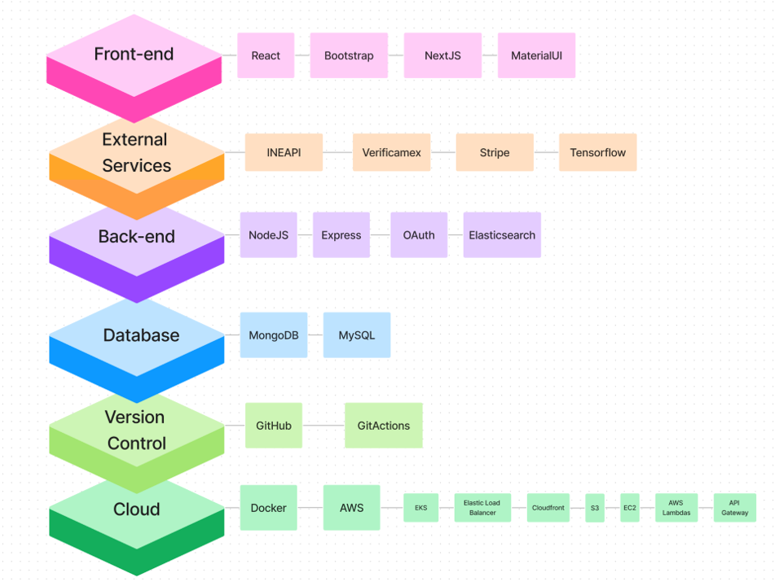

<!--    -->

<h2 align="center"> Digitalización del Proceso de Adquisición de un Vehículo 

<h2 align="center"> Software Requirements Specification

| Date       | Version | Description  |  
|------------|:-------:| :----------- |
| 26/02/2023 | 0.1     | Creación del Doc SRS |

<h2 align="center"> Autores
<h3 align="center"> Andreína Sanánez
<h3 align="center"> Andrew Dunkerley
<h3 align="center"> Do Hyun Nam
<h3 align="center"> Emiliano Cabrera
<h3 align="center"> Karla Mondragón
 <h3 align= "center"> Andrea Serrano Diego
<h3 align="center"> Mateo Herrera 
<h3 align="center"> Regina Rodríguez
<h3 align="center"> Salvador Milanés

<h1 align="center"> Software Requirements Specification

# índice
1. [Introducción](#1-introducción)
        
    1.1. [Propósito](#11-propósito)

    1.2. [Convenciones del Documento](#15-convenciones-de-documento)

    1.3. [Enfoque y Alcance](#12-enfoque-y-alcances)

    1.4. [Objetivos SMART](#13-objetivos-smart)

    1.5. [Referencias](#16-referencias)

2. [Descripción General](#2-descripción-general)

    2.1. [Pespectiva del Producto](#21-perspectiva-del-producto)

    2.2. [Clases de Usuarios y Características](#22-clases-de-usuarios-y-características)

    2.3. [Ambiente de Desarrollo](#23-ambiente-de-desarrollo)

    2.4. [Restricciones del Diseño e Implementación](#24-restricciones-de-implementación-y-diseño)

    2.5. [Suposiciones y Dependencias](#25-suposiciones-y-dependencias)

3. [Características del Sistema](#3-características-del-sistema)

    3.1. [Requerimientos Funcionales](#31-requerimientos-funcionales)

    3.2. [Requerimientos No Funcionales](#32-requerimientos-no-funcionales)

    3.3. [Diagrama de Casos de Uso](#33-diagramas-de-casos-de-uso)

4. [Requerimientos de Datos](#4-requerimientos-de-datos) 

    4.1. [Modelo de Datos Lógico: Diagrama Entidad-Relación](#41-modelo-de-datos-lógico-diagrama-entidad-relación)

    4.2. [Diccionario de Datos](#42-diccionario-de-datos)

    4.3. [Reportes](#43-reportes)

    4.4. [Adquisición, Integridad, Retención y Eliminación de Datos](#44-adquisición-de-datos-integridad-retención-y-eliminación)  

5. [Requerimientos de Interfaces Externas](#5-requerimientos-de-interfaces-externas)

    5.1. [Interfaces de Usuario](#51-interfaces-de-usuario)

    5.2. [Interfaces de Software](#52-interfaces-de-software)

    5.3. Interfaces de Hardware (N/A)

    5.4. [Interfaces de Comunicación](#54-interfaces-de-comunicación)

6. [Atributos de Calidad](#6-atributos-de-calidad)

    6.1. [Usabilidad](#61-usabilidad)

    6.2. [Rendimiento](#62-rendimiento)

    6.3. [Seguridad](#63-seguridad)

    6.4. [Protección](#64-protección)

7. [Internacionalización y Ubicación de Requerimientos](#7-internacionalización-y-ubicación-de-requerimientos)

8. Otros Requerimientos (N/A)

9. [Apéndices](#9-apéndices)

    9.1. [WBS](#1-wbs)

    9.2. [Gantt](#2-gantt)

    9.3. [Budget and Effort Analysis](#3-budget-and-effort-analysis)

    9.4. [Historias de Usuario](#4-historias-de-usuario)

    9.5. [Administración de Riesgos](#5-administración-de-riesgos) 
# 1. Introducción
> Pendiente a validar por todo el grupo
  
> By team 1
  

 El objetivo de este documento es recopilar, analizar y brindar una visión profunda de la aplicación web para NDS Cognitive Labs, definiendo el problema y la solución en detalle. El documento también concentra las capacidades requeridas por todos los stakeholders y sus necesidades definiendo las características del producto.

 Nuestra misión para este proyecto es hacer el proceso de compra de un auto más fácil y conveniente para el usuario digitalizando dicho proceso. Esto planeamos lograrlo creando una plataforma confiable, transparente y de fácil acceso en la que los clientes puedan tomar decisiones informadas basadas en información confiable y recomendaciones profesionales. Nuestro compromiso con nuestros clientes es ofrecerles una gama variada de autos a través de agencias y grupos automotrices previamente verificadas en nuestra plataforma. El problema que nuestra propuesta busca solucionar lo inconventiente que se ha vuelto el proceso de adquisición de un vehículo, tanto para las agencias que no tienen acceso a un equipo de TI como para los compradores que pueden tardar meses en el proceso.

 Con respecto a nuestra visión, buscamos transformar radicalmente el sector de ventas de autos. Con este proyecto queremos que la experiencia tradicional de la compra de autos cambie, se adapte a las nuevas tecnologías y no estrese a los usuarios. Estamos comprometidos a crear una comunidad confiable de vendedores y compradores donde las transacciones puedan ser en línea, quitando los problemas e inconvenientes asociados a la compra tradicional de autos. 
## 1.1. Propósito

 El propósito del documento es recopilar y analizar todas las ideas que han surgido para definir el sistema y sus requisitos con respecto a los usuarios que harán uso de la aplicación. 

 En este proyecto en colaboración con NDS Cognitive Labs, se busca la digitalización del proceso de adquisición de vehículos nuevos y seminuevos. La problemática que se busca resolver es agilizar un proceso que se ha vuelto inconveniente y tedioso: la compra de un vehículo. Dicho proceso presenta múltiples inconvenientes desde que no todas las agencias tienen el catálogo completo de autos disponibles hasta la cercanía entre las agencias y el comprador. Nuestra propuesta busca:
<ol>
    <li> Transparencia en los procesos de compra 
    <li> Un diseño intuitivo y funcional
    <li> Un proceso de compra amigable y conveniente
    <li> La protección de datos de usuarios
</ol>
## 1.2. Enfoque y Alcances
  
> Pendiente a validar por todo el grupo
>
> Comparar con team 4
  
> By teams 1,2
  
El enfoque de este proyecto es construir un servicio web responsivo y escalable que permita a los usuarios buscar, filtrar, comparar y comprar auto que satisfaga sus necesidades. Debido a las leyes y regulaciones aplicables en el pais donde el producto se va a desplegar, todos los pagos deben manejarse de forma externa. Dentro de sus multiples funcionalidades, se espera que el usuario sea capaz de:
1. Elegir un vehículo desde un amplio catálogo, 
2. Encuentre planes de financiamiento que se adapten a sus necesidades,  
4. Solicitar una prueba de manejo si así lo desea, 
5. Comprar su vehículo en cualquier agencia disponible,
6. Comunicarse con una agencia (vendedor específico) por medio de un chat en tiempo real,
7. Subir los documentos legales requeridos.

El proyecto debe tambien proveer a sus usuarios una experiencia fluida en toda la aplicacion, incluyendo procesos como digitalizacion y procesamiento de documentos, solicitudes de pruebas de manejo, filtrado y especificacion, manejo de cuenta y perfil de usuario, etc.

Los socios de este proyecto son:
<ul>
    <li> NDS Cognitive Labs: El cliente para quien se desarrolla el proyecto.
    <li> (Nombre de nuestro equipo): El equipo de desarrollo
    <li> Tecnológico de Monterrey: El instituto que colabora con el cliente y el equipo de desarrollo.
    <li> El usuario final, limitado a México.
</ul>

La aplicacion pretende:
1. Habilitar permisos de usuarios y roles administrativos, 
2. Permitir a usuarios administradores subir catálogos de autos y a sus clientes navegar los mismos,
3. Tener una interfaz intuitiva para que los usuarios puedan buscar y filtrar autos de un catálogo, 
4. Comparar opciones seleccionadas y ver sus especificaciones,
5. Tener una plataforma con diversas formas de pago, 
6. Que la información solicitada estará cifrada y protegida.

Lo que nos distingue de la competencia es nuestra intención de:
- Crear un simulador comparativo de autos, 
- Dar recomendaciones personalizadas con Machine Learning y 
- La implementación de un "Wishlist" (Bookmark de autos preferidos).  
Pero, priorizando la entrega de un MVP funcional, de calidad y que cubra las necesidades del cliente, NDS. 

Algunos aspectos de la solución, que quedan mas allá de nuestra propuesta como (nombre de nuestro grupo) son el mantenimiento de la aplicación, el servicio y hospedaje para el almacenamiento en Cloud y la solución de quejas acerca de la manufactura o el estado de los automóviles; así como el servicio de respaldo (backup) y la red de distribución de contenido (CDN).
## 1.3. Objetivos SMART
> Pendiente a validar por todo el grupo
> By team 1
1. _Mejorar la experiencia del usuario:_ al terminar el proyecto, con el lanzamiento de la aplicación, buscamos reducir aproximadamente un 30% el tiempo que le toma a un usuario comparar y adquirir un automóvil.
2. _Mejorar el servicio al cliente:_ dentro del desarrollo del proyecto (75%), se busca implementar un chatbot que pueda ofrecer ayuda a los clientes para así reducir hasta en un 50% los tiempos de respuesta. Esto mejorará el servicio al cliente en la plataforma.
3. _Aumentar las opciones de pago:_ al terminar el proyecto, con el lanzamiento de la aplicación, se busca incluir una pasarela de pago que acepte diversas formas de pago para ampliar la cantidad de alternativas para los clientes en la plataforma.
4. _Aumentar el posicionamiento en los motores de búsqueda:_ al terminar el proyecto, con el lanzamiento de la aplicación, se pretende utilizar mejores prácticas de optimización de motores de búsqueda para aumentar el ranking de la plataforma.
5. _Mejorar la seguridad de la plataforma:_ para evitar violaciones de datos y proteger la privacidad del consumidor, se agregara autenticación y la verificación de autorización y se incluirá el cifrado de datos dentro del desarrollo del proyecto (80%). 
6. _Implemente análisis predictivos:_ al terminar el proyecto, con el lanzamiento de la aplicación (si existen recursos disponibles), se pretende mejorar el uso de análisis predictivo con el objetivo de estudiar los datos de los clientes y ofrecer sugerencias de automóviles individuales, lo que lleva a un aumento en la satisfacción del cliente.
## 1.4. Convenciones de Documento
> Pendiente a validar por todo el grupo
  
> By team 1
  
| Concepto   | Descripción       |  
| :---------:|:-------------     | 
| SQL        | Structured Query Language, lenguaje de programación para almacenar y procesar información en una base de datos relacional|                           
| API        | Application Programming Interface, conjunto de definiciones y protocolos que se usa para diseñar e integrar el software de las aplicaciones|      
| BD o DB    | Base de Datos o Database|   
| AWS        | Amazon Web Services, colección de servicios de computación en la nube pública que en conjunto forman una plataforma de computación en la nube, ofrecidas a través de Internet por Amazon.com|  
| Stack Tecnológico | Ecosistema tecnológico, conjunto de lineamientos, servicios y softwares que componen un aplicación |
## 1.5. Referencias
> Pendiente a validar por todo el grupo
  
> By team 1
  
"IEEE Guide for Software Requirements Specifications," in IEEE Std 830-1984 , vol., no., pp.1-26, 10 Feb. 1984, doi: 10.1109/IEEESTD.1984.119205. https://ieeexplore.ieee.org/document/278253
# 2. Descripción General
## 2.1. Perspectiva del Producto
  
> Pendiente a validar por todo el grupo
  
> By team 1,2
  
La aplicación busca ser un servicio e-commerce donde un usuario comprador tenga la oportunidad de comprar un vehículo de forma intuitiva, amigable, segura y digital. NDS Cognitive Labs es una consultora internacional especializada en el diseño y desarrollo de soluciones de software de tiempo real que van desde Inteligencia Artificial a Nube. 

La idea del servicio pretende trabajar con tecnologías emergentes para facilitar el proceso de adquisión de un vehículo de agencia.

> ! Adjuntar imagen del diagrama hecho por el equipo 1 - 33 VLANs Studio
  
## 2.2. Clases de Usuario y Características
  
> Validado !
  
1. _Usuario Comprdador_  

2. _Usuario Vendedor_

3. _Usuario Gerente_

4. _Usuario Grupo Automotriz_

5. _Usuario Super-Administrador_
## 2.3. Ambiente de Desarrollo
 

 En esta sección, se define el Tech Stack diseñado para la solución que se presenta en este escrito. Como se observa a continuación, dese el IDE de desarrollo de software hasta los navegadores utilizados para acceder al sitio, cada herramienta se ha seleccionado cuidadosamente en función de sus características y compatibilidad con el sistema global. Posteriormente, se describen las ventajas particulares de cada una de estas tecnologías que justifican su elección para la implementación de la solución. De manera general, se examinan las ventajas de utilizar MySQL Community Edition para el almacenamiento de cuentas y MongoDB para el almacenamiento de catálogos e información de compra. Además, se exploran las ventajas de utilizar NodeJS para la capa de aplicación, Express para el desarrollo backend, React y NextJS para el desarrollo front-end y Bootstrap para las bibliotecas de estilo en cascada. Entre otros, se propone el uso de AWS para los servicios en la nube y Stripe para la integración de la funcionalidad de pago. 
  
### 1. Database
  
<i>MySQL Community Edition (Almacenamiento de Cuentas):</i> 
* Gratuito - GPL Licence.
* Los programadores cuentan con conocimiento y experiencia previa.
* Compatible con diversos OS - compatible con Windows.
* Cuenta con capas de seguridad.
* Estructura relacional - bueno para almacenar relaciones como aquellas en los diferentes tipos de cuentas definidas para la plataforma.
* Cuenta con una buena comunidad, documentación y material de consulta para su utilización.
  
<i>MongoDB (Almacenamiento de catálogo e información de la compra):</i> 
* Gratuito.
* Los programadores cuentan con conocimiento y experiencia previa.
* Compatible con diversos OS - compatible con Windows.
* Fácil instalación e implementación.
* Altamente flexible y escalable.
* Tolera grandes volúmenes de datos.
* Estructura no relacional - bueno para manejar muchas read-write operations como lo son búsquedas, filtrado e información referente a la compra del auto.
* Cuenta con una buena comunidad, documentación y material de consulta para su utilización.
  
### 2. Dev. Environments
  
* <i>NodeJS (Application Layer):</i> 
* Gratuito - Open Source.
* Los programadores cuentan con conocimiento y experiencia previa.
* Compatibilidad cross-platform - gran compatibilidad con React.
* Facilita el desarrollo del backend en JavaScript.
* Particularmente rápido y escalable al estar construido sobre Chrome V8 Engine.
* Cuenta con una buena comunidad, documentación y material de consulta para su utilización.
  
### 3. Frameworks
  
<i>Express:</i> 
* Gratuito - Open Source.
* Framework derivado de NodeJS y por ende compatible.
* Los programadores cuentan con conocimiento y experiencia previa.
* Provee un conjunto de herramientas que facilitan la creación del backend/API con NodeJS.
* Cuenta con una buena comunidad, documentación y material de consulta para su utilización.
  
### 4. Front-end Development Libraries
  
<i>React (JavaScript):</i> 
* Gratuito - Open Source
* Los programadores cuentan con conocimiento y experiencia previa.
* Permite programación por componentes haciendo fácil reutilización y mantenimiento de código para la implementación de la funcionalidad y renderizado del front-end.
* Utiliza virtual DOM lo cual aumenta su rendimiento al permitir que cierta información se maneje y esté disponible “client-side”.
* Cuenta con una buena comunidad, documentación y material de consulta para su utilización.
  
<i>Figma:</i> 	
* Gratuito 
* Intuitivo y fácil de usar.
* Permite la creación de diseños (mockups) directamente traspasables para la implementación.
* Los programadores cuentan con conocimiento y experiencia previa.
* Permite la colaboración simultánea en línea.
* Cuenta con una buena comunidad, documentación y material de consulta para su utilización.
  
<i>MaterialUI:</i> 
* Gratuito y Open Source.
* Provee componentes de UI pre-diseñados.
* Compatible y utilizado sobre React.
* Flexible para la customización de los componentes.
* Cuenta con una buena comunidad, documentación y material de consulta para su utilización.	

<i>NextJS:</i> 
* Gratuito y Open Source.
* Framework de React para el desarrollo de aplicaciones web.
* Permite “server-side rendering” que agiliza el cargado de la página.
* Permite un fácil enrutamiento de los diferentes “endpoints” requeridos.
* Cuenta con una buena comunidad, documentación y material de consulta para su utilización.
  
### 5. Cascading Style Libraries
  
<i>Bootstrap:</i> 
* Gratuito.
* Los programadores cuentan con conocimiento y experiencia previa.
* Opera en base a un “Grid System” con elementos pre-desarrollados que ahorran tiempo y esfuerzo al momento de realizar el estilo.
* A comparación de otras opciones que dan más libertad, con Bootstrap es sumamente rápido el desarrollo del UI.
* Cuenta con una buena comunidad, documentación y material de consulta para su utilización.
  
### 6. Cloud Service
  
<i>AWS - Academy Trial:</i> 
* Se cuenta con 100 USD de crédito por cada integrante (2,000 USD).
* Los programadores cuentan con conocimiento y experiencia previa.
* Altamente escalable y confiable.
* Ofrece un amplio rango de herramientas y servicios.
* Proporciona un alto nivel de seguridad necesaria para la documentación legal y otra información confidencial manejada en la compra de un auto.
  
### 7. Payment Gateway Integration
  
<i>Stripe:</i> 
* Comisión de 2.9% + 30 centavos por cada transacción.
* API fácil y rápida de utilizar/integrar con otra plataforma.
* Soporta una amplia variedad de monedas y métodos de pago.
* Proporciona un sistema seguro de pago.
* Cuenta con servicio al cliente 24/7 ya sea vía teléfono, email o live chat.
* Cuenta con una buena comunidad, documentación y material de consulta para su utilización.
  
### 8. Machine Learning
  
<i>Tensorflow:</i> 
* Gratuito y Open Source.
* Los programadores cuentan con conocimiento y experiencia previa.
* Permite implementar diversos tipos de modelos de ML.
* Permite escalar fácilmente los modelos de ML para procesar una mayor cantidad de datos.
* Eficiente para correr las intensivas operaciones computacionales requeridas.
* Cuenta con una buena comunidad, documentación y material de consulta para su utilización.	
  
### 9. Security
  
<i>OAuth:</i> 
* Gratuito - Open Standard.
* Provee un método seguro para implementar la autorización sin necesidad de credenciales.
* Permite la implementación de la autorización mediante diversos servicios (Google, Facebook, Twitter).
* Provee privacidad al darle al usuario cierto control sobre la información a la que ciertas empresas pueden acceder.
* Cuenta con una buena comunidad, documentación y material de consulta para su utilización.	
  
### 10. Document Validation
  
<i>INE API:</i> 
* Número limitado de peticiones gratuitas.
* Permite la verificación de INEs 
* Cuenta con una buena documentación, materiales de consulta y soporte.
  
### Verificamex:</i> 
* Ofrece Demo gratuita
* Permite validación de INEs mediante AI
* Cuenta con una buena documentación, materiales de consulta y soporte.

### Version Control
  
<i>GitHub:</i> 
* Gratuito.
* Todos los programadores han utilizado y conocen extensamente la herramienta.
* Permite repositorios ilimitados - lo cual da versatilidad a la organización que se tome para la realización del proyecto.
* Permite administrar de forma sencilla y organizada controlar la colaboración, actualizaciones y cambios que se realicen al proyecto por parte de todos los miembros del equipo.
* Cuenta con una buena comunidad, documentación y material de consulta para su utilización.  

  
A continuación se encuentra la visualización gráfica del Tech Stack de la solución.  
<b>Link al diagrama:</b>
https://www.figma.com/embed?embed_host=share&url=https%3A%2F%2Fwww.figma.com%2Ffile%2FyLADWuGigqfuYnZxik1LG7%2FTech-Stack-Diagram-Final%3Fnode-id%3D0%253A1%26t%3DHp719fauwD8rWIgr-1

  

## 2.4. Restricciones de Implementación y Diseño
> Pendiente a validar por todo el grupo
  
> By teams 1,2
  
El dueño de proyecto no ha establecido restricciones explicitas con respecto a las herramientas para el desarrollo, pues el proyecto pretende funcionar unicamente como prueba de concepto. Por lo tanto, las unicas restricciones son en relacion a los recursos disponibles.

Este proyecto no tendra financiamiento externo. La posibilidad de implementacion de la arquitectura propuesta puede ajustarse a opciones mas viables economicamente, pero no se limita a alternativas open-source.

Es importante recalcar que el equipo de desarrollo esta formado por estudiantes aspirantes a desarrolladores, sin conocimiento a nivel experto en el diseño e implementacion de métodos formal. El enfoque principal de los desarrolladores sera en la adecuada funcionalidad y amigabilidad del software.

En términos del diseño:
1. Solamente se aceptarán grupos automotrices y agencias como participantes en el sistema, y no individuos.
2. El sistema tendrá uso de nube (cloud) SaaS.
3. (Nombre del equipo desarrollador) no proveerá mantenimiento ni soporte al sistema.
  
## 2.5. Suposiciones y Dependencias
  
> Pendiente a definir por todo el grupo
  
## 2.6. Casos de Uso
  
> Pendiente a validar por todo el grupo
  
> By team 1
  
> ! Traducir
>
> ! No será mejor tenerlo en su propio .md ? - Salva
  
**2.6.1 General**
| Name of Use Case: | Sign-up |
| --- | --- |
| Created By: | Equipo 1 |
| Last Updated By: | E. Cabrera |
| Date Created: | 09/03/2023 |
| Last Revision Date: | 14/03/2023 |
| **Description:** | A user decides to create an account on the AutoMart platform. |
| **Actors:** | User, AutoMart platform, DBMS |
| **Preconditions:** | 1. The user has access to a computer.2. The user has access to required legal documents.3. The system has an existent connection to a database |
| **Postconditions:** | 1. The user has an account on the AutoMart platform.2. The user can use their account successfully. |
| **Flow:** | 1. The user enters the site and is greeted by the home page.2. The user clicks the "Sign-up" button.4. The user is prompted to choose between Google sign-in or to create an account, and chooses to create an account.5. The user enters an email and the corresponding information required to create an account, such as full name, date of birth, phone number, and a strong password.6. The user is prompted to enter the required legal documents that can verify their identity.7. The user clicks the "Accept" button and is prompted to accept the terms and conditions.8. The user clicks the "Accept conditions" button.9. The frontend sends the information and files to the DBMS for it to be inserted into the database.10. The DBMS creates a query to make a new entry in the Customer table.11. The DBMS returns a successful response to the frontend.12. The user is redirected to their personal homepage. |
| **Alternative Flows:** | 4. In step 4 of the normal flow, the user can choose to make use of a Google account sign-in.1. The user is prompted to sign in via Google.2. The user enters their corresponding Google account and signs in.3. The user enters the corresponding information required to create an account, such as full name, date of birth, phone number, and a strong password.4. The user is prompted to enter the required legal documents that can verify their identity.5. The user clicks the "Accept" button and is prompted to accept the terms and conditions.6. The user clicks the "Accept conditions" button.7. The frontend sends the information and files to the DBMS for it to be inserted into the database.8. The DBMS creates a query to make a new entry in the Customer table.9. The DBMS returns a successful response to the frontend.10. The user is redirected to their personal homepage.6. In step 6 of the normal flow, as well as in step 4 of the previous alternate flow, the user can choose to skip adding documents at that moment.1. The user clicks the "Accept" button and is prompted to accept the terms and conditions.2. The user clicks the "Accept conditions" button.3. The frontend sends the information and files to the DBMS for it to be inserted into the database.4. The DBMS creates a query to make a new entry in the Customer table.5. The DBMS returns a successful response to the frontend.6. The user is redirected to their personal homepage.8. In step 8 of the normal flow, as well as steps 5 of the first alternate flow and step 2 of the second alternate flow, the user can turn down the terms and conditions.1. The corresponding prompt is closed and the user is redirected to the homepage. |
| **Exceptions:** | 8. In step 8 of the normal flow, in case the user turns down the terms and conditions their account is not created and are redirected to the general homepage. |
| **Requirements:** | The following requirements must be met before execution of the use case1. The user must have a stable internet connection.2. The user must input a valid email address.3. The user must input a valid phone number.4. The user must input a date of birth that corresponds with that of an adult of legal age. |

| Name of Use Case: | Login |
| --- | --- |
| Created By: | Equipo 1 |
| Last Updated By: | E. Cabrera |
| Date Created: | 09/03/2023 |
| Last Revision Date: | 14/03/2023 |
| **Description:** | A user decides to enter the AutoMart platform with a preexisting registered account. |
| **Actors:** | User , AutoMart platform |
| **Preconditions:** | 1. The user has access to a computer.2. The user has signed up already onto the AutoMart platform, whether it be via Google or with a native account. |
| **Postconditions:** | 1. The user can use their account successfully. |
| **Flow:** | 1. The user enters the site and is greeted by the home page.2. The user clicks the "Login" button.3. The user is prompted to choose between Google sign-in or enter an email, and chooses to enter an email.4. The user enters the corresponding email and password.5. The user clicks the "Enter" button and the DBMS makes a query to verify that the email and password pair exist within the database.6. The DBMS makes a query to the AgencyMembers table to verify if the account has additional permissions.7. A successful response is returned and the user is redirected to their personal homepage. |
| **Alternative Flows:** | 3. In step 3 of the normal flow, the user can choose to make use of a Google account login.1. The user is prompted to sign in via Google.2. The user enters their corresponding Google account and signs in.3. The DBMS makes a query to verify the existence of the email-password pair within the database.4. A successful response is returned and the user is redirected to their personal homepage. |
| **Exceptions:** | 4. In step 4 of the normal flow, as well as in step 2 of the first alternate flow, in case the user enters the wrong sign in details, the user is never redirected to their homepage and is instead prompted to try again. |
| **Requirements:** | The following requirements must be met before execution of the use case1. The user must have a stable internet connection.2. The user must input a valid email address and corresponding password. |

**2.6.2 Client**

| Name of Use Case: | Buying a car as a client |
| --- | --- |
| Created By: | Equipo 1 |
| Last Updated By: | E. Cabrera |
| Date Created: | 05/03/2023 |
| Last Revision Date: | 14/03/2023 |
| **Description:** | A client purchases a car via the AutoMart platform. |
| **Actors:** | Client, AutoMart platform, Seller, Manager |
| **Preconditions:** | 1. The client has access to a computer.2. The client has signed up already onto the AutoMart platform, whether it be via Google or with a native account.3. The client has entered their required legal documents onto their account. |
| **Postconditions:** | 1. The client is in the process of buying a car. |
| **Flow:** | 1. The client enters their home page, where they can see several vehicles and can scroll to see more.2. The client enters a specific car's page.3. The client can see the vehicle's details.4. The client is able to choose between Agencies.5. The client is able to elect details such as transmission, color, and more, according to their chosen Agency's inventory availability6. The client can elect between doing a driving test or to buy the vehicle, they choose to buy the vehicle.7. The client is prompted to enter their payment method and details, it can be between credit/debit card or bank transfer. The client chooses a credit card.8. The Agency's Manager is notified of the purchase request, after which a Seller is assigned to the transaction and their details are presented to the client.9. The client is prompted with a message that indicates that the transaction is now underway. |
| **Alternative Flows:** | 6. In step 6 of the normal flow, the client can choose to request a driving test.1. The client is prompted to choose a date and time for the test.2. A message is sent to the corresponding Agency's Manager.3. A message is presented to the client indicating that their request has been made, and to await further confirmation.7. In step 7 of the normal flow the client can choose between several payment options, in case of a bank transfer.1. The client is prompted that the transaction has been started and to please provide proof of the transfer before anything else can be done.2. The transaction is marked as pending in the client's history so that they can upload proof and the Manager is notified of the transfer.3. After such proof has been uploaded, the Agency's Manager is notified of the proof upload, and after validation a Seller is assigned to the transaction and their details are presented to the client.4. The client is prompted with a message that indicates that the transaction is now underway. |
| **Exceptions:** | 5. In step 5 of the normal flow in case the client doesn't have the adequate documents or they are incomplete, the client is not allowed to choose either option, and is instead prompted to complete their documents. |
| **Requirements:** | The following requirements must be met before execution of the use case1. The client must have a stable internet connection.2. The client's funds must be verified before any confirmation is made or sale acknowledged. |

| Name of Use Case: | Searching for a car as a client |
| --- | --- |
| Created By: | Equipo 1 |
| Last Updated By: | E. Cabrera |
| Date Created: | 05/03/2023 |
| Last Revision Date: | 14/03/2023 |
| **Description:** | A client looks for a car via the AutoMart platform. |
| **Actors:** | Client, AutoMart platform, DBMS, NLP Algorithm |
| **Preconditions:** | 1. The client has access to a computer.2. The client has signed up already onto the AutoMart platform, whether it be via Google or with a native account. |
| **Postconditions:** | 1. The client is presented with car options according to their specifications. |
| **Flow:** | 1. The client is at their homepage.2. The client can click on the search bar and enter specific terms to look up.3. The client enters the search.4. The NLP algorithm segments the search terms into possible terms that match the database's columns.5. The DBMS makes a query with the extracted terms and returns the results.6. The frontend makes elements to display the information to the client.7. The client is presented with vehicle options that fit their description. |
| **Alternative Flows:** | 2. In step 2 of the normal flow, the client can choose to utilize filters.1. The client can select from a variety of dropdown options, checkboxes and sliders to adjust the brand, model, transmission, color, and more.2. The client enters the search.3. The DBMS makes a query with the extracted terms and returns the results.4. The frontend makes elements to display the information to the client.5. The client is presented with vehicle options that fit the elected filters. |
| **Exceptions:** | 2. In step 2 of the normal flow in case the NLP algorithm finds no usable terms, no query is made and the client is prompted with no results available. |
| **Requirements:** | The following requirements must be met before execution of the use case1. The client must have a stable internet connection. |

| Name of Use Case: | Messaging a Seller as a client |
| --- | --- |
| Created By: | Equipo 1 |
| Last Updated By: | E. Cabrera |
| Date Created: | 05/03/2023 |
| Last Revision Date: | 06/03/2023 |
| **Description:** | A client wishes to contact a transaction's Seller via the AutoMart platform. |
| **Actors:** | Client, AutoMart platform, Seller |
| **Preconditions:** | 1. The client has access to a computer.2. The client has signed up already onto the AutoMart platform, whether it be via Google or with a native account.3. The client is currently undergoing a transaction. |
| **Postconditions:** | 1. The client can communicate with their corresponding Seller. |
| **Flow:** | 1. The client is at their personal homepage.2. The client clicks on their account icon and goes to their "Transactions".3. The client enters a specific transaction.4. The client clicks on the "Contact Seller" button.5. A chat window is prompted to the user and they can communicate with the corresponding Seller.6. The corresponding Seller is pinged that they have a message. |
| **Alternative Flows:** | - |
| **Exceptions:** | 3. In step 3 of the normal flow in case the client has no ongoing transactions they cannot communicate with a Seller. |
| **Requirements:** | The following requirements must be met before execution of the use case1. The client must have a stable internet connection.2. The client has an ongoing transaction with confirmed payment. |

| Name of Use Case: | Uploading legal documents as a client |
| --- | --- |
| Created By: | Equipo 1 |
| Last Updated By: | E. Cabrera |
| Date Created: | 05/03/2023 |
| Last Revision Date: | 14/03/2023 |
| **Description:** | A client looks for a car via the AutoMart platform. |
| **Actors:** | Client, AutoMart platform |
| **Preconditions:** | 1. The client has access to a computer.2. The client has signed up already onto the AutoMart platform, whether it be via Google or with a native account. |
| **Postconditions:** | 1. The client has their legal identity linked to their AutoMart account. |
| **Flow:** | 1. The client is at their personal homepage.2. The client clicks on their account icon and goes to their "Settings".3. The client goes to the "Details" section.4. The client selects the corresponding document and selects the "Upload" button.6. The client is prompted to upload a file.7. The file is validated by the system.8. The DBMS makes a query to insert the files into the database.9. A prompt is presented to the client that indicates that their file was uploaded successfully. |
| **Alternative Flows:** | 7. In step 7 of the normal flow, in case the document cannot be validated the client is prompted to try again. |
| **Exceptions:** | 1. In step 1 of the normal flow in case the client has no account, they cannot access their "Settings". |
| **Requirements:** | The following requirements must be met before execution of the use case1. The client must have a stable internet connection. |

**2.6.3 Superadmin**

| Name of Use Case: | Handling Auto Group creation requests as a superadmin |
| --- | --- |
| Created By: | Equipo 1 |
| Last Updated By: | E. Cabrera |
| Date Created: | 05/03/2023 |
| Last Revision Date: | 06/03/2023 |
| **Description:** | A superadmin verifies that an Auto Group can be created. |
| **Actors:** | Superadmin, AutoMart platform, Administrator |
| **Preconditions:** | 1. The superadmin has access to a computer. |
| **Postconditions:** | 1. The superadmin verifies and creates an Auto Group or the request is denied. |
| **Flow:** | 1. The superadmin is notified of a new Auto Group creation request.2. The superadmin logs in and enters the "Request" section.3. The superadmin can see all documents attached to the Auto Group.4. The superadmin accepts the request and a new Auto Group is created.5. The Administrator that put in the request is notified of the creation and is assigned to the Auto Group. |
| **Alternative Flows:** | 4. In step 4 of the normal flow, in case the documents cannot be validated or the superadmin denies the request.1. The corresponding Administrator is notified of the denial. |
| **Exceptions:** | - |
| **Requirements:** | The following requirements must be met before execution of the use case1. The superadmin must have a stable internet connection. |

| Name of Use Case: | Removing Administrators from an Auto Groups as a superadmin |
| --- | --- |
| Created By: | Equipo 1 |
| Last Updated By: | E. Cabrera |
| Date Created: | 05/03/2023 |
| Last Revision Date: | 14/03/2023 |
| **Description:** | A superadmin removes an Auto Group's Administrator. |
| **Actors:** | Superadmin, AutoMart platform, Administrator, DBMS |
| **Preconditions:** | 1. The superadmin has access to a computer.2. An Auto Group with an Administrator exists. |
| **Postconditions:** | 1. The superadmin removes the Administrator from the Auto Group. |
| **Flow:** | 1. The superadmin enters the "Auto Groups" section.2. The superadmin enters the corresponding Auto Group.3. The superadmin clicks the "Remove" button under the Auto Group's Administrator's information.4. The DBMS sends a query to remove the Administrator from the AutomotiveGroup table. |
| **Alternative Flows:** | - |
| **Exceptions:** | 3. In step 3 of the normal flow, in case there is no Administrator there is no "Remove" button. |
| **Requirements:** | The following requirements must be met before execution of the use case1. The superadmin must have a stable internet connection. |

| Name of Use Case: | Adding Administrators to an Auto Groups as a superadmin |
| --- | --- |
| Created By: | Equipo 1 |
| Last Updated By: | E. Cabrera |
| Date Created: | 05/03/2023 |
| Last Revision Date: | 14/03/2023 |
| **Description:** | A superadmin removes an Auto Group's Administrator. |
| **Actors:** | Superadmin, AutoMart platform, Administrator, DBMS |
| **Preconditions:** | 1. The superadmin has access to a computer.2. An Auto Group without an Administrator exists. |
| **Postconditions:** | 1. The superadmin adds an Administrator to the Auto Group. |
| **Flow:** | 1. The superadmin enters the "Auto Groups" section.2. The superadmin enters the corresponding Auto Group.3. The superadmin clicks the "Add Administrator" button under the Auto Group's information.4. The superadmin can enter an account code and click the "Accept" button5. The DBMS creates a query to insert the Administrator into the AutomotiveGroup table.6. The account is given Administrator permissions and is added to the Auto Group in question. |
| **Alternative Flows:** | - |
| **Exceptions:** | - |
| **Requirements:** | The following requirements must be met before execution of the use case1. The superadmin must have a stable internet connection. |

| Name of Use Case: | Viewing account details as a superadmin |
| --- | --- |
| Created By: | Equipo 1 |
| Last Updated By: | E. Cabrera |
| Date Created: | 05/03/2023 |
| Last Revision Date: | 14/03/2023 |
| **Description:** | A superadmin can view any account's details and documents. |
| **Actors:** | Superadmin, AutoMart platform, Administrator, Manager, Seller, Client, DBMS |
| **Preconditions:** | 1. The superadmin has access to a computer.2. There are accounts within AutoMart's system. |
| **Postconditions:** | 1. The superadmin can view any account's details. |
| **Flow:** | 1. The superadmin can choose between several sections regarding all types of accounts (Clients, Auto Groups, Administrators, Managers, Sellers).2. The superadmin can select between any existing account in the section they chose.3. The superadmin can search for a specific account via a search bar.4. The superadmin selects the account they are interested in.5. The DBMS makes a query to obtain all details on the account and their files.6. The superadmin can view information as well as access their uploaded documents. |
| **Alternative Flows:** | - |
| **Exceptions:** | 4. In step 4 of the normal flow, in case there are no uploaded files the superadmin cannot view a file. |
| **Requirements:** | The following requirements must be met before execution of the use case1. The superadmin must have a stable internet connection. |

| Name of Use Case: | Creating accounts as a superadmin |
| --- | --- |
| Created By: | Equipo 1 |
| Last Updated By: | E. Cabrera |
| Date Created: | 05/03/2023 |
| Last Revision Date: | 14/03/2023 |
| **Description:** | A superadmin can create any type of account. |
| **Actors:** | Superadmin, AutoMart platform, Administrator, Manager, Seller, Client, DBMS |
| **Preconditions:** | 1. The superadmin has access to a computer. |
| **Postconditions:** | 1. The superadmin creates an account. |
| **Flow:** | 1. The superadmin can choose between several sections regarding all types of accounts (Clients, Auto Groups, Administrators, Managers, Sellers).2. The superadmin clicks the "Create account" button.3. They are prompted to enter the same details as in the sign-up process.4. The DBMS creates a query to insert the corresponding information into the tables. |
| **Alternative Flows:** | - |
| **Exceptions:** | 3. In step 3 of the normal flow, in case they do not add all necessary bits of information they system does not create the account. |
| **Requirements:** | The following requirements must be met before execution of the use case1. The superadmin must have a stable internet connection. |

| Name of Use Case: | Deleting accounts as a superadmin |
| --- | --- |
| Created By: | Equipo 1 |
| Last Updated By: | E. Cabrera |
| Date Created: | 05/03/2023 |
| Last Revision Date: | 14/03/2023 |
| **Description:** | A superadmin can delete any type of account. |
| **Actors:** | Superadmin, AutoMart platform, Administrator, Manager, Seller, Client, DBMS |
| **Preconditions:** | 1. The superadmin has access to a computer.2. There are accounts within AutoMart's system. |
| **Postconditions:** | 1. The superadmin deletes an account. |
| **Flow:** | 1. The superadmin can choose between several sections regarding all types of accounts (Clients, Auto Groups, Administrators, Managers, Sellers).2. The superadmin enters a particular account.3. The superadmin clicks the "Delete" button.4. The DBMS makes a query to eliminate the corresponding information from the tables. |
| **Alternative Flows:** | - |
| **Exceptions:** | - |
| **Requirements:** | The following requirements must be met before execution of the use case1. The superadmin must have a stable internet connection. |

| Name of Use Case: | Assign Administrator accounts as a superadmin |
| --- | --- |
| Created By: | Equipo 1 |
| Last Updated By: | E. Cabrera |
| Date Created: | 09/03/2023 |
| Last Revision Date: | 14/03/2023 |
| **Description:** | A superadmin gives Administrator privileges. |
| **Actors:** | Superadmin, AutoMart platform, Administrator, DBMS |
| **Preconditions:** | 1. The superadmin has access to a computer. |
| **Postconditions:** | 1. The superadmin gives Administrator permissions to an account. |
| **Flow:** | 1. The superadmin enters the "Administrators" section.3. The superadmin clicks the "Add Administrator" button.4. The superadmin can enter an account code and click the "Accept" button5. The DBMS makes a query to update the Administrator table.6. The account is given Administrator permissions. |
| **Alternative Flows:** | - |
| **Exceptions:** | - |
| **Requirements:** | The following requirements must be met before execution of the use case1. The superadmin must have a stable internet connection. |

| Name of Use Case: | View Auto Groups' statistics as a superadmin |
| --- | --- |
| Created By: | Equipo 1 |
| Last Updated By: | E. Cabrera |
| Date Created: | 10/03/2023 |
| Last Revision Date: | 14/03/2023 |
| **Description:** | A superadmin views statistics for any Auto Groups. |
| **Actors:** | Superadmin, AutoMart platform, DBMS |
| **Preconditions:** | 1. The superadmin has access to a computer.2. There are Auto Groups within the system |
| **Postconditions:** | 1. The superadmin can view the statistics of any Auto Group. |
| **Flow:** | 1. The superadmin enters the "Auto Groups" section.2. The superadmin enters the corresponding Auto Group.3. The superadmin clicks the "Stats" button under the Auto Group's information.4. The DBMS makes a query to obtain all information regarding an Auto Group.5. The superadmin is presented with the Auto Group's statistics and can choose to download them as a file via a "Download" button. |
| **Alternative Flows:** | 5. In step 5 of the normal flow, the superadmin can choose to download a file.1. The backend converts the information into a \*.pdf file.2. The file is downloaded into their computer.3. They are prompted that the file has been downloaded. |
| **Exceptions:** | - |
| **Requirements:** | The following requirements must be met before execution of the use case1. The superadmin must have a stable internet connection. |

| Name of Use Case: | View Agencies' statistics as a superadmin |
| --- | --- |
| Created By: | Equipo 1 |
| Last Updated By: | E. Cabrera |
| Date Created: | 10/03/2023 |
| Last Revision Date: | 14/03/2023 |
| **Description:** | A superadmin views statistics for Agencies. |
| **Actors:** | Superadmin, AutoMart platform |
| **Preconditions:** | 1. The superadmin has access to a computer.2. There are Agencies within the system |
| **Postconditions:** | 1. The superadmin can view the statistics of any Agency. |
| **Flow:** | 1. The superadmin enters the "Auto Groups" section.2. The superadmin enters the corresponding Auto Group.3. The superadmin is presented with the Auto Group's Agencies and enters one.4. The superadmin clicks the "Stats" button under the Agency's information.5. The DBMS makes a query to obtain all information regarding an Agency.6. The superadmin is presented with the Agency's statistics and can choose to download them as a file via a "Download" button. |
| **Alternative Flows:** | 6. In step 6 of the normal flow, the superadmin can choose to download a file.1. The backend converts the information into a \*.pdf file.2. The file is downloaded into their computer.3. They are prompted that the file has been downloaded. |
| **Exceptions:** | - |
| **Requirements:** | The following requirements must be met before execution of the use case1. The superadmin must have a stable internet connection. |

| Name of Use Case: | View Clients' statistics as a superadmin |
| --- | --- |
| Created By: | Equipo 1 |
| Last Updated By: | E. Cabrera |
| Date Created: | 10/03/2023 |
| Last Revision Date: | 14/03/2023 |
| **Description:** | A superadmin views statistics for Clients. |
| **Actors:** | Superadmin, AutoMart platform |
| **Preconditions:** | 1. The superadmin has access to a computer.2. There are users within the system |
| **Postconditions:** | 1. The superadmin can view the statistics of any Client. |
| **Flow:** | 1. The superadmin enters the "Clients" section.2. The superadmin clicks the "Details" button.3. The superadmin clicks the "Stats" button under the Client's information.4. The DBMS makes a query to obtain all information regarding a Client.5. The superadmin is presented with the Client's statistics and can choose to download them as a file via a "Download" button. |
| **Alternative Flows:** | 5. In step 5 of the normal flow, the superadmin can choose to download a file.1. The backend converts the information into a \*.pdf file.2. The file is downloaded into their computer.3. They are prompted that the file has been downloaded. |
| **Exceptions:** | - |
| **Requirements:** | The following requirements must be met before execution of the use case1. The superadmin must have a stable internet connection. |

**2.6.4 Administrators**

| Name of Use Case: | Assign Manager accounts as an administrator |
| --- | --- |
| Created By: | Equipo 1 |
| Last Updated By: | E. Cabrera |
| Date Created: | 05/03/2023 |
| Last Revision Date: | 14/03/2023 |
| **Description:** | An admin can assign Manager accounts to Agencies. |
| **Actors:** | Administrator, AutoMart platform, Manager, DBMS |
| **Preconditions:** | 1. The admin has access to a computer.2. There are accounts within AutoMart's system. |
| **Postconditions:** | 1. The admin assigns a Manager to an Agency. |
| **Flow:** | 1. The admin can choose between several Agencies.2. The admin clicks the corresponding Agency.3. They click the "Add Manager" button.4. The admin can enter an account code and click the "Accept" button.5. The DBMS makes a query to insert the corresponding data into the Manager table.5. The account is given Manager permissions and is assigned to the Agency. |
| **Alternative Flows:** | - |
| **Exceptions:** | - |
| **Requirements:** | The following requirements must be met before execution of the use case1. The admin must have a stable internet connection. |

| Name of Use Case: | Petition to create an Auto Group as an administrator |
| --- | --- |
| Created By: | Equipo 1 |
| Last Updated By: | E. Cabrera |
| Date Created: | 06/03/2023 |
| Last Revision Date: | 06/03/2023 |
| **Description:** | An admin can petition Superadmins to create Auto Groups. |
| **Actors:** | Administrator, AutoMart platform, Superadmin |
| **Preconditions:** | 1. The admin has access to a computer.2. The admin has an account on the platform. |
| **Postconditions:** | 1. The Superadmin creates a new Auto Group. |
| **Flow:** | 1. The admin is at their homepage and they click the "Make Request" button.2. The admin is prompted to enter the required information and upload the required legal documents.3. The admin clicks the "Make Request" button.4. The Superadmin is notified of a new request.5. The admin is shown a message that indicates that the request has been put in. |
| **Alternative Flows:** | 2. In step 2 of the normal flow in case the admin does not add all required documents, they are not allowed to make the request and instead are prompted to add them. |
| **Exceptions:** | - |
| **Requirements:** | The following requirements must be met before execution of the use case1. The admin must have a stable internet connection. |

| Name of Use Case: | Remove Manager accounts as an administrator |
| --- | --- |
| Created By: | Equipo 1 |
| Last Updated By: | E. Cabrera |
| Date Created: | 06/03/2023 |
| Last Revision Date: | 14/03/2023 |
| **Description:** | An admin can remove Manager accounts from Agencies. |
| **Actors:** | Administrator, AutoMart platform, Manager, DBMS |
| **Preconditions:** | 1. The admin has access to a computer.2. There is at least one Manager assigned to an Agency. |
| **Postconditions:** | 1. The admin removes a Manager from an Agency. |
| **Flow:** | 1. The admin can choose between several Agencies.2. The admin clicks the corresponding Agency.3. They click the "Remove" button under the Manager's details.4. The DBMS makes a query to remove the corresponding information from the Agency table. |
| **Alternative Flows:** | - |
| **Exceptions:** | 4. In step 4 of the normal flow, in case there are no assigned Managers, there is no button available. |
| **Requirements:** | The following requirements must be met before execution of the use case1. The admin must have a stable internet connection. |

| Name of Use Case: | Create Agencies as an administrator |
| --- | --- |
| Created By: | Equipo 1 |
| Last Updated By: | E. Cabrera |
| Date Created: | 06/03/2023 |
| Last Revision Date: | 14/03/2023 |
| **Description:** | An admin can create Agencies. |
| **Actors:** | Administrator, AutoMart platform, DBMS |
| **Preconditions:** | 1. The admin has access to a computer.2. The admin has successfully created an Auto Group. |
| **Postconditions:** | 1. The admin creates an Agency within their Auto Group. |
| **Flow:** | 1. The admin clicks the "Create Agency" button on their homepage.2. The admin is prompted to add all relevant details on the Agency as well as the required legal documents.3. The admin clicks the "Create" button.4. The DBMS makes a query to add the corresponding information to the Agency table.5. The admin is prompted with a message that indicates that the Agency is created. |
| **Alternative Flows:** | - |
| **Exceptions:** | 3. In step 3 of the normal flow, in case the admin does not add all documents or details, they are not allowed to create the Agency and are instead prompted to complete the information. |
| **Requirements:** | The following requirements must be met before execution of the use case1. The admin must have a stable internet connection. |

| Name of Use Case: | View Auto Group's statistics as an administrator |
| --- | --- |
| Created By: | Equipo 1 |
| Last Updated By: | E. Cabrera |
| Date Created: | 10/03/2023 |
| Last Revision Date: | 14/03/2023 |
| **Description:** | An admin views statistics for their Auto Group. |
| **Actors:** | Administrator, AutoMart platform, DBMS |
| **Preconditions:** | 1. The manager has access to a computer.2. They are assigned to an Auto Group. |
| **Postconditions:** | 1. The admin can view the statistics of their Auto Group. |
| **Flow:** | 1. The admin enters their Auto Group.2. The admin clicks the "Stats" button under the Auto Group's information.4. The DBMS makes a query to obtain all information regarding an Auto Group.5. The admin is presented with the Auto Group's statistics and can choose to download them as a file via a "Download" button. |
| **Alternative Flows:** | 4. In step 4 of the normal flow, the admin can choose to download a file.1. The backend converts the information into a \*.pdf file.2. The file is downloaded into their computer.3. They are prompted that the file has been downloaded. |
| **Exceptions:** | - |
| **Requirements:** | The following requirements must be met before execution of the use case1. The admin must have a stable internet connection. |

| Name of Use Case: | View Agencies' statistics as an administrator |
| --- | --- |
| Created By: | Equipo 1 |
| Last Updated By: | E. Cabrera |
| Date Created: | 10/03/2023 |
| Last Revision Date: | 10/03/2023 |
| **Description:** | An admin can view statistics for their Agencies. |
| **Actors:** | Administrator, AutoMart platform |
| **Preconditions:** | 1. The admin has access to a computer.2. They are assigned to an Auto Group.3. There are Agencies within the Auto Group. |
| **Postconditions:** | 1. The admin can view the statistics of any Agency. |
| **Flow:** | 1. The admin enters their Auto Group.2. The admin enters an Agency.3. The admin clicks the "Stats" button under the Agency's information.4. The DBMS makes a query to obtain all information regarding an Agency.5. The admin is presented with the Agency's statistics and can choose to download them as a file via a "Download" button. |
| **Alternative Flows:** | 4. In step 4 of the normal flow, the admin can choose to download a file.1. The backend converts the information into a \*.pdf file.2. The file is downloaded into their computer.3. They are prompted that the file has been downloaded. |
| **Exceptions:** | - |
| **Requirements:** | The following requirements must be met before execution of the use case1. The admin must have a stable internet connection. |

**2.6.5 Managers**

| Name of Use Case: | View an Agency's inventory as a manager |
| --- | --- |
| Created By: | Equipo 1 |
| Last Updated By: | E. Cabrera |
| Date Created: | 06/03/2023 |
| Last Revision Date: | 14/03/2023 |
| **Description:** | A manager can see their Agency's inventory. |
| **Actors:** | Manager, AutoMart platform, DBMS |
| **Preconditions:** | 1. The manager has access to a computer.2. The manager is assigned to an Agency. |
| **Postconditions:** | 1. The manager can view their Agency's inventory. |
| **Flow:** | 1. The manager clicks the "View Inventory" button on their homepage.2. The DBMS makes a query to see all cars within an Agency.3. The manager is presented with their Agency's inventory. |
| **Alternative Flows:** | - |
| **Exceptions:** | 3. In step 3 of the normal flow, in case there is no inventory nothing will be shown. |
| **Requirements:** | The following requirements must be met before execution of the use case1. The manager must have a stable internet connection. |

| Name of Use Case: | Add to the Agency's inventory as a manager |
| --- | --- |
| Created By: | Equipo 1 |
| Last Updated By: | E. Cabrera |
| Date Created: | 06/03/2023 |
| Last Revision Date: | 14/03/2023 |
| **Description:** | A manager can add to their Agency's inventory. |
| **Actors:** | Manager, AutoMart platform, DBMS |
| **Preconditions:** | 1. The manager has access to a computer.2. The manager is assigned to an Agency. |
| **Postconditions:** | 1. The manager can view their Agency's inventory. |
| **Flow:** | 1. The manager clicks the "Add Inventory" button on their homepage.2. The manager is prompted to select a model, its details and specifications.3. The manager clicks the "Add" button.4. The DBMS makes a query to insert a new car in the Car table with the corresponding Agency key. |
| **Alternative Flows:** | - |
| **Exceptions:** | 2. In step 2 of the normal flow, in case all required fields are not added the element cannot be added. |
| **Requirements:** | The following requirements must be met before execution of the use case1. The manager must have a stable internet connection. |

| Name of Use Case: | Remove from the Agency's inventory as a manager |
| --- | --- |
| Created By: | Equipo 1 |
| Last Updated By: | E. Cabrera |
| Date Created: | 06/03/2023 |
| Last Revision Date: | 14/03/2023 |
| **Description:** | A manager can remove an element from their Agency's inventory. |
| **Actors:** | Manager, AutoMart platform, DBMS |
| **Preconditions:** | 1. The manager has access to a computer.2. The manager is assigned to an Agency. |
| **Postconditions:** | 1. The manager can view their Agency's inventory. |
| **Flow:** | 1. The manager clicks the "View Inventory" button on their homepage.2. The manager is presented with their Agency's inventory.3. The manager clicks the "Remove" button under a specific element.4. The DBMS makes a query to remove a specific element from the Car table. |
| **Alternative Flows:** | - |
| **Exceptions:** | 2. In step 2 of the normal flow, in case there is no inventory nothing will be shown. |
| **Requirements:** | The following requirements must be met before execution of the use case1. The manager must have a stable internet connection. |

| Name of Use Case: | Assign Sellers to an Agency as a manager |
| --- | --- |
| Created By: | Equipo 1 |
| Last Updated By: | E. Cabrera |
| Date Created: | 06/03/2023 |
| Last Revision Date: | 09/03/2023 |
| **Description:** | A manager can assign a Seller to their Agency. |
| **Actors:** | Manager, AutoMart platform, Seller |
| **Preconditions:** | 1. The manager has access to a computer.2. The manager is assigned to an Agency. |
| **Postconditions:** | 1. The manager assigns Sellers to their Agency. |
| **Flow:** | 1. The manager is notified of a new Seller request.2. The manager clicks the "Add Seller" button on their homepage.3. The manager can enter an account code and click the "Accept" button.4. The account is given Seller permissions and is assigned to the Agency in question. |
| **Alternative Flows:** | - |
| **Exceptions:** | - |
| **Requirements:** | The following requirements must be met before execution of the use case1. The manager must have a stable internet connection. |

| Name of Use Case: | Remove Sellers from an Agency as a manager |
| --- | --- |
| Created By: | Equipo 1 |
| Last Updated By: | E. Cabrera |
| Date Created: | 06/03/2023 |
| Last Revision Date: | 06/03/2023 |
| **Description:** | A manager can remove a Seller from their Agency. |
| **Actors:** | Manager, AutoMart platform, Seller |
| **Preconditions:** | 1. The manager has access to a computer.2. The manager is assigned to an Agency.33. The manager's Agency has at least one Seller. |
| **Postconditions:** | 1. The manager removes Sellers from their Agency. |
| **Flow:** | 1. The manager clicks the "View Staff" button on their homepage.2. The manager can view all current Sellers.3. The manager clicks the "Remove" button on one of the Sellers.4. The Seller is removed from the Agency in question. |
| **Alternative Flows:** | - |
| **Exceptions:** | 2. In step 2 of the normal flow, in case there are no Sellers. |
| **Requirements:** | The following requirements must be met before execution of the use case1. The manager must have a stable internet connection. |

| Name of Use Case: | View Agencies' statistics as a manager |
| --- | --- |
| Created By: | Equipo 1 |
| Last Updated By: | E. Cabrera |
| Date Created: | 10/03/2023 |
| Last Revision Date: | 10/03/2023 |
| **Description:** | A manager can view statistics for their Agencies. |
| **Actors:** | Administrator, AutoMart platform |
| **Preconditions:** | 1. The manager has access to a computer.2. They are assigned to an Agency. |
| **Postconditions:** | 1. The manager can view the statistics of any Agency. |
| **Flow:** | 1. The manager enters their Agency.3. The manager clicks the "Stats" button under the Agency's information.4. The manager is presented with the Agency's statistics and can choose to download them as a file via a "Download" button. |
| **Alternative Flows:** | 4. In step 4 of the normal flow, the superadmin can choose to download a file.1. The file is downloaded into their computer.2. They are prompted that the file has been downloaded. |
| **Exceptions:** | - |
| **Requirements:** | The following requirements must be met before execution of the use case1. The manager must have a stable internet connection. |

**2.6.6 Sellers**

| Name of Use Case: | View ongoing sales as a seller |
| --- | --- |
| Created By: | Equipo 1 |
| Last Updated By: | E. Cabrera |
| Date Created: | 06/03/2023 |
| Last Revision Date: | 06/03/2023 |
| **Description:** | A seller can view all of their ongoing sales. |
| **Actors:** | Seller, AutoMart platform |
| **Preconditions:** | 1. The seller has access to a computer.2. The seller is assigned to an Agency.3. The seller has an ongoing sale. |
| **Postconditions:** | 1. The seller can see their ongoing sales. |
| **Flow:** | 1. The seller clicks the "View sales" button on their homepage.2. The seller can view all ongoing sales and can click a "View details" button under each of them.3. The seller can see the details of the chosen sale. |
| **Alternative Flows:** | - |
| **Exceptions:** | 2. In step 2 of the normal flow, in case there are no ongoing sales the seller will not see anything. |
| **Requirements:** | The following requirements must be met before execution of the use case1. The seller must have a stable internet connection. |

| Name of Use Case: | Message a client as a seller |
| --- | --- |
| Created By: | Equipo 1 |
| Last Updated By: | E. Cabrera |
| Date Created: | 06/03/2023 |
| Last Revision Date: | 06/03/2023 |
| **Description:** | A seller can view all of their ongoing sales. |
| **Actors:** | Seller, AutoMart platform |
| **Preconditions:** | 1. The seller has access to a computer.2. The seller is assigned to an Agency.3. The seller has an ongoing sale. |
| **Postconditions:** | 1. The seller can message a client of an ongoing sale. |
| **Flow:** | 1. The seller clicks the "View sales" button on their homepage.2. The seller can view all ongoing sales and can click a "View details" button under each of them.3. The seller can see the details of the chosen sale and can click a "Message client" button.4. The seller is prompted with a chat window. |
| **Alternative Flows:** | - |
| **Exceptions:** | 2. In step 2 of the normal flow, in case there are no ongoing sales the seller will not see anything. |
| **Requirements:** | The following requirements must be met before execution of the use case1. The seller must have a stable internet connection. |
# 3. Características del Sistema

 En este apartado se definen las características y aspectos específicos que se requieren del sistema. En específico, se detalla cada uno de los requerimientos funcionales y no funcionales recopilados a lo largo de las diferentes sesiones para el levantamiento de requerimientos que se tuvieron con el cliente. De la misma manera, muestran los diagramas de casos de uso, cuyo propósito es presentar de una manera gráfica y visual el comportamiento esperado de cierta parte del sistema en relación con sus diferentes actores.

## 3.1. Requerimientos Funcionales
### Todos los Usuarios
| ID Req Funcional| Requerimiento                                      |Usuarios |
|      :----:     |    :----:                                          | :----:  |
|REQ_FUN_01       |Registro de usuario a la plataforma                 |C        |
|REQ_FUN_02       |Solicitud de registro de usuario                    |GA/G     |
|REQ_FUN_03       |Edición de perfil de usuario propio                 |Todos    |
|REQ_FUN_04       |Eliminación de perfil de usuario propio             |C        |
|REQ_FUN_05       |Eliminación de perfil de usuario ajeno              |G/GA/SA  |
|REQ_FUN_06       |Login                                               |Todos    |
|REQ_FUN_07       |Log out                                             |Todos    |
|REQ_FUN_08       |Registro de documentos                              |C/GA     |
|REQ_FUN_09       |Visualización de documentos propios                 |C/GA     |
|REQ_FUN_10       |Visualización de retroalimentación de documentos propios|C/GA |
|REQ_FUN_11       |Visualización de estatus de aceptación de documentos propios|C/GA|
|REQ_FUN_12       |Edición/Borrado de documentos propios               |C/GA     |
|REQ_FUN_13       |Visualización de documentos ajenos                  |SA/V/G   |
|REQ_FUN_14       |Aprobación/Negación de documentos ajenos            |SA/V/G   |
|REQ_FUN_15       |Vista de catálogo                                   |Todos    |
|REQ_FUN_16       |Registro de automóviles                             |G        |
|REQ_FUN_17       |Edición/Borrado de automóviles                      |G        |
|REQ_FUN_18       |Registro de planes de financiamiento/seguros        |G        |
|REQ_FUN_19       |Edición/Borrado de planes de financiamiento/seguros |G        |
|REQ_FUN_20       |Búsqueda por filtros                                |C/V/G/GA |
|REQ_FUN_21       |Búsqueda por lenguaje natural                       |C/V/G/GA |
|REQ_FUN_22       |Solicitud de prueba de manejo                       |C        |
|REQ_FUN_23       |Revisión de estatus de solicitud de prueba de manejo|C        |
|REQ_FUN_24       |Aprobación/Negación de prueba de manejo             |V        |
|REQ_FUN_25       |Asignación de disponibilidad de prueba de manejo    |V        |
|REQ_FUN_26       |Apertura de chat con vendedor                       |C        |
|REQ_FUN_27       |Solicitud de compra                                 |C        |
|REQ_FUN_28       |Confirmación de inicio de compra                    |C        |
|REQ_FUN_29       |Visualización de detalles de compra                 |C        |
|REQ_FUN_30       |Selección de plan de financiamiento                 |C        |
|REQ_FUN_31       |Selección de método de pago                         |C        |
|REQ_FUN_32       |Autorización del proceso de compra                  |V        |
|REQ_FUN_33       |Reasignación de orden de compra                     |V        |
|REQ_FUN_34       |Aprobación de reasignación de orden de compra       |G        |
|REQ_FUN_35       |Realización de pago en línea                        |C        |

Comprador - C
Vendedor - V
Gerente - G
Grupo Automotriz - GA
Super Admin - SA

## 3.2. Requerimientos No Funcionales
|ID Req No Funcional|Requerimiento|
|:----:             |:----:       |
|REQ_NO_FUN_01      |Diseño intuitivo|
|REQ_NO_FUN_02      |Diseño de UX armonioso|
|REQ_NO_FUN_03      |Screen-size adaptable para tablet y celular|
|REQ_NO_FUN_04      |Texto de ayuda y texto alternativo en botones e imágenes|
|REQ_NO_FUN_05      |Bóton de ayuda en caso de que los usuarios necesiten asistencia del chat bot o de un operador humano|
|REQ_NO_FUN_06      |Se utilizarán cookies para guardar las búsquedas recientes|
|REQ_NO_FUN_07      |Funcionalidad de comparativa de autos|
|REQ_NO_FUN_08      |Funcionalidad de lista de deseos|
|REQ_NO_FUN_09      |Procesamiento de documentos con OCR|
|REQ_NO_FUN_10      |Proceso de venta transparente|
|REQ_NO_FUN_11      |Compra a cualquier agencia disponible|
|REQ_NO_FUN_12      |Visualización predenterminada del catálogo|
|REQ_NO_FUN_13      |Método de autorización para cada ususario|
|REQ_NO_FUN_14      |Habilidad de actualizar la información de la cuenta|
|REQ_NO_FUN_15      |Transparencia de datos|
|REQ_NO_FUN_16      |Esquema de datos estandarizado|
|REQ_NO_FUN_17      |Asegurar que la información de ventas y usuarios sea guardada por lo menos cinco años antes de ser descartada|
|REQ_NO_FUN_18      |Protección de información|
|REQ_NO_FUN_19      |Tutoriales y sección de FAQ|
|REQ_NO_FUN_20      |Política de privacidad|

## 3.3. Diagramas de Casos de Uso
> Pendiente a definir por todo el grupo
  
# 4. Requerimientos de Datos
## 4.1. Modelo de Datos Lógico: Diagrama Entidad-Relación
### Primera Versión
> Adjuntar imagen del diagrama entidad-relación

## 4.2. Diccionario de Datos
> Pendiente a definir por todo el grupo

## 4.3. Reportes
> Pendiente a validar por todo el grupo
  
> By teams 1,2
  
Se busca que la plataforma sea capaz de producir diferentes estádisticas y dependiendo el rol del usuario y sus permisos se le muestran diferentes datos y aspectos de la plataforma. Algunas de las estadísticas que se pretenden mostrar en la aplicación son:

1. Ventas de cada vendedor, agencia y grupo automotriz, pruebas de manejo por agencia.
2. Venta de cada vehículo y su popularidad (ya sea por número de personas interesadas en el o por la cantidad de pruebas de manejo del modelo).
3. Comportamiento de la plataforma, cantidad de usuarios, información geográfica de los usuarios.

Por otra parte, la app generará los siguientes logs:

- Log de Auditoría: Incuirá el comprador, el vendedor, el administrador y dueño en caso de haber conflicto en una organizacion y se requiere transparencia, o si hay un error en las acciones CRUD y los desarrolladores requieren una referencia de un posible causante del error. Se incluye el timestamp, el usuario que realizó la acción y la acción realizada con su descripción.

- Log de Ventas: Se utilizará como comprobante al iniciarse, completarse o cambiar de etapa la venta de un vehículo. Se incluye el timestamp, el comprador, el vendedor y el estado de la venta.

## 4.4. Adquisición de Datos, Integridad, Retención y Eliminación
> Pendiente a definir por todo el grupo
  
# 5. Requerimientos de Interfaz Externas
> Pendiente a definir por todo el grupo
  

## 5.1. Interfaces de Usuario
### Diagrama de Procesos
> Pendiente a definir por todo el grupo
>
> Comparar teams 1(5.1) con diagramas de proceso de team 1.

> Revisar concepto de diagrama de secuencia

### Flujo del Comprador:
> Adjuntar imagen del flujo del Comprador

### Flujo del Vendedor:
> Adjuntar imagen del flujo del Vendedor

### Flujo del Gerente:
> Adjuntar imagen del flujo del Gerente

### Flujo del Grupo Automotriz:
> Adjuntar imagen del flujo del Grupo Automotriz

### Flujo del Super-Administrador:
> Adjuntar imagen del flujo del Super-Administrador

### Wireframe
> Insertar liga al wireframe

> Insertar imagen del wireframe

## 5.2. Interfaces de Software
### Diagrama de Arquitectura
> Pendiente a definir por todo el grupo
>
> Comparar e incorporar teams 1,2,3
  
### Componentes
> Pendiente a definir por todo el grupo (Descripcion de la arquitectura).

## 5.3. Interfaces de Hardware
### No aplica

## 5.4. Interfaces de Comunicación
> Pendiente a definir por todo el grupo
  
# 6. Atributos de Calidad
## 6.1. Usabilidad
> Pendiente a validar por todo el grupo
  
> By team 2
  
* <b>Interfaz Fácil de Usar:</b> La plataforma debe tener una interfaz clara e intuitiva que facilite a los usuarios la navegación y la búsqueda de la información que necesitan.
  
* <b>Interfaz Responsiva:</b> Cada una de las interfaces y diseño de la plataforma deberá ser responsive, es decir, accesible y funcional en distintos dispositivos y tamaños de pantalla (computadora, tablet, teléfono). 
  
* <b>Velocidad de Respuesta:</b> La plataforma debe cargarse rápidamente y responder a las acciones del usuario en el momento oportuno.

* <b>Información Clara sobre el Producto:</b> La plataforma debe ofrecer información transparente y detallada sobre cada coche, incluyendo especificaciones, precios y disponibilidad.

## 6.2. Rendimiento
> Pendiente a validar por todo el grupo
  
> By team 2
  
* Tiempo de carga de la Página:</b> La plataforma debe cargarse rápidamente, idealmente en unos segundos o menos, para garantizar una experiencia de usuario positiva y ágil.

* <b>Capacidad de Respuesta:</b> La plataforma debe responder rápidamente a las interacciones del usuario, como clics, toques y deslizamientos, proporcionando una experiencia de usuario fluida e intuitiva.
  
* <b>Escalabilidad:</b> La plataforma debe ser capaz de gestionar grandes volúmenes de tráfico y transacciones sin ralentizarse ni bloquearse.
  
* <b>Disponibilidad:</b> La plataforma debe estar disponible y accesible 24 horas al día, 7 días a la semana, garantizando que los usuarios puedan navegar y comprar autos en cualquier momento.
  
* <b>Fiabilidad:</b> La plataforma debe ser fiable y estable, con el mínimo tiempo de inactividad o errores que puedan interrumpir la experiencia del usuario y las transacciones.

## 6.3. Seguridad
> Pendiente a validar por todo el grupo
  
> By team 2
  
* <b>Comunicación Segura:</b> La página web debe utilizar protocolos de comunicación segura como HTTPS para cifrar todos los datos del usuario en tránsito, evitando su interceptación y manipulación.
  
* <b>Autenticación:</b> La página web debe utilizar mecanismos de autenticación fuertes como JWT tokens o Cookies para verificar la identidad de los usuarios y evitar escalamiento de privilegios.
  
* <b>Autorización:</b> La página web debe utilizar mecanismos de autorización adecuados como el hashing de las credenciales  para controlar el acceso a recursos y datos sensibles, garantizando que sólo los usuarios autorizados puedan acceder a ellos.
  
* <b>Protección de datos:</b> La página web debe utilizar medidas adecuadas para proteger todos los datos (en reposo, tránsito o uso) de los usuarios, como la información personal, los detalles de pago y el historial de compras.
  
* <b>Cifrado:</b> la plataforma deberá cifrar adecuadamente toda la información sensible contenida en la base de datos.
  
* <b>Seguridad en Código:</b> La plataforma debe seguir prácticas de seguridad en código y comprobarse periódicamente para detectar vulnerabilidades como Cross-site scripting (XSS) y SQL injection. Correspondientemente, deben tomarse las medidas adecuadas para solucionar cualquier vulnerabilidad detectada.

## 6.4. Protección
> Pendiente a validar por todo el grupo
  
> By team 2
  
* <b>Backup y Recuperación:</b> La plataforma debe contar con un plan de backup y recuperación para garantizar que los datos puedan restaurarse en caso de pérdida de datos o fallo del sistema.
  
* <b>Redundancia:</b> La plataforma debe contar con sistemas redundantes para garantizar que la página web siga disponible incluso en caso de fallo de hardware o software.
  
* <b>Protección de datos:</b> La plataforma debe aplicar medidas adecuadas de privacidad de datos para proteger los datos de los usuarios y garantizar el cumplimiento de la Ley Federal de Protección de Datos Personales en Posesión de Particulares.
  
* <b>Hosting:</b> La plataforma debe estar alojada en servidores seguros y fiables, idealmente utilizando un proveedor de alojamiento de confianza como AWS que aplique las medidas de seguridad adecuadas.
# 7. Internacionalización y Localización de Requerimientos
> Pendiente a validar por todo el grupo
  
Debido a las diferencias legales que se presentan de acuerdo a la región política y geográfica, los requerimientos para la internacionalización y localización de la aplicación dependerán del proveedor, los stakeholders y las legislaciones particulares de cada país. El alcance de la aplicación en ese momento es exclusivo de México.
# 8. Otros Requerimientos
### No aplica
  
# 9. Apéndices
> Agregar ligas a los apéndices
  
## 1. [WBS →]()

## 2. [Gantt →]()

## 3. [Budget & Effort Analysis →]()

## 4. [Historias de Usuario →]()

## 5. [Administración de Riesgos →]()

← [Inicio](https://github.com/SFMBa01029956/TC3005B.501)

← [Manuales](https://github.com/SFMBa01029956/TC3005B.501/tree/manuals)
