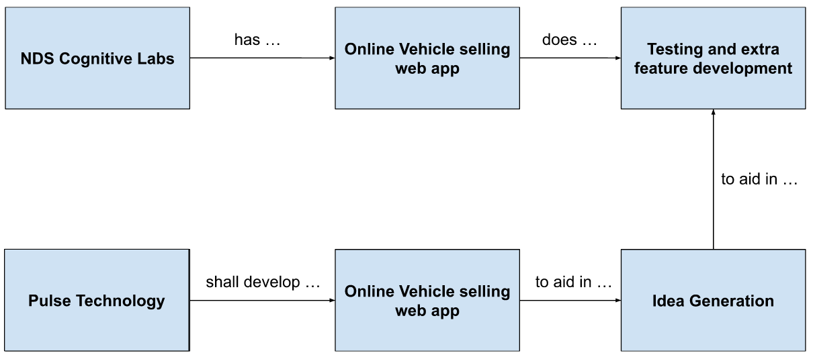

    

    

<h2 align="center"> Software Requirements Specification

| Date       | Version | Description  |  
|------------|:-------:| :----------- |
| 02/04/2023 | 1     | Integración SRS |

<h2 align="center"> Autores
<h3 align="center"> Alexa Serrano 
<h3 align="center"> Alfredo Park
<h3 align="center"> Ana Paula Katsuda
<h3 align="center"> Andrea Serrano
<h3 align="center"> Andreína Sanánez
<h3 align="center"> Andrés Briseño
<h3 align="center"> Andrew Dunkerley
<h3 align="center"> Diego Corrales
<h3 align="center"> Do Hyun Nam
<h3 align="center"> Emiliano Cabrera
<h3 align="center"> Francisco Salcedo
<h3 align="center"> Gerardo Gutierrez
<h3 align="center"> Iwalani Amador
<h3 align="center"> Karla Mondragón
<h3 align="center"> Luis Javier Karam
<h3 align="center"> Mateo Herrera 
<h3 align="center"> Regina Rodríguez
<h3 align="center"> Salvador Milanés
<h3 align="center"> Sebastian González
<h3 align="center"> Tonatiuh Reyes 

# Índice
1. [Introducción](#1-introducción)
        
    1.1. [Propósito](#11-propósito)

    1.2. [Convenciones del Documento](#15-convenciones-de-documento)

    1.3. [Enfoque y Alcance](#12-enfoque-y-alcances)

    1.4. [Objetivos SMART](#13-objetivos-smart)

    1.5. [Referencias](#16-referencias)

2. [Descripción General](#2-descripción-general)

    2.1. [Perspectiva del Producto](#21-perspectiva-del-producto)

    2.2. [Clases de Usuarios y Características](#22-clases-de-usuarios-y-características)

    2.3. [Ambiente de Desarrollo](#23-ambiente-de-desarrollo)

    2.4. [Restricciones del Diseño e Implementación](#24-restricciones-de-implementación-y-diseño)

    2.5. [Suposiciones y Dependencias](#25-suposiciones-y-dependencias)

3. [Características del Sistema](#3-características-del-sistema)

    3.1. [Requerimientos Funcionales](#31-requerimientos-funcionales)

    3.2. [Requerimientos No Funcionales](#32-requerimientos-no-funcionales)

    <!-- 3.3. [Diagrama de Casos de Uso](#33-diagramas-de-casos-de-uso) -->

4. [Requerimientos de Datos](#4-requerimientos-de-datos) 

    4.1. [Modelo de Datos Lógico: Diagrama Entidad-Relación](#41-modelo-de-datos-lógico-diagrama-entidad-relación)

    4.2. [Diccionario de Datos](#42-diccionario-de-datos)

    4.3. [Reportes](#43-reportes)

    4.4. [Adquisición, Integridad, Retención y Eliminación de Datos](#44-adquisición-de-datos-integridad-retención-y-eliminación)  

5. [Requerimientos de Interfaces Externas](#5-requerimientos-de-interfaces-externas)

    5.1. [Interfaces de Usuario](#51-interfaces-de-usuario)

    5.2. [Interfaces de Software](#52-interfaces-de-software)

    5.3. Interfaces de Hardware (N/A)

    5.4. [Interfaces de Comunicación](#54-interfaces-de-comunicación)

6. [Atributos de Calidad](#6-atributos-de-calidad)

    6.1. [Usabilidad](#61-usabilidad)

    6.2. [Rendimiento](#62-rendimiento)

    6.3. [Seguridad](#63-seguridad)

    6.4. [Protección](#64-protección)

7. [Internacionalización y Ubicación de Requerimientos](#7-internacionalización-y-ubicación-de-requerimientos)

8. Otros Requerimientos (N/A)

9. [Apéndices](#9-apéndices)

    9.1. [Organigrama](#1-organigrama)

    9.2. [Gantt](#2-gantt)

    9.3. [Historias de Usuario](#3-historias-de-usuario)

    9.4. [Administración de Riesgos](#4-administración-de-riesgos) 
    
    9.5. [Casos de Uso](#5-casos-de-uso)

    9.6. [Glosario](#6-glosario)

# 1. Introducción

 El objetivo de este documento es recopilar, analizar y brindar una visión profunda de la aplicación web para NDS Cognitive Labs, definiendo el problema y la solución en detalle. El documento también concentra las capacidades requeridas por todos los stakeholders y sus necesidades definiendo las características del producto.

 Nuestra misión para este proyecto es hacer el proceso de compra de un auto más fácil y conveniente para el usuario digitalizando dicho proceso. Esto planeamos lograrlo creando una plataforma confiable, transparente y de fácil acceso en la que los clientes puedan tomar decisiones informadas basadas en información confiable y recomendaciones profesionales. Nuestro compromiso con nuestros clientes es ofrecerles una gama variada de autos a través de agencias y grupos automotrices previamente verificadas en nuestra plataforma. El problema que nuestra propuesta busca solucionar lo inconveniente que se ha vuelto el proceso de adquisición de un vehículo, tanto para las agencias que no tienen acceso a un equipo de TI como para los compradores que pueden tardar meses en el proceso.

 Con respecto a nuestra visión, buscamos transformar radicalmente el sector de ventas de autos. Con este proyecto queremos que la experiencia tradicional de la compra de autos cambie, se adapte a las nuevas tecnologías y no estrese a los usuarios. Estamos comprometidos a crear una comunidad confiable de vendedores y compradores donde las transacciones puedan ser en línea, quitando los problemas e inconvenientes asociados a la compra tradicional de autos. 

## 1.1. Propósito

 El propósito del documento es recopilar y analizar todas las ideas que han surgido para definir el sistema y sus requisitos con respecto a los usuarios que harán uso de la aplicación. 

 En este proyecto en colaboración con NDS Cognitive Labs, se busca la digitalización del proceso de adquisición de vehículos nuevos y seminuevos. La problemática que se busca resolver es agilizar un proceso que se ha vuelto inconveniente y tedioso: la compra de un vehículo. Dicho proceso presenta múltiples inconvenientes desde que no todas las agencias tienen el catálogo completo de autos disponibles hasta la cercanía entre las agencias y el comprador. Nuestra propuesta busca:
<ol>
    <li> Transparencia en los procesos de compra 
    <li> Un diseño intuitivo y funcional
    <li> Un proceso de compra amigable y conveniente
    <li> La protección de datos de usuarios
</ol>

## 1.2. Enfoque y Alcances

El enfoque de este proyecto es construir un servicio web responsivo y escalable que permita a los usuarios buscar, filtrar, comparar y comprar un auto que satisfaga sus necesidades. Debido a las leyes y regulaciones aplicables en el país donde el producto se va a desplegar, todos los pagos deben manejarse de forma externa. 

Dentro de sus multiples funcionalidades, se espera que el usuario sea capaz de:
1. Elegir un vehículo desde un amplio catálogo, 
2. Encuentre planes de financiamiento que se adapten a sus necesidades,  
4. Solicitar una prueba de manejo si así lo desea, 
5. Comprar su vehículo en cualquier agencia disponible,
6. Comunicarse con una agencia (vendedor específico) por medio de un chat en tiempo real,
7. Subir los documentos legales requeridos.

El proyecto debe también proveer a sus usuarios una experiencia fluida en toda la aplicación, incluyendo procesos como digitalización y procesamiento de documentos, solicitudes de pruebas de manejo, filtrado y especificación, manejo de cuenta y perfil de usuario, etc.

Los socios de este proyecto son:
<ul>
    <li> NDS Cognitive Labs: El cliente para quien se desarrolla el proyecto.
    <li> Pulse Studio: El equipo de desarrollo formado por los y las estudiantes de ITC.
    <li> Tecnológico de Monterrey: El instituto que colabora con el cliente y el equipo de desarrollo.
    <li> El usuario final, limitado a México.
</ul>

La aplicación pretende:
1. Habilitar permisos de usuarios y roles administrativos, 
2. Permitir a usuarios administradores subir catálogos de autos y a sus clientes navegar los mismos,
3. Tener una interfaz intuitiva para que los usuarios puedan buscar y filtrar autos de un catálogo, 
4. Comparar opciones seleccionadas y ver sus especificaciones,
5. Tener una plataforma con diversas formas de pago, 
6. Que la información solicitada estará cifrada y protegida.

Lo que nos distingue de la competencia es nuestra intención de:
- Crear un simulador comparativo de autos, 
- Un formulario para entender las necesidades del usuario, 
- Agendar citas mediante un calendario, 
- Dar recomendaciones personalizadas con Machine Learning y 
- La implementación de un "Wishlist" (Bookmark de autos preferidos).  
Pero, priorizando la entrega de un MVP funcional, de calidad y que cubra las necesidades del cliente, NDS. 

Algunos aspectos de la solución, que quedan mas allá de nuestra propuesta como Pulse Studio son el mantenimiento de la aplicación, el servicio y hospedaje para el almacenamiento en Cloud y la solución de quejas acerca de la manufactura o el estado de los automóviles; así como el servicio de respaldo (backup) y la red de distribución de contenido (CDN).

## 1.3. Objetivos SMART
1. _Mejorar la experiencia del usuario:_ al terminar el proyecto, con el lanzamiento de la aplicación, buscamos reducir aproximadamente un 30% el tiempo que le toma a un usuario comparar y adquirir un automóvil.
2. _Mejorar el servicio al cliente:_ dentro del desarrollo del proyecto (75%), se busca implementar un chatbot que pueda ofrecer ayuda a los clientes para así reducir hasta en un 50% los tiempos de respuesta. Esto mejorará el servicio al cliente en la plataforma.
3. _Aumentar las opciones de pago:_ al terminar el proyecto, con el lanzamiento de la aplicación, se busca incluir una pasarela de pago que acepte diversas formas de pago para ampliar la cantidad de alternativas para los clientes en la plataforma.
4. _Aumentar el posicionamiento en los motores de búsqueda:_ al terminar el proyecto, con el lanzamiento de la aplicación, se pretende utilizar mejores prácticas de optimización de motores de búsqueda para aumentar el ranking de la plataforma.
5. _Mejorar la seguridad de la plataforma:_ para evitar violaciones de datos y proteger la privacidad del consumidor, se agregara autenticación y la verificación de autorización y se incluirá el cifrado de datos dentro del desarrollo del proyecto (80%). 
6. _Implemente análisis predictivos:_ al terminar el proyecto, con el lanzamiento de la aplicación (si existen recursos disponibles), se pretende mejorar el uso de análisis predictivo con el objetivo de estudiar los datos de los clientes y ofrecer sugerencias de automóviles individuales, lo que lleva a un aumento en la satisfacción del cliente.

## 1.4. Convenciones de Documento
| Término | Definición |
|---------|------------|
| SRS | Documento de Especificación de Requerimientos de Software en el que se describen las funcionalidades necesarias para un proyecto de desarrollo de software |
| Project Manager | Se entiende como la persona responsable de dar seguimiento y gestionar las actividades al desarrollar un proyecto |
| Product Owner | Se entiende como la persona que representa las necesidades del cliente de cara al equipo de desarrollo |

## 1.5. Referencias
"IEEE Guide for Software Requirements Specifications," in IEEE Std 830-1984 , vol., no., pp.1-26, 10 Feb. 1984, doi: 10.1109/IEEESTD.1984.119205. https://ieeexplore.ieee.org/document/278253

# 2. Descripción General
## 2.1. Perspectiva del Producto
  
La aplicación busca ser un servicio e-commerce donde un usuario comprador tenga la oportunidad de comprar un vehículo de forma intuitiva, amigable, segura y digital. NDS Cognitive Labs es una consultora internacional especializada en el diseño y desarrollo de soluciones de software de tiempo real que van desde Inteligencia Artificial a Nube. 

La idea del servicio pretende trabajar con tecnologías emergentes para facilitar el proceso de adquisición de un vehículo de agencia.

  

  
## 2.2. Clases de Usuario y Características
1. _Usuario Comprador_:
- Usuario que usa la plataforma con el propósito de adquirir un vehículo.
- No tiene ningún permiso de tipo administrador como todos los demás usuarios.
- Tiene una cuenta, perfil y la posibilidad de realizar una transacción monetaria.

2. _Usuario Vendedor_:
- Primer usuario de tipo administrador, tiene el menor número de privilegios; solamente se le permite acceder a su información y a la de sus clientes.
- Tiene una cuenta y un perfil.
- Sus permisos y accesos son asignados por un usuario gerente o agencia.

3. _Usuario Gerente_:
- Usuario administrador, que pertenece a una agencia y sus permisos están gestionados por el grupo automotriz.
- Se le permite acceder a la información de sus vendedores y los clientes de su sucursal correspondiente.
- Se le permite acceder a la información de sus vendedores, vehículos y los clientes de la agencia.
- Tiene una cuenta y un perfil.

4. _Usuario Grupo Automotriz_:
- Usuario administrador, sus permisos y acceso es gestionado por el usuario super-administrador.
- Se le permite acceder a la información de todas las agencias bajo su supervisión, sus catálogos y vehículos, gerentes y vendedores.
- Gestiona que sucursales serán parte de la plataforma en conjunto con el usuario super-administrador.
- Tiene una cuenta y un perfil.

5. _Usuario Super-Administrador_:
- Usuario con mayor número de privilegios, su acceso y permisos son gestionados por NDS y los desarrolladores. Es el responsable de gestionar a los usuarios grupo automotriz.
- Puede acceder a la información de los grupos, agencias, ventas, catálogos y vehículos, al igual que a la información del comportamiento de la plataforma.
- Tiene una cuenta y un perfil.

## 2.3. Ambiente de Desarrollo
 

 En esta sección, se define el Tech Stack diseñado para la solución. 

### 1. Database
  
<i>MongoDB (Almacenamiento de catálogo e información de la compra):</i> 
La base de datos que se utiliza en el sistema es MongoDB, desplegada en un servicio propio de mongo llamado Mongo Atlas. Esta base de datos se conecta directamente con los APIs que constituyen al backend y guarda toda la información de la aplicación a excepción del catálogo.
* Gratuito.
* Los programadores cuentan con conocimiento y experiencia previa.
* Compatible con diversos OS - compatible con Windows.
* Fácil instalación e implementación.
* Altamente flexible y escalable.
* Tolera grandes volúmenes de datos.
* Estructura no relacional - bueno para manejar muchas read-write operations como lo son búsquedas, filtrado e información referente a la compra del auto.
* Cuenta con una buena comunidad, documentación y material de consulta para su utilización.
  
### 2. Back-End
El backend de la aplicación está constituido por todos aquellos módulos que permiten extraer información de la base de datos y otros recursos y desplegarla en el frontend. Para su desarrollo se usó NodeJS y NEXT al igual que el frontend. Debido a que tanto frontend como backend forman parte de una misma aplicación, esta parte también estará desplegada en Vercel. Al igual que frontend considera la autenticación y persistencia de datos para las sesiones y usuarios.

### 3. Librerías y Herramientas de Front-end   
<i>Figma:</i> 	
* Gratuito 
* Intuitivo y fácil de usar.
* Permite la creación de diseños (mockups) directamente traspasables para la implementación.
* Los programadores cuentan con conocimiento y experiencia previa.
* Permite la colaboración simultánea en línea.
* Cuenta con una buena comunidad, documentación y material de consulta para su utilización.
  
<i>MaterialUI:</i> 
* Gratuito y Open Source.
* Provee componentes de UI pre-diseñados.
* Compatible y utilizado sobre React.
* Flexible para la customización de los componentes.
* Cuenta con una buena comunidad, documentación y material de consulta para su utilización.	

<i>NextJS:</i> 
* Gratuito y Open Source.
* Framework de React para el desarrollo de aplicaciones web.
* Permite “server-side rendering” que agiliza el cargado de la página.
* Permite un fácil enrutamiento de los diferentes “endpoints” requeridos.
* Cuenta con una buena comunidad, documentación y material de consulta para su utilización.
  
### 4. Almacenamiento de Archivos
Para el almacenamiento de archivos se utiliza Firestore, un servicio de almacenamiento que forma parte de la nube de Google. Este se conecta con los APIs del backend para procesar el archivo y finalmente guardar la liga del archivo en la base de datos.

### 5. Motor de Búsqueda
Para el motor de búsqueda se hace uso de ElasticSearch. Este recurso permite habilitar las funcionalidades de búsqueda por filtros y por lenguaje natural y abre la posibilidad de utilizar otras como lo son voz a texto e integración de modelos pre-entrenados para mejorar la búsqueda. El servicio se encuentra desplegado en la nube de Google y es consumido por medio de las APIs del backend. Este motor de búsqueda almacena únicamente el catálogo de autos y la información relacionada a ellos, permitiendo su fácil recuperación y acceso.

### 6. Cloud Service: Vercel

### 7. Autenticación
<i>NextAuth:</i> 
Para la autenticación se utilizan dos servicios. El primero es la librería para el framework en el que está desarrollada la aplicación, NextAuth. Este permite el manejo de los permisos y sesiones del usuario en toda la aplicación y permite almacenar las credenciales de estos en nuestra propia base de datos de manera segura. El segundo servicio es Google Authenticator, el cuál permite al usuario usar su cuenta existente de Google para crear una cuenta en el sistema.

### 8. Control de Versionamiento
  
<i>GitHub:</i> 
* Gratuito.
* Todos los programadores han utilizado y conocen extensamente la herramienta.
* Permite repositorios ilimitados - lo cual da versatilidad a la organización que se tome para la realización del proyecto.
* Permite administrar de forma sencilla y organizada controlar la colaboración, actualizaciones y cambios que se realicen al proyecto por parte de todos los miembros del equipo.
* Cuenta con una buena comunidad, documentación y material de consulta para su utilización.  

### 9. APIs de Terceros
<i>Stripe:</i> 
* Para la integración de pagos en la plataforma se utiliza Stripe. 
* Este servicio permite generar una pantalla de “checkout” para que el usuario pueda hacer el pago del auto que está comprando. 
* Este servicio se conecta con el frontend para posteriormente guardar las claves de rastreo del pago en la base de datos.

<i>INE API:</i> 
* Número limitado de peticiones gratuitas.
* Permite la verificación de INEs 
* Cuenta con una buena documentación, materiales de consulta y soporte.

<i>Live Person:</i> 
La aplicación hace uso de Live Person, un servicio de comunicación en vivo que permite chat, llamada y videollamada en tiempo real. Este servicio se utiliza para el soporte de la aplicación.

<i>Twilio:</i> 
Twilio permite mandar notificaciones ya sea por mail, whatsapp o cualquier otro medio de contacto al usuario.

<i>OpenAI:</i> 
El API de OpenAI permite utilizar sus modelos generativos de inteligencia artificial para generar las descripciones para cada auto en el catálogo. Estas descripciones son las que nutren la búsqueda por lenguaje natural en ElasticSearch.

## 2.4. Restricciones de Implementación y Diseño
  
El dueño de proyecto no ha establecido restricciones explicitas con respecto a las herramientas para el desarrollo, pues el proyecto pretende funcionar unicamente como prueba de concepto. Por lo tanto, las únicas restricciones son en relación a los recursos disponibles.

Este proyecto no tendrá financiamiento externo. La posibilidad de implementación de la arquitectura propuesta puede ajustarse a opciones mas viables económicamente, pero no se limita a alternativas open-source.

Es importante recalcar que el equipo de desarrollo esta formado por estudiantes aspirantes a desarrolladores, sin conocimiento a nivel experto en el diseño e implementación de métodos formal. El enfoque principal de los desarrolladores sera en la adecuada funcionalidad y amigabilidad del software.

En términos del diseño:
1. Solamente se aceptarán grupos automotrices y agencias como participantes en el sistema, y no individuos.
2. El sistema tendrá uso de nube (cloud) SaaS.
3. Los desarrolladores no proveerán mantenimiento ni soporte al sistema.
  
## 2.5. Suposiciones y Dependencias
Las premisas realizadas para el desarrollo de este proyecto son:

1. El proyecto seguirá una metodología ágil durante toda la fase de implementación.
2. Nuestro P.O. estará disponible para evaluar el progreso durante las Sesiones de demostración semanales o las Pruebas de aceptación del usuario.
3. Ni NDS ni el Tec de Monterrey proporcionarán financiamiento alguno para el desarrollo.
5. El usuario utilizará la plataforma en un dispositivo digital como: una computadora, una tablet, un dispositivo móvil.
6. Se utilizará un Tech Stack mayormente open-source; que no representa un gasto. Si se incluyen componentes o herramientas con costo, se dejan a manera de propuesta tentativa para el Project Owner, estipulando una cotización estimada clara.
  
## 2.6. Casos de Uso

← [Casos de Uso](https://github.com/SFMBa01029956/TC3005B.501/blob/main/Wiki/Casos_de_Uso.md)

# 3. Características del Sistema

 En este apartado se definen las características y aspectos específicos que se requieren del sistema. En específico, se detalla cada uno de los requerimientos funcionales y no funcionales recopilados a lo largo de las diferentes sesiones para el levantamiento de requerimientos que se tuvieron con el cliente. De la misma manera, muestran los diagramas de casos de uso, cuyo propósito es presentar de una manera gráfica y visual el comportamiento esperado de cierta parte del sistema en relación con sus diferentes actores.

## 3.1. Requerimientos Funcionales
### Todos los Usuarios
| ID Req Funcional |                        Requerimiento                         | Usuarios  | Prioridad    |
| :--------------: | :----------------------------------------------------------: | :-------: | --- |
|    REQ_FUN_01    |             Registro de usuario a la plataforma              |     C     |  M  |
|    REQ_FUN_02    |               Solicitud de registro de usuario               |   GA/G    |  M  |
|    REQ_FUN_03    |             Edición de perfil de usuario propio              |   Todos   |  S  |
|    REQ_FUN_04    |           Eliminación de perfil de usuario propio            |     C     |  S  |
|    REQ_FUN_05    |            Eliminación de perfil de usuario ajeno            |  G/GA/SA  |  S  |
|    REQ_FUN_06    |                            Login                             |   Todos   |  M  |
|    REQ_FUN_07    |                           Log out                            |   Todos   |  M  |
|    REQ_FUN_08    |                    Registro de documentos                    |   C/GA    |  M  |
|    REQ_FUN_09    |             Visualización de documentos propios              |   C/GA    |  M  |
|    REQ_FUN_10    |   Visualización de retroalimentación de documentos propios   |   C/GA    |  M  |
|    REQ_FUN_11    | Visualización de estatus de aceptación de documentos propios |   C/GA    |  M  |
|    REQ_FUN_12    |            Edición/Borrado de documentos propios             |   C/GA    |  M  |
|    REQ_FUN_13    |              Visualización de documentos ajenos              |  SA/V/G   |  M  |
|    REQ_FUN_14    |           Aprobación/Negación de documentos ajenos           |  SA/V/G   |  M  |
|    REQ_FUN_15    |                      Vista de catálogo                       |   Todos   |  M  |
|    REQ_FUN_16    |                   Registro de automóviles                    |     G     |  M  |
|    REQ_FUN_17    |                Edición/Borrado de automóviles                |     G     |  M  |
|    REQ_FUN_18    |         Registro de planes de financiamiento/seguros         |     G     |  S  |
|    REQ_FUN_19    |     Edición/Borrado de planes de financiamiento/seguros      |     G     |  S  |
|    REQ_FUN_20    |                     Búsqueda por filtros                     | C/V/G/GA  |  S  |
|    REQ_FUN_21    |                Búsqueda por lenguaje natural                 | C/V/G/GA  |  C  |
|    REQ_FUN_22    |                Solicitud de prueba de manejo                 |     C     |  M  |
|    REQ_FUN_23    |     Revisión de estatus de solicitud de prueba de manejo     |     C     |  S  |
|    REQ_FUN_24    |           Aprobación/Negación de prueba de manejo            |     V     |  M  |
|    REQ_FUN_25    |       Asignación de disponibilidad de prueba de manejo       |     V     |  M  |
|    REQ_FUN_26    |                Apertura de chat con vendedor                 |     C     |  M  |
|    REQ_FUN_27    |                     Solicitud de compra                      |     C     |  M  |
|    REQ_FUN_28    |               Confirmación de inicio de compra               |     C     |  M  |
|    REQ_FUN_29    |             Visualización de detalles de compra              |     C     |  S  |
|    REQ_FUN_30    |             Selección de plan de financiamiento              |     C     |  M  |
|    REQ_FUN_31    |                 Selección de método de pago                  |     C     |  M  |
|    REQ_FUN_32    |              Autorización del proceso de compra              |     V     |  M  |
|    REQ_FUN_33    |               Reasignación de orden de compra                |     V     |  M  |
|    REQ_FUN_34    |        Aprobación de reasignación de orden de compra         |     G     |  M  |
|    REQ_FUN_35    |                 Realización de pago en línea                 |     C     |  M  |
|    REQ_FUN_36    |                    Dashboard Estadístico                     | V/G/GA/SA |  S  |

Comprador - C
Vendedor - V
Gerente - G
Grupo Automotriz - GA
Super Admin - SA

## 3.2. Requerimientos No Funcionales
| ID Req No Funcional |                                                 Requerimiento                                                 | Prioridad|
| :-----------------: | :-----------------------------------------------------------------------------------------------------------: | --- |
|    REQ_NO_FUN_01    |                                               Diseño intuitivo                                                |  M  |
|    REQ_NO_FUN_02    |                                            Diseño de UX armonioso                                             |  S  |
|    REQ_NO_FUN_03    |                                  Screen-size adaptable para tablet y celular                                  |  S  |
|    REQ_NO_FUN_04    |                           Texto de ayuda y texto alternativo en botones e imágenes                            |  C  |
|    REQ_NO_FUN_05    |     Botón de ayuda en caso de que los usuarios necesiten asistencia del chat bot o de un operador humano      |  S  |
|    REQ_NO_FUN_06    |                          Se utilizarán cookies para guardar las búsquedas recientes                           |  M  |
|    REQ_NO_FUN_07    |                                     Funcionalidad de comparativa de autos                                     |  C  |
|    REQ_NO_FUN_08    |                                       Funcionalidad de lista de deseos                                        |  C  |
|    REQ_NO_FUN_09    |                                      Procesamiento de documentos con OCR                                      |  C  |
|    REQ_NO_FUN_10    |                                         Proceso de venta transparente                                         |  S  |
|    REQ_NO_FUN_11    |                                     Compra a cualquier agencia disponible                                     |  M  |
|    REQ_NO_FUN_12    |                                  Visualización predeterminada del catálogo                                   |  S  |
|    REQ_NO_FUN_13    |                                   Método de autorización para cada usuario                                   |  M  |
|    REQ_NO_FUN_14    |                              Habilidad de actualizar la información de la cuenta                              |  M  |
|    REQ_NO_FUN_15    |                                            Transparencia de datos                                             |  M  |
|    REQ_NO_FUN_16    |                                        Esquema de datos estandarizado                                         |  S  |
|    REQ_NO_FUN_17    | Asegurar que la información de ventas y usuarios sea guardada por lo menos cinco años antes de ser descartada |  M  |
|    REQ_NO_FUN_18    |                                           Protección de información                                           |  M  |
|    REQ_NO_FUN_19    |                                          Tutoriales y sección de FAQ                                          |  C  |
|    REQ_NO_FUN_20    |                                            Política de privacidad                                             |  M  |

<!-- 
## 3.3. Diagramas de Casos de Uso
> Pendiente a definir por todo el grupo
-->
  
# 4. Requerimientos de Datos
## 4.1. Modelo de Datos Lógico: Diagrama desnormalizado

[Diagrama desnormalizado](../assets/diagrams/Base_de_Datos%20-%20MongoDesnormalizado(5).png.png)

    

## 4.2. Diccionario de Datos
Para esta versión del diagrama, se realizó una división de actores, consistiendo de:

- Automóviles y sus detalles como especificaciones e imágenes (morado). Almacenado en Elasticsearch.
- Usuarios y credenciales de las cuentas relevantes a las agencias y grupos automotrices (azul). Almacenado en MongoDB.
- Procesos de la página (amarillo). Almacenado en MongoDB.
- Mensajes de chat (naranja). Almacenado en MongoDB.

Esto se hizo para tener más clara la llamadas a la base de datos y la ubicación de cada dato en la colección indicada, y así ayudar a tener un desarrollo más fluido.  

Con el fin de ahondar más en que es cada campo que se esta guardando, el diccionario de datos contiene un formato donde se describe el campo y se incluye un ejemplo para contextualizar la entrada y ayudar a delimitar que campos se requieren para qe proceso o usuario. 

En el siguiente enlace se puede acceder a este diccionario: https://docs.google.com/spreadsheets/d/103zkVDPbrAVLM8oNYfTzrvIYOvG7wQquobjWRwPf2Dg/edit?usp=sharing

## 4.3. Reportes
  
Se busca que la plataforma sea capaz de producir diferentes estadísticas y dependiendo el rol del usuario y sus permisos se le muestran diferentes datos y aspectos de la plataforma. Algunas de las estadísticas que se pretenden mostrar en la aplicación son:

1. Ventas de cada vendedor, agencia y grupo automotriz, pruebas de manejo por agencia.
2. Venta de cada vehículo y su popularidad (ya sea por número de personas interesadas en el o por la cantidad de pruebas de manejo del modelo).
3. Comportamiento de la plataforma, cantidad de usuarios, información geográfica de los usuarios.

## 4.4. Adquisición de Datos, Integridad, Retención y Eliminación
La información que será recopilada dentro de la plataforma podrá o no contener datos sensibles protegidos por los derechos ARCO dentro de Mexico. Esta información podría o no contener documentos, imágenes e información confidencial que sea requerida para el proceso de compra/venta de automóviles, registro de usuarios y cualquier otro pedazo de información que sea requerido para el correcto funcionamiento de los procesos de el servicio.

Es por esto por lo que es importante recalcar que la información capturada dentro de la plataforma estará cifrada . De igual manera, el acceso a esta información estará restringido a los usuarios propietarios de la misma. Igualmente en relación a la modificación y eliminación de la información guardada, estos cambios se verán reflejados excepto en casos donde un registro de documentación referente a los procesos legales de la compra y venta de los automóviles ofrecidos sea requerido.

**Integridad de los Datos**

Una de estas medidas es una base de datos de respaldo que se actualice cada cierto tiempo, o con snapshots de la información, esto con el fin de que en caso de que se presente algún problema con la base de datos principal, se pueda recuperar la información de la base de datos.

**Seguridad de los Datos**

La seguridad de los datos será manejada con productos del proveedor de nube que se elija para el desarrollo del programa. Se utilizarán herramientas de seguridad como el cifrado de datos, autenticación de usuarios, etc. De igual manera se pondrán restricciones de leído/borrado de datos para los usuarios que no tengan permiso para realizar dichas acciones. 
  
# 5. Requerimientos de Interfaz Externas
En esta sección se presentan las diferentes interfaces que componen a la plataforma propuesta para la solución. De manera específica, se comienza por detallar las interfaces de usuario que hacen referencia al flujo en el que interactúan cada uno de los diferentes tipos de usuario dentro de la aplicación; posteriormente se describen las interfaces de software que hace referencia a la relación e interacción entre los diferentes componentes de software que conforman a la arquitectura de la aplicación; finalmente se listan las interfaces de comunicación que a un nivel más alto de abstracción incluye a los diferentes puntos de comunicación que se ofrecen dentro de la plataforma. 

## 5.1. Interfaces de Usuario
### Diagrama de Procesos
En esta sección se incluyen los diagramas de actividad para cada usuario. En este caso, se especifica de manera general el flujo que tendrá cada usuario (diagramas) y, posteriormente, se presenta un wireframe en donde se ven las pantallas por las que pasará cada usuario durante su navegación en el sitio. Es relevante mencionar que dicho wireframe está principalmente enfocado en el acomodo de los elementos. 

A continuación, se encuentran los flujos establecidos a nivel usuario. 

### Flujo del Comprador:

Es posible visualizar en el flujo las secciones principales por las que pasa el comprados, estas siendo la página inicial, el registro/ingreso a la cuenta, gestión de perfil propio, el catálogo de autos y los filtros del mismo, la compra de autos o la prueba de manejo, la comunicación con el vendedor, y la gestión de documentos propios. 

### Flujo del Vendedor:

Para el flujo de vendedor, es posible visualizar procesos tales como la gestión del perfil propio, búsqueda de catálogo de la agencia, revisión tanto de solicitud de compra como de solicitud de pruebas de manejo, la revisión de documentos, contacto con el cliente, cambios de estatus de las solicitudes y retroalimentación. 

### Flujo del Gerente:

En el diagrama de flujo del gerente, es posible visualizar el ingreso a la plataforma, la gestión del perfil propio, la visualización del catálogo de la agencia, la revisión de solicitudes, la gestión de planes de financiamiento o seguros y la gestión de autos.

### Flujo del Grupo Automotriz:

Para el flujo del grupo automotriz, se muestran los procesos generales de la gestión de gerentes, el registro de agencia o grupo automotriz, la vista de estadísticas, y la gestión del perfil propio. 

### Flujo del Super-Administrador:

El diagrama del flujo para el usuario administrador incluye páginas tales como la vista principal, el borrado/edición de cuentas, acceso a las estadísticas, gestión del perfil propio, revisión y retroalimentación de solicitudes de agencia y grupo automotriz. 

### Wireframe
En cuanto al wireframe, este provee una vista gráfica de las pantallas que se mostrarán a cada usuario. De esta manera, será posible tener una guía para el diseño y la interfaz gráfica del sitio a desarrollar. Con lo anterior en mente, será posible revisar dicho wireframe en el [siguiente link](https://drive.google.com/drive/folders/1EHhItYpjeRQcp6R5jbqvvDpo5uWfLBVQ?usp=sharing)

### Mockup
El mockup funge como la guía gráfica del sitio que se desarrollará. El diseño se encuentra especificado en este archivo siguiendo los lineamientos de diseño, colores, tipografía, acomodo de páginas, entre otros. A partir de dicho mockup se podrá crear un prototipo. Será posible encontrarlo en [siguiente link](https://www.figma.com/file/CI5ObOAwXAoy8NorgVRuWY/Mock?node-id=1%3A130&t=zjYOwqyUShV2fRoX-1).

## 5.2. Interfaces de Software
### Diagrama de Arquitectura
 

 En esta sección se presenta un diagrama ilustrativo de la arquitectura que describe la aplicación y los diferentes servicios que se utilizan para su despliegue y desarrollo. Este incluye los elementos de Usuario, Frontend, Backend, APIs de Terceros y las conexiones entre estas. De igual manera se describe cada uno de los componentes a profundidad, haciendo énfasis en las tecnologías que se utilizan y su conexión con las demás partes.

  

### Componentes
#### Red Pública
<i> Usuario: </i>  
Los usuarios acceden a nuestra aplicación e infraestructura a través de un navegador ya sea en su computadora personal o su teléfono móvil. La aplicación es compatible con la mayoría de los navegadores modernos gracias a las tecnologías usadas para su desarrollo.

#### Red en Nube de SWIVEL
Dentro de este segmento se encuentra el frontend, backend, la base de datos, el motor de búsqueda y todos los demás servicios que componen la aplicación.

## 5.3. Interfaces de Hardware
### No aplica

## 5.4. Interfaces de Comunicación
1. E-mail:

Se integrará un servicio de respuesta automática por correo, utilizando una herramienta como MailChimp. Este servicio permitirá a los usuarios recibir notificaciones de los cambios en el estado de su solicitud, así como de los cambios en la información de la misma.

2. Entrega y Reconocimiento de Documentos:

Se desarrollarán interfaces donde el usuario pueda arrastrar o elegir documentos desde su sistema de archivos, asegurando que el formato sea el adecuado. El sistema deberá ser capaz de reconocer el tipo de documento y verificar la identidad por medio de un servicio de validación de identidad facial. El sistema también deberá validar los carnets de identidad y licencias a partir del texto que contengan.
3. Sistema de Chat:

Se integrará una herramienta externa para instanciar chat en tiempo real entre los usuarios y los administradores de la aplicación para dar seguimiento a las solicitudes.

4. Plataforma de Pago:

Se integrará una plataforma de pago para que los usuarios puedan pagar por los servicios de la aplicación a partir de un servicio, se sugiere Stripe para esta implementación dado su sistema de comisión por transacción; contra alternativas como OpenPay.
  
# 6. Atributos de Calidad
## 6.1. Usabilidad
  
* <b>Interfaz Fácil de Usar:</b> La plataforma debe tener una interfaz clara e intuitiva que facilite a los usuarios la navegación y la búsqueda de la información que necesitan.
  
* <b>Interfaz Responsiva:</b> Cada una de las interfaces y diseño de la plataforma deberá ser responsiva, es decir, accesible y funcional en distintos dispositivos y tamaños de pantalla (computadora, tablet, teléfono). 
  
* <b>Velocidad de Respuesta:</b> La plataforma debe cargarse rápidamente y responder a las acciones del usuario en el momento oportuno.

* <b>Información Clara sobre el Producto:</b> La plataforma debe ofrecer información transparente y detallada sobre cada coche, incluyendo especificaciones, precios y disponibilidad.

## 6.2. Rendimiento
  
* <b>Tiempo de Carga de la Página:</b> La plataforma debe cargarse rápidamente, idealmente en unos segundos o menos, para garantizar una experiencia de usuario positiva y ágil.

* <b>Capacidad de Respuesta:</b> La plataforma debe responder rápidamente a las interacciones del usuario, como clics, toques y deslizamientos, proporcionando una experiencia de usuario fluida e intuitiva.
  
* <b>Escalabilidad:</b> La plataforma debe ser capaz de gestionar grandes volúmenes de tráfico y transacciones sin ralentizarse ni bloquearse.
  
* <b>Disponibilidad:</b> La plataforma debe estar disponible y accesible 24 horas al día, 7 días a la semana, garantizando que los usuarios puedan navegar y comprar autos en cualquier momento.
  
* <b>Fiabilidad:</b> La plataforma debe ser fiable y estable, con el mínimo tiempo de inactividad o errores que puedan interrumpir la experiencia del usuario y las transacciones.

## 6.3. Seguridad

* <b>Comunicación Segura:</b> La página web debe utilizar protocolos de comunicación segura como HTTPS para cifrar todos los datos del usuario en tránsito, evitando su intercepción y manipulación.
  
* <b>Autenticación:</b> La página web debe utilizar mecanismos de autenticación fuertes como JWT tokens o Cookies para verificar la identidad de los usuarios y evitar escalamiento de privilegios.
  
* <b>Autorización:</b> La página web debe utilizar mecanismos de autorización adecuados como el hashing de las credenciales  para controlar el acceso a recursos y datos sensibles, garantizando que sólo los usuarios autorizados puedan acceder a ellos.
  
* <b>Protección de datos:</b> La página web debe utilizar medidas adecuadas para proteger todos los datos (en reposo, tránsito o uso) de los usuarios, como la información personal, los detalles de pago y el historial de compras.
  
* <b>Cifrado:</b> la plataforma deberá cifrar adecuadamente toda la información sensible contenida en la base de datos.
  
* <b>Seguridad en Código:</b> La plataforma debe seguir prácticas de seguridad en código y comprobarse periódicamente para detectar vulnerabilidades como Cross-site scripting (XSS) y SQL injection. Correspondientemente, deben tomarse las medidas adecuadas para solucionar cualquier vulnerabilidad detectada.

## 6.4. Protección

* <b>Backup y Recuperación:</b> La plataforma debe contar con un plan de backup y recuperación para garantizar que los datos puedan restaurarse en caso de pérdida de datos o fallo del sistema.
  
* <b>Redundancia:</b> La plataforma debe contar con sistemas redundantes para garantizar que la página web siga disponible incluso en caso de fallo de hardware o software.
  
* <b>Protección de datos:</b> La plataforma debe aplicar medidas adecuadas de privacidad de datos para proteger los datos de los usuarios y garantizar el cumplimiento de la Ley Federal de Protección de Datos Personales en Posesión de Particulares.
  
* <b>Hosting:</b> La plataforma debe estar alojada en servidores seguros y fiables, idealmente utilizando un proveedor de alojamiento de confianza como AWS que aplique las medidas de seguridad adecuadas.

# 7. Internacionalización y Localización de Requerimientos
  
Debido a las diferencias legales que se presentan de acuerdo a la región política y geográfica, los requerimientos para la internacionalización y localización de la aplicación dependerán del proveedor, los stakeholders y las legislaciones particulares de cada país. El alcance de la aplicación en ese momento es exclusivo de México.

# 8. Otros Requerimientos
### No aplica
  
# 9. Apéndices

← [Inicio](https://github.com/SFMBa01029956/TC3005B.501)

← [Manuales](https://github.com/SFMBa01029956/TC3005B.501/tree/manuals)
  
## 1. [Organigrama →](https://lucid.app/lucidchart/580864bb-0177-4ba8-9e3a-9dbb6148d2f7/edit?viewport_loc=-163%2C180%2C2035%2C860%2C0_0&invitationId=inv_28b72812-fd5d-49db-abaf-64d2158449f1)

## 2. [Gantt →](https://docs.google.com/spreadsheets/d/1gQOCrEyqyHThUOxP-niAMtOYwplinlct/edit?usp=sharing&ouid=103048302256739869165&rtpof=true&sd=true)

## 3. [Historias de Usuario →]()

## 4. [Administración de Riesgos →]()

## 5. [Casos de Uso →](https://github.com/SFMBa01029956/TC3005B.501/blob/main/Wiki/Casos_de_Uso.md)

## 6. Glosario

API: Una "interfaz de programación de aplicaciones" es un conjunto de protocolos, rutinas y herramientas para la creación tanto de software y aplicaciones.

AWS: Amazon Web Services es un servicio en la nube el cual ofrece un rango de servicios como: almacenamiento, manejo de bases de datos, poder de computo, etc.

Backend: Es la parte de un sistema de software que procesa tareas e interactúa con APIs, servidores, bases de datos, entre otros.

Cache: Almacenamiento temporal de ciertos recursos para reducir tiempos de carga y tráfico de red.

CloudFront: "Red de distribución de contenido" (CDN) un servicio proveído por AWS para distribuir contenido a los usuarios en la red mundial.

Content Delivery Network (CDN): Red distribuida de servidores usada para mandar contenido web alrededor del mundo

DDoS: Una "denegación de servicios distribuida" es un ataque cibernético que interrumpe el funcionamiento normal de una red al abrumarla con tráfico.

Debian: Un sistema operativo de código abierto usado por servidores.

DNS: El "Sistema de nombres de dominio" es un sistema para guardar los nombres de las direcciones del internet.

DynamoDB: Base de datos no relacional proveída por AWS.

EC2: Amazon Elastic Compute Cloud is a scalable cloud computing service that provides on-demand computing resources.

Firewall: Un sistema de seguridad diseñado pra prevenir acceso no autorizado a la red.
  
Frontend: Es la parte de un sistema de software que interactúa con los usuarios y muestra información.

Gateway: Es un sistema que conecta diferentes sistemas o redes para permitir la comunicación entre ellos.

HTTP: El "Protocolo de transferencia de hipertexto" es utilizado para transferir datos a través de Internet.

IEEE: El "Instituto de Ingenieros Eléctricos y Electrónicos" es una organización profesional internacional con sede en Nueva York para ingenieros en varios campos, como: ciencias de la computación y la electrónica.

Procesamiento del lenguaje natural: Rama de la inteligencia artificial que se ocupa de permitir que las máquinas entiendan el lenguaje humano.

Plataforma: Software como una plataforma de servicio que se realizará para este proyecto.

Usuario: Un usuario de cualquier clase de usuario, es quien usa la herramienta de software.

Base de datos relacional: Un tipo de base de datos que almacena y organiza datos en tablas con relaciones predefinidas.

S3 Bucket: "Amazon Simple Storage Service" es un servicio de almacenamiento en la nube proporcionado por AWS.

SQL: "Lenguaje de consulta estructurado" es un lenguaje estándar utilizado para administrar bases de datos relacionales.

Subnet: Una subdivisión de una red para controlar el tráfico y aislar dispositivos.

Ubuntu: Un sistema operativo de código abierto basado en Debian.

Nube privada virtual: Entorno de red virtual que permite a un usuario lanzar recursos en una sección lógicamente aislada de la nube.
